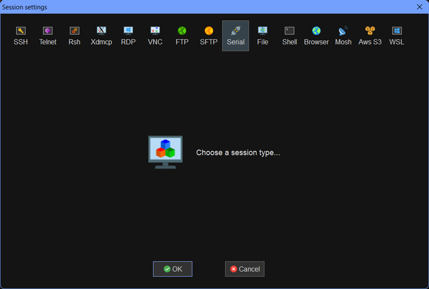
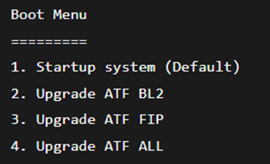
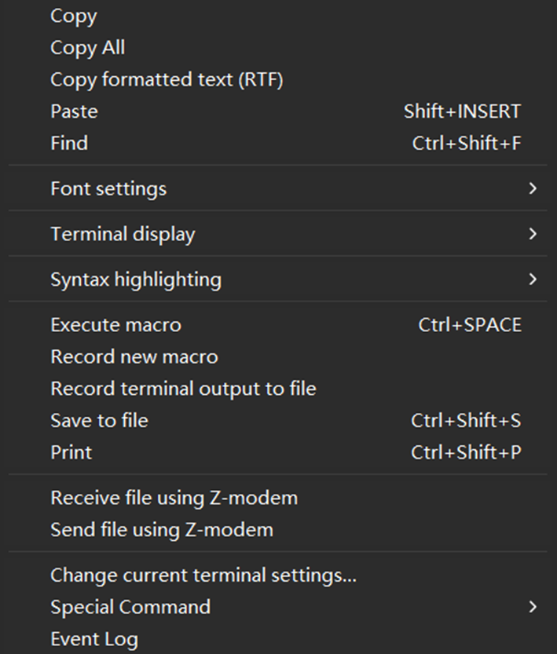
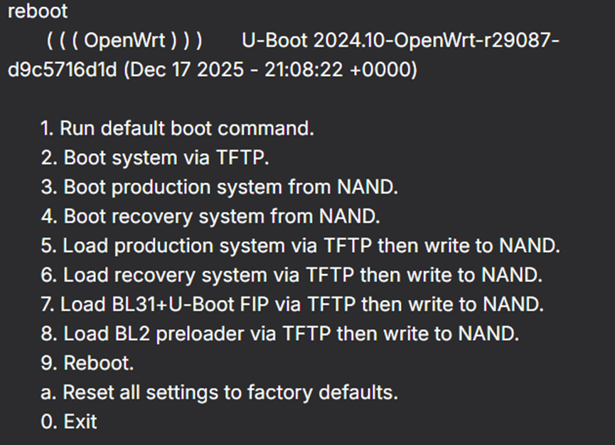
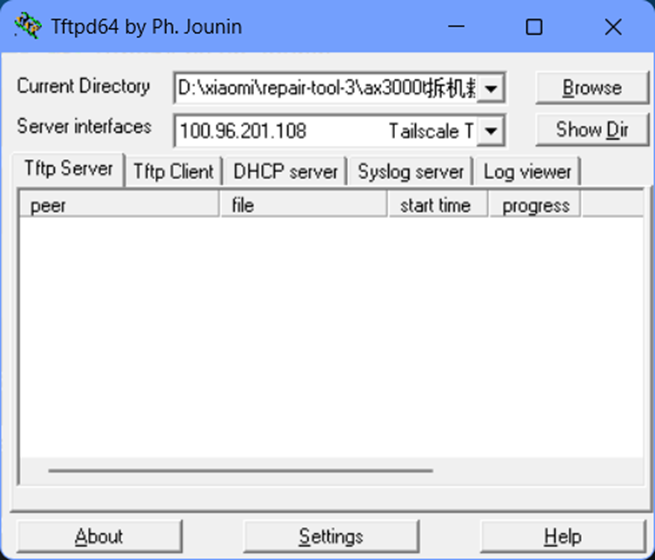
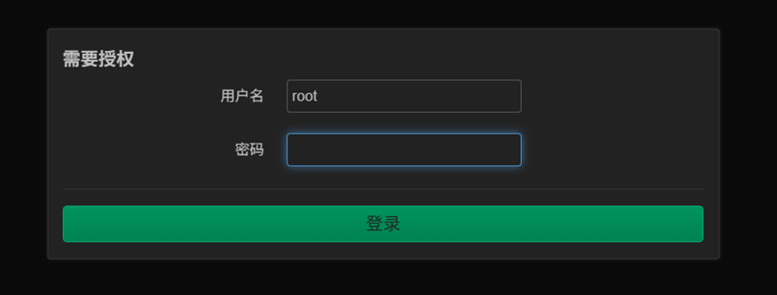
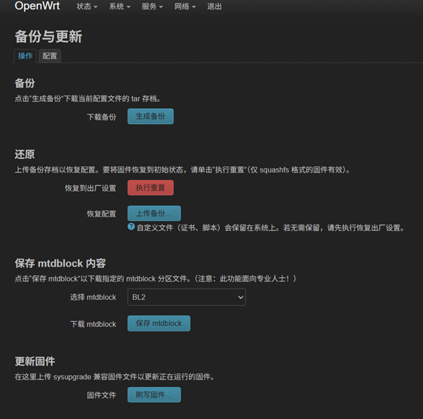

# 从路由器选型到远程追番（一）：路由器选取与系统刷取

——计算机网络是一个由无数计算机人搭起的喜马拉雅，我们有幸站在这样的山巅、站在巨人的肩膀上，继续构思、创造的循环。

## 0、阅读指引（先看这个）

这篇文章的定位是「技术分享」，目标是：用尽量可复现的方式，带你完成一台“随时在线的低功耗网络入口设备”的准备工作。

本文覆盖：

- 为什么我需要一台可玩性高的路由器（以及它在整套方案里的定位）
- 路由器怎么选：关键硬件指标与型号确认
- 通过 TTL 串口进入 U-Boot，刷入 OpenWrt（救砖向思路）

不覆盖（后续写）：

- OpenWrt 初始化（网络、LAN/WAN、旁路由/主路由模式取舍）
- Tailscale 安装与常用配置（ACL、Exit Node、Subnet Router 等）

## 0.1、风险提示与前置条件

刷机存在风险（轻则配置丢失，重则变砖）。建议：

- 认真确认硬件版本（同款不同版本可能完全不同 SoC/Flash）
- 备份原厂固件/配置（如果你有条件）
- 操作中不要急着断电、不要“感觉差不多了就下一步”

本文内容来自个人实践记录，不保证适配所有设备/所有版本；如果你照做，默认你理解并自行承担风险。

## 1、这么做的原因 & 我们要做什么

自从开始使用个人电脑以来，我个人的私人数据正在以一个大于线性速度而小于指数增长的方式逐渐增加。同时由于个人学习的需要，把所有开发环境和文档资料都存在一台电脑上会导致存储内容和程序运行逐渐臃肿，十分不便。

于是乎，在了解到 NAS 这一种互联网设备和计算机网络专业课当中的 C/S 架构之后，我逐渐产生了想要组建一台属于自己的服务器的想法。用于运行 mysql、pgsql、个人项目模拟服务器环境部署、文件存储、小参数的 LLM 模型部署等众多功能。

于是开始吧！来搭建一个属于自己的服务器吧！

## 2、问题拆解：为什么离不开一台“能折腾的路由器”？

### 2.1 云服务器：省事但不适合我

服务器通常使用的方式是租赁网上的云服务器然后自己在相关的网站对服务器操作。但是这样成本太高了，存储空间不大，并且网上租赁的服务器面对学生的性能也不高。更何况这个服务器的服务是针对自己运行的，这样一来似乎没有必要。

它当然有一个优点：不需要折腾网络，直接使用公网 IP 地址就能访问。但我选择自己从硬件层面搭建服务器。

### 2.2 家庭网络：没有公网 IP 时，外网访问是核心难题

如果自己从硬件层面搭建服务器，那么网络是一个严重的问题。为了实现远程访问，当前我们大多数的网络都是基于家用路由器下的局域网。外部网络环境下无法直接访问该服务器内部的网络，这就需要我们通过使用一些技术手段来进行内网穿透等操作，让远程访问在没有公网 IP 的情况下能够成为现实。

### 2.3 方案选择：Tailscale 组虚拟局域网

这里我使用一款叫做 Tailscale 的软件来搭建虚拟局域网，通过 Tailscale 的 UDP 打洞等方式尽量实现 P2P 架构下的边缘设备相互访问。

### 2.4 “永远在线”的入口：路由器天然适合做中枢

远程访问最重要的功能之一，就是远程启动（省电费、随用随开）。但要做到这一点，我们需要一台设备：

- 能够 24/7 在线
- 功耗低
- 连接稳定
- 能装一些网络相关的服务（比如 Tailscale）

在现阶段没有 NAS 的情况下，我把目光投向了经典设备：路由器。这也引出了本篇文章的核心对象。

## 3、路由器怎么选？（别只看“AX”这类营销词）

类似于别的计算机，路由器也会有它的重要参数。根据上面的目标，我认为至少要满足：

1) 性能不能过差
路由器要在原有功能之上运行 Tailscale 服务，并且后续可能增加其他服务，因此应当选择性能较好的型号。这里我个人建议 RAM 至少 256MB（我原文里写 230MB，实际建议直接对齐 256MB 更好记）。

2) 能刷系统
大量家用路由器的原厂系统对普通用户足够，但对折腾党“不够自由”。因此我希望它能刷更开放的系统，比如 OpenWrt。购买前一定要确认硬件是否支持。

3) 网口速度/数量符合你的宽带与设备情况
以我为例，宽带 300M，实测能到 500M 左右。百兆口会出现木桶效应跑不满；视情况选择千兆口和口数。

4) 价格合理
对学生党而言，我预算大概 200 元以内，接受二手（前提功能完备无损坏）。

### 3.1 我的选择：Xiaomi AX3000T（V2）

综上，我选择了 Xiaomi AX3000T 的 V2 版本：

- 联发科 SoC，支持刷 OpenWrt，并且性能足够
- 网口支持千兆
- 价格友好（PDD 上 95 新大概 100 元左右）

注意：购买时请注意路由器底部的 SN 码等信息。SN 码可以体现版本情况：据我了解，4 开头的是联发科 V2 版本。V1/V2 才支持刷 OpenWrt。

能否刷取新系统，可在 OpenWrt 官网查询，或查阅网上资料，或直接问客服确认。

现在我们选好了路由器，开始刷机。

## 4、刷机主线：TTL 串口 + U-Boot + TFTP（救砖思路）

### 4.1 概念与工具

1) U-Boot：承载新系统的“底座”

在刷入新系统之前需要合适的引导环境。你可以把它理解为电脑的 BIOS/UEFI：

- 上电第一个程序：路由器通电，先跑 U-Boot，再跑系统
- 初始化硬件：CPU、内存、Flash、串口、网口
- 加载系统内核：从 Flash/TFTP 把 Linux 内核读到内存
- 传参并跳转：把控制权交给 Linux

它一般不“常驻在系统里让你日常使用”，更像启动阶段的引导者。

2) MobaXterm：路由器与电脑之间的通讯软件

通过杜邦线连接路由器触点和 TTL 编程器引脚，再通过 TTL 与电脑连接，你就能在 MobaXterm 里看到串口输出、输入命令。

3) TTL 编程器 & 杜邦线：路由器与电脑之间的通讯硬件

网上有很多教程会使用 TTL + MobaXterm。这里我按我自己的实操路径记录。

4) Tftpd64/32：路由器从电脑端拉取固件的工具

用于在电脑上作为 TFTP 服务器，把固件文件传给路由器。

5) xmir-patcher：解锁 SSH 的工具

GitHub 上的开源项目，需匹配你的路由器型号/版本。

### 4.2 必要文件准备（按“用途”理解更不容易搞混）

下面这些文件名很长，但你把它们分成三类就清晰了：

A. 让设备“能进入可控的启动环境”的工具/载荷

- mtk_uartboot.exe（或 B 站博主提供的 one-key TTL 工具）：用于启动前加载临时环境

B. 引导相关文件（写入 Flash）

- openwrt-mediatek-filogic-xiaomi_mi-router-ax3000t-ubootmod-preloader.bin
- openwrt-mediatek-filogic-xiaomi_mi-router-ax3000t-ubootmod-bl31-uboot.fip

C. OpenWrt 固件

- openwrt-24.10.5-mediatek-filogic-xiaomi_mi-router-ax3000t-ubootmod-initramfs-factory.ubi（或对应的 recovery/initramfs 文件）
- openwrt-24.10.5-mediatek-filogic-xiaomi_mi-router-ax3000t-ubootmod-squashfs-sysupgrade.itb（用于持久化写入）

### 4.3 开始刷机（我走的是“救砖向”流程）

注：这里我没有选择更现代化的 ImmortalWrt，而是选择了更经典的 OpenWrt。同时我这次的出发点是“救砖”——之前的路由器被不靠谱教程误导刷错东西导致变砖，所以这篇更像一份救砖思路记录。

#### 4.3.1 使用 xiaomi-patcher 解锁路由器 SSH

参考教程：

- 【小米路由器AX3000T刷机教程傻瓜式支持v1v2（uboot版大分区）openwrt最新版附原厂恢复教程！变砖？不存在的】
  https://www.bilibili.com/video/BV1Qo2pBvEKo/?share_source=copy_web&vd_source=4bf721e64949ccc5a58b6e22a21a0b0b

#### 4.3.2 使用 MobaXterm 通过串口通信/SSH 连接到路由器



点击左上角菜单第一个弹出如上窗口。如果是 SSH 就选第一个，如果是串口就选择 Serial。

#### 4.3.3 在电脑端注入临时环境（mtk_uartboot）

命令示例：

```bash
mtk_uartboot.exe -s COM3（这里应当是你现实的串口号） -p bl2-mt7981-bga-ddr3-ram.bin -a -f openwrt-mediatek-filogic-xiaomi_mi-router-ax3000t-ubootmod-bl31-uboot.fip
```

或者通过博主给定的工具刷取（据说需要付费工具包）。

参考链接：

- 【【实测有效】小米路由器AX3000T救砖教程！简易操作版！V1V2 通用,TTL刷机一步不落！附工具包】
  https://www.bilibili.com/video/BV1XtBeB1EEM/?share_source=copy_web&vd_source=4bf721e64949ccc5a58b6e22a21a0b0b

成功后输出大致类似：

```
Handshake...
hw code:0x7981
sending payload to 0x201000...
Jumping to 0x201000in aarch64...
NOTICE: BL2:v2.10.0(release)
NOTICE:EMI:Using DDR3 settings
NOTICE:CPU:MT7981 (1300MHz)
BL2 UART DL version:0x10
FIP sent.
NOTICE:Received FIP...@0x40400000
```

第一种方法重启之后会自动进入 U-Boot 控制台，第二种方法应当按照博主的教程进入到 U-Boot 控制台。一般会看到类似：

```
MT7981# （此处待输入）
```

这时可以输入 `help` 查看如何调出 bootmenu 界面，一般类似：



#### 4.3.4 刷入 preloader 与 fip

选择 2，系统会提示你通过串口发送对应的文件。此时你需要在窗口中右键：



然后选择 **Send file using Y-modem**（如果你的路由器支持 Z-modem 就用 Z-modem）。

- 上传 preloader 文件，直到命令行显示成功（失败就重来）
- 选择 3，重复上述操作，上传 fip 文件

注意：不同路由器可能不一样，但 BL2 -> preloader、FIP -> fip 的对应关系一般不变。

完成后使用 `reset` 重启。

#### 4.3.5 通过 TFTP 启动临时 OpenWrt，并刷入 sysupgrade 固件完成持久化

重启后你应该会看到类似：



这时候需要用到 TFTP 工具：



这里只做演示，图中并没有按下面步骤修改。

1) 将电脑 IP 设为 192.168.1.100，子网掩码建议使用 255.255.255.0（/24）。

2) 开启 TFTP 服务器（如 Tftpd64），将文件放在 TFTP 根目录。

我这里用到的是：

- openwrt-mediatek-filogic-xiaomi_mi-router-ax3000t-ubootmod-initramfs-recovery.itb（急救固件）

3) 在 U-Boot 菜单中选择：

>5. Load production system via TFTP then write to NAND

之后按照正常流程，系统会自动下载 initramfs-recovery.itb，然后启动一个临时的 OpenWrt。

此时你可以通过路由器 IP（常见是 192.168.1.1）访问 OpenWrt 管理界面。

注意：如果你家光猫/上级路由也用 192.168.1.1，后续一定要改 LAN 网段避免冲突。



（注：这里是已经打了中文包之后的登录界面，最开始应该是英文。）用户名是 root，密码默认不填或按固件说明。

4) 刷写永久固件（sysupgrade）

在 系统(System) -> 备份与升级(Backup / Flash Firmware) -> 刷写固件(Flash image)，选择 sysupgrade 固件，等待系统完成并确认。



总之就是最下面这个。

到这里，恭喜你完成了 OpenWrt 的系统刷取。

## 5、常见坑点速查（建议收藏）

- 图片/固件路径：确认 TFTP 根目录与文件名完全一致（大小写也要一致）
- 型号/版本：同型号不同版本的 SoC/Flash 不同，固件不可混用
- 网段冲突：上级设备也用 192.168.1.1 时，OpenWrt 的 LAN 网段在之后必须改
- 心态：串口刷机的本质是“可控、可回退”，不要慌，失败就按步骤重来

## 6、下一篇预告

下一篇我会继续写：OpenWrt 的初始化设置与 Tailscale 安装配置（以及如何让路由器成为你远程访问家庭网络的稳定入口）。
