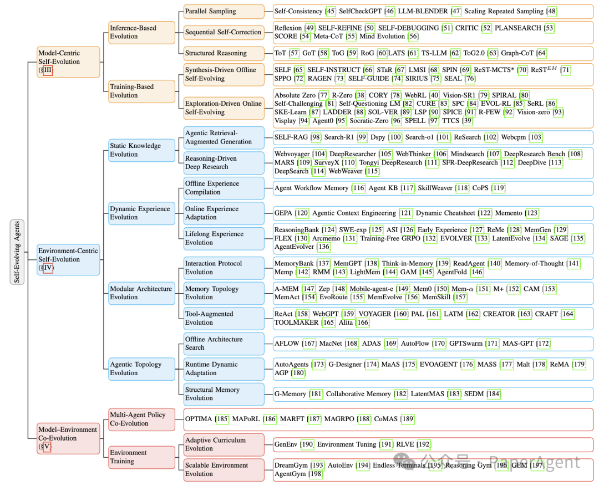
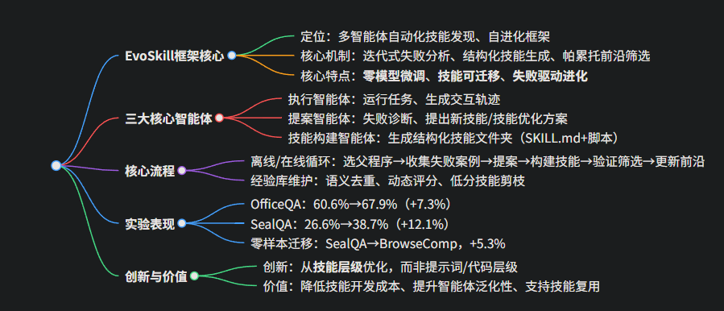
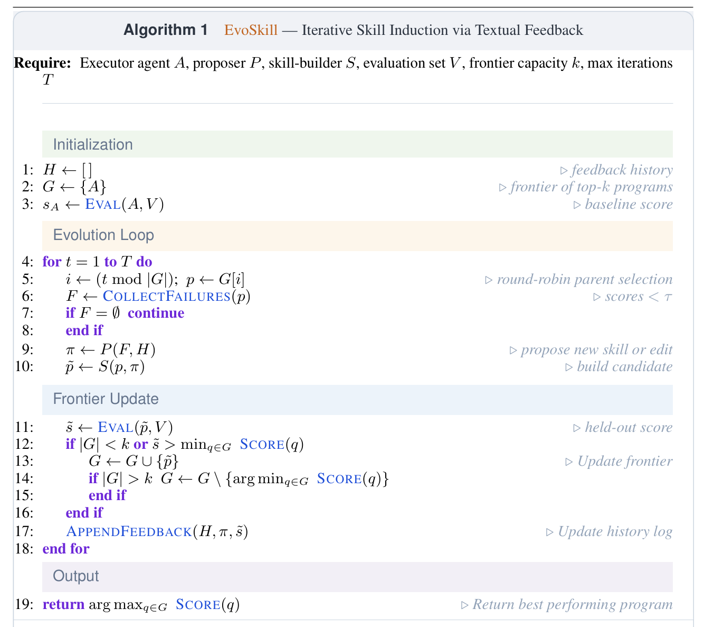

# 自进化Agent综述：从模型中心到环境驱动的共进化

A Systematic Survey of Self-Evolving Agents: From Model-Centric to Environment-Driven Co-Evolution | TechRxiv
·按「进化发生的位置」将现有研究划分为三条递进路线：
模型中心自进化：
挖掘模型自身潜在能力，不直接依赖外部环境
推理时进化：不更新参数，靠增加测试计算提升单次输出可靠性，比如并行采样投票、多轮自我纠错、树/图结构推理
2. 训练时进化：将能力写入模型参数实现长期提升，分为「离线合成驱动（模型自生成训练数据）」和「在线探索驱动（实时交互反馈、自博弈更新策略）」，代表工作包括R-Zero、Absolute Zero等
环境中心自进化：
进化来自模型对外部资源的利用，而非仅参数更新
1. 静态知识演化：从被动检索升级为Agent主动判断知识缺口、自主完成搜索-验证-整合，典型如Agentic RAG、Deep Research类工作
2. 动态经验演化：沉淀可复用的行为经验（工具调用顺序、错误恢复策略、工作流模板），区分离线经验编译、在线经验适配、终身经验进化三类
3. 模块架构演化：记忆、工具、交互接口等组件自主迭代，比如自适应记忆系统、Agent自动创建/组合工具
4. 多Agent拓扑演化：打破固定角色分工，让多Agent的协作结构、通信模式、团队配置动态优化
模型-环境共进化：
模型和环境双向驱动、同步迭代

1、弥补前两条路线的缺陷：既避免模型自进化的幻觉累积，也突破静态环境的任务限制。
2、具体包括：①多Agent策略共进化（其他Agent构成动态环境，通过协作/竞争互相提供反馈）；②环境自适应训练（环境可按模型能力动态调整难度、生成多样化可验证任务，代表工作如Reasoning Gym、AgentGym）
·自进化的一种方法：面向多智能体系统的自动化技能发现自进化框架
EvoSkill: Automated Skill Discovery for Multi-Agent Systems
核心通过迭代式失败分析自动发现、提炼可复用智能体技能，无需微调基础模型，将技能固化为含说明、元数据与脚本的结构化技能文件夹；

（二）闭环进化流程
初始化：设定帕累托前沿（保留 top-k 最优程序）、反馈历史，基线模型无技能。
迭代循环
1、选父程序：轮询从前沿选最优程序；
2、收集失败案例：父程序执行任务，收集低于阈值的失败样本；
3、提案：提案智能体分析失败，结合反馈历史，提出新建技能 / 优化旧技能；
4、构建技能：技能构建智能体生成结构化技能；
5、验证筛选：候选技能在验证集评估，仅提升性能才保留，更新前沿、剔除最差程序；
6、记录反馈：提案、分数、结果存入反馈历史，避免重复错误。
7、输出：迭代结束后，返回前沿中最优程序。

·自进化的一种方法：EvolveR：从轨迹到原则的闭环
https://arxiv.org/abs/2510.16079
方法：
一、volver 受人类 "实践 — 反思" 模式启发，包含三大核心组件：
离线自蒸馏：冻结策略，将轨迹提炼为策略原则；
在线交互：检索原则指导推理，生成高质量轨迹；
策略进化：用强化学习更新策略，完成闭环。
### 二、智能体交互形式化
（1）智能体动作空间：
1：检索经验库中的策略原则；
2：检索外部知识库；
3：输出最终答案。
### 三、生命周期：从交互到原则
#### （1）离线自蒸馏生成策略原则
1、原则提炼：智能体利用自身模型，将成功轨迹提炼为指导原则、失败轨迹提炼为警示原则。每条原则包含：
自然语言描述；
结构化知识三元组。[(对比任务, 需要, 双方数据), (结论, 依赖, 数据完整性)]
（2）去重与整合：
语义相似度过滤；
模型二元判断；
新原则加入、旧轨迹合并。
#### 2、在线交互
原则指导推理：智能体随时检索原则，获得启发式指导，减少试错、提高效率。
生成高质量轨迹：在原则引导下生成结构化交互数据，为下一轮蒸馏提供素材。
### （3） 策略进化：强化学习闭环
结果奖励：答案正确与否（稀疏二元）；
格式奖励：推理过程质量（密集）。
策略优化（GRPO）： 采用 分组相对策略优化（GRPO），避免价值函数，稳定高效。核心：最大化目标函数，引入 KL 约束防止策略崩塌。
成功轨迹 → 指导原则（Guiding Principle）：提炼 "为什么成功、怎么做才对"
失败轨迹 → 警示原则（Cautionary Principle）：提炼 "哪里错、以后避免什么"
使用过程：
离线阶段，Agent 跑完一批任务之后，对所有轨迹做提炼，把具体的交互步骤抽象成更通用的"策略原则"，存入原则库。在线阶段，Agent 在新任务里实时检索这些原则，指导自己的行动，同时又产生新轨迹，反哺下一轮蒸馏。
Hermes自进化代码层面讲解
### 一、核心定位：Agent 的「经验笔记」系统 
普通 Agent 没有跨会话记忆，重复任务会反复踩坑；而 Hermes 会把成功流程提炼成 Skill（技能文档），下次自动加载，还能在使用过程中动态修正。
它是当前主流开源 Agent 框架（LangChain、AutoGen 等）中，唯一内置完整自学习闭环的方案，实现了「经验提取 → 知识存储 → 智能检索 → 上下文注入 → 执行验证 → 自动改进」的全链路。
### 二、Skills 全生命周期的 7 个阶段 
