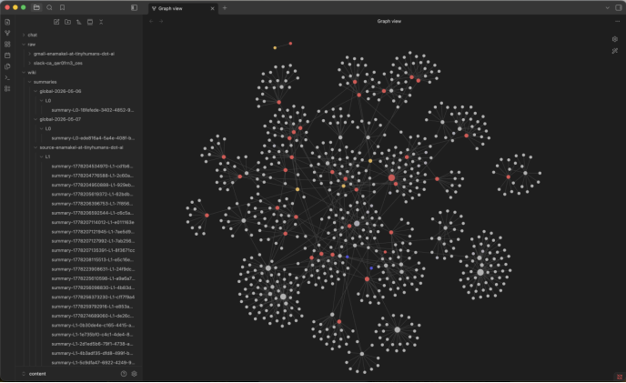
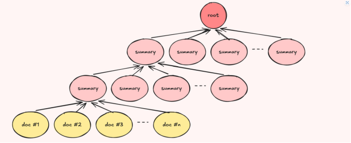
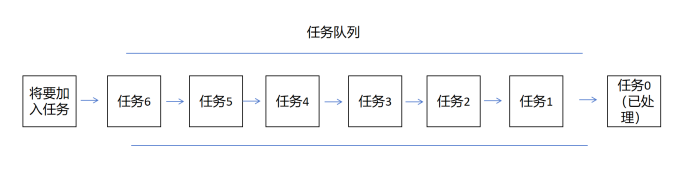
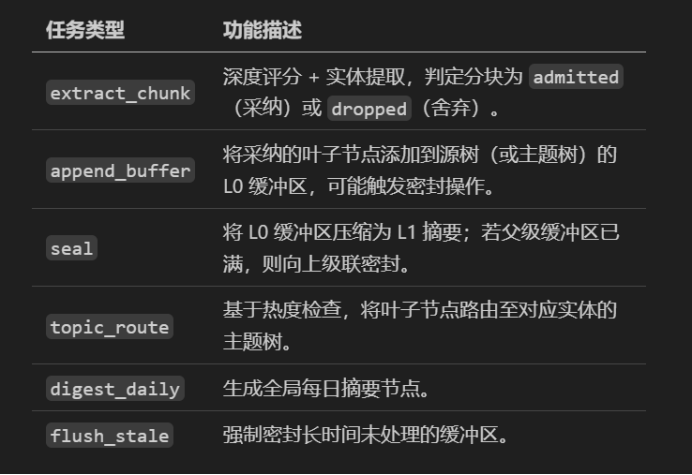
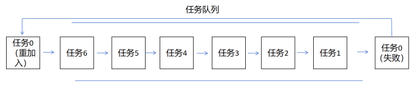

# 个人理解下的OpenHuman记忆树原理与具体流程
## 1 核心实现使用技术对象
### 1.1 本地持久化方法：规范化MarkDown文件+Obsidian+SQLite数据库
#### 1.1.1 规范化MarkDown文件：用于记录
在规范化的MarkDown文件当中，将不同来源的数据统一转化为格式统一的MarkDown文件，消除不同数据源的格式差异，同时在md文件当中还记录该文件的来源、时间等具体信息。

总结为：**身份证（来源标签）+个人简历（信息内容）**

#### 1.1.2 Obsidian：用于用户查看和修改，记忆的“可视化界面 + 用户可编辑层”
Obsidian是一个个人的文档管理软件，它能够通过MD文件当中引用别的MD链接，将各个零散的MD文件通过链接的方式可视化成一张图，同时用户可以通过该软件进行对智能体记忆的手动修改，这样保证了智能体的记忆不是面向用户隐藏的。

总结为：**记忆可视化与傻瓜式编辑**

#### 1.1.3 SQLite：快速检索与查阅记忆
在上面的MD文件处理过后，这些MD文件最终会被处理成块（chunks），然后被放到SQLite数据库中查询。由于数据库对查询等功能进行了优化（数据库核心专业优势），所以查询通过数据库而不是通过看文档检索。

总结为：**快速查询工具**

该数据库存储的内容有以下几个方面：
- 记忆分块（chunks）：所有资料（文档、聊天、邮件）切成3000 token以内的小片段
- 向量嵌入（Embeddings）：文本转成数字向量
- 记忆树（Memory Tree）：AI自动生成的层级化摘要结构
- 元数据与索引（Metadata + Index）：来源、时间、重要度评分等

### 1.2 最重要的核心存储架构：记忆树（Memory-Tree）
#### 1.2.1 三种树与对应工作职责
- **源树**：每个信息源对应一个滚动缓冲区（L0层），缓冲区填满后会密封为L1→L2→…层级。例如，每个Gmail标签、每个Slack频道、每个上传的文档都对应一个源树。越往下内容越细碎详细，越往上内容越抽象越有代表性。
- **主题树**：基于“热度”惰性生成的实体级摘要。某个实体（人物、项目、股票代码、代码仓库）出现频率越高，其主题树的构建和刷新就越频繁。这个树跟一个实体对象相关，这个实体对象的信息都在这个树当中，越往上越大致描绘该实体整体状态，越往下越描述实体细节。
- **全局树**：每日生成一份涵盖当天所有摄入数据的全局摘要。每天0点准时将一天的内容总结放入任务队列当中。

总结：L0→L1→L2→…类似于CPU三级缓存，越小的越新、易变，越大的越有效、固定。
1. Source Tree（来源树）：按数据源聚合、分层摘要
2. Topic Tree（主题树）：按实体聚合、热度驱动构建
3. Global Tree（全局树）：按日期聚合、每日一条总摘要

#### 1.2.2 树构建流程
##### Source Tree（来源树）构建流程
1. 新内容进来 → 分块器分块→ chunk（≤3k token）
2. chunk进入L0缓冲区（滚动缓存）
3. L0满了 → seal（封存） → 压缩成L1摘要节点
4. L1满了 → 再seal → L2、L3……层层向上合并
5. 形成：L0（原始块）→ L1 → L2 → … → 根节点（来源总摘要）

##### Topic Tree（主题树）构建流程
1. chunk被提取实体（人名、项目、代码库、股票代码）
2. 对每个实体算hotness（热度）：出现次数、近期频率
3. 热度达标 → 为该实体新建/追加Topic Tree L0缓冲区
4. L0满 → seal → L1 → L2 … 逐层向上
5. 形成：实体专属分层摘要树

##### Global Tree（全局树）构建流程
1. 每天UTC 00:00 → 调度器触发digest_daily
2. 把当天所有来源、所有chunk、所有摘要 → 合并生成当日全局摘要节点
3. 节点追加到Global Tree末尾
4. 多日累积：日1→日2→日3→…→全局根摘要

#### 1.2.3 叶子节点生命周期
每个分块会经历以下状态流转（状态链条模式）：
pending_extraction（待提取） --> admitted（采纳） --> buffered（已缓冲） --> sealed（已密封）
\
——————-> dropped（舍弃）

1. 提取环节基于评分算法判定分块为admitted（采纳）或dropped（舍弃）。
2. 采纳的叶子节点进入缓冲区（buffered状态，即进入到L0，L1等）。
3. 缓冲区密封时，内部所有叶子节点标记为sealed（已密封）。
4. 舍弃（dropped）的叶子节点终止流转。其分块数据行会保留用于溯源，但不会被缓冲区或摘要引用。

“这也是检索功能无需重新执行处理流程即可展示溯源信息的原因：分块数据行及其最终生命周期状态已足够支撑溯源需求。”——来自官方手册

## 2 一个信息，怎么从聊天记录变成一个持久化的记忆？
### 2.1 流程总览
数据摄入（聊天记录被处理为被规划好的可处理对象实例） -> 任务队列（类似于消息队列） -> 工作进程（类似于消息队列取消息处理） -> 管理树状态（更新数据库）

### 2.2 流程细讲
#### 2.2.1 数据摄入
当新的聊天记录/邮件/文档抵达时，系统会将其规范化为Markdown格式，分割为带确定性ID的定长分块，执行轻量快速评分，通过单次事务完成所有数据持久化，将每个分块标记为pending_extraction（待提取），并将后续处理任务加入队列等待工作进程处理。

个人总结：到达系统-》系统分割规范化-》评分-》本地持久化记录-》标记与任务规划-》加入队列

#### 2.2.2 任务队列（类似于MQ，这里我将其称为TQ，task_queue）
可以想象队列是一个传送带，任务从传送带一头由系统不断投入，任务可能是多样的，任务从传送带另一头被下一个环节不断取出处理。

任务类型有如下几个：

#### 2.2.3 工作进程
小规模后台工作进程池（默认3个）从队列中获取任务并执行。摄入路径会立即唤醒进程池，同时辅以短轮询机制，避免因唤醒失效导致任务滞留。共享信号量限制并发的LLM调用数量，防止新增大量信息源时意外触发数十个并发嵌入向量生成操作。

人话总结：默认三个工人流水线干活，接到什么任务干哪种，并且每隔一段时间查询一次队列看看有没有任务

系统启动时，所有因进程崩溃或终止导致租约过期的任务会被重新放回队列。即使进程崩溃，已采纳但尚未密封的任务也不会丢失。

人话总结：处理失败的任务又会被加入到队列当中

#### 2.2.4 树状态管理
见上文1.2部分，此处不赘述。

#### 2.2.5 调度器
用于每天定时自动运行记忆树的收尾和整理工作。每天UTC 00:00自动触发两件事：
1. 生成昨日Global Tree摘要
2. 强制封存长时间未更新的缓冲区

但是它的方式依旧是把最终生成的任务重新丢到任务队列当中。

---

## 总结
OpenHuman 的记忆系统核心是“可追溯的原始记录 + 可编辑的可视化界面 + 可检索的结构化索引”，并通过 Memory Tree 把海量信息分层压缩、逐步抽象。

- 底层用规范化 Markdown 承载原始内容与来源信息，保证透明与可追溯；
- 借助 Obsidian 将记忆以图谱方式呈现，并允许用户直接修订；
- 使用 SQLite 将分块、向量、树结构与元数据组织起来，实现高效检索与溯源；
- Memory Tree 以 L0→L1→L2… 的“封存/压缩”机制，把新鲜细节逐层汇聚成稳定摘要，同时分别在来源树、主题树、全局树三条轴线上组织信息。

整体上，它更像一个“分层缓存 + 可解释摘要”的记忆工程：既能持续摄入新信息，又能在不丢失溯源的前提下保持可用性与可扩展性。
