## 1：系统设置

（前提：请将你的路由器的WAN口接入到你家的光猫/已经接入网的路由器的LAN口相连，保证外部网络通畅以执行下面的所有操作）

### 1.1：安装中文

在最开始的时候OpenWRT进入系统会是英文，因此我们需要安装中文语言包，在顶部banner的 系统 → 软件包（英文则应该是 System → Software）当中进入如下页面：

（注意：这里我已经汉化过了，原版英文布局相同只是语言不同，其次关于「服务」的内容请忽略，这个是在安装了其他的插件之后才会有的，在正常的情况下一般没有这个。）

在图中我们对应操作：

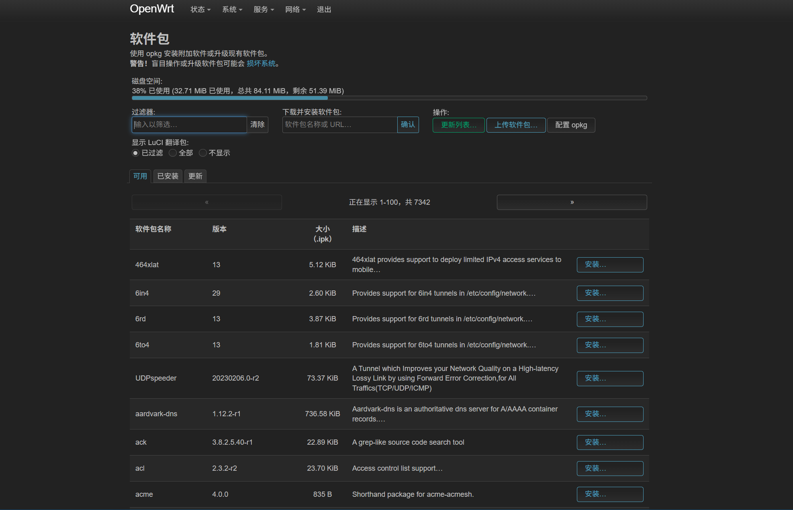

点击更新列表：Update，并等待更新完成

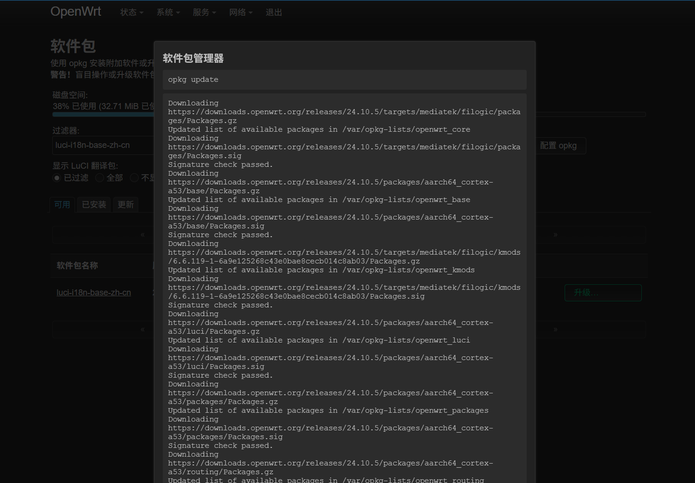

更新完成之后我们在下面的列表中搜索：`luci-i18n-base-zh-cn`，然后安装对应的包

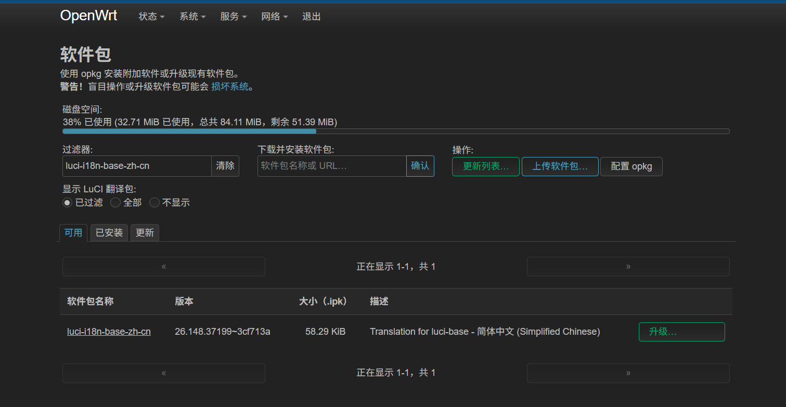

（这里我已经安装了所以是升级的字样，如未安装过则应当是安装）

安装成功后我们进入到顶部导航栏的 系统 → 系统 → 语言和界面（System → System → Language and Style）当中选择中文包，之后点击保存并应用：

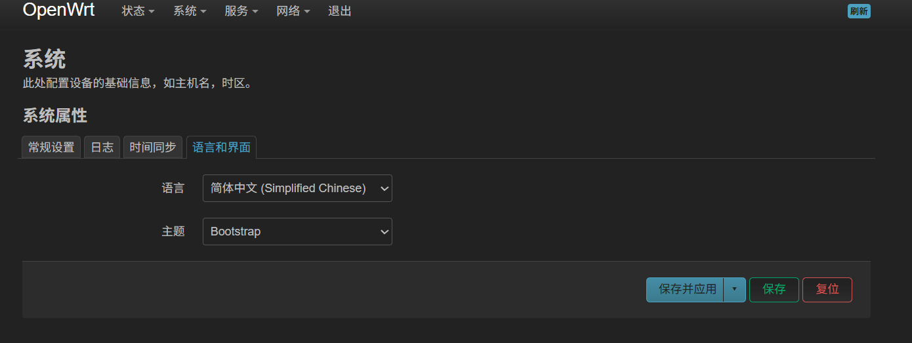

之后我们便能看到初始化为中文的系统页面，中文设定到此结束。

### 1.2：关于无线网络的基本设定

这里推荐看B站的教程，跟着视频一步步设定会比自己看文档更加直观，此处为链接：

【OpenWRT设置(3) - 无线设置, 如何优化WiFi】 https://www.bilibili.com/video/BV1pj411F7Qm/?share_source=copy_web&vd_source=4bf721e64949ccc5a58b6e22a21a0b0b

基本上跟着视频设置，按照自己的需求就能设定的很好了。这里主要要避坑就是最好不要将 2.4G 和 5G 的网络都设定为一个名字（也就是说想要双频合一的作用），这样会使得在后续的某些操作当中出现问题。可以但是不建议这么弄，分开似乎也没什么坏处。也就是 2.4G 范围和穿墙能力比 5G 强，5G 速度比 2.4G 强，2.4G 兼容性更好。

## 2：Tailscale 的安装与设定

### 2.1：安装 Tailscale

同上类似于安装中文包的步骤，我们需要到 OpenWRT 的软件包当中先更新列表，再搜索：

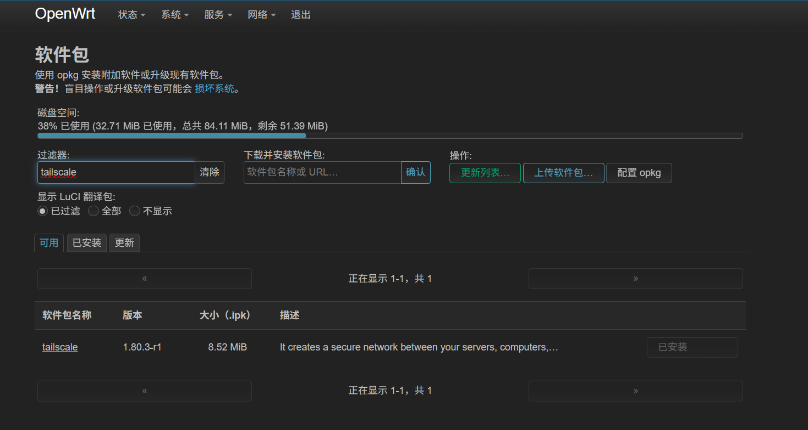

这里我已经安装好了，未安装过这里需要安装。（注意：如果遇到需要下载其他依赖包的情况请选择都下载，否则无法正常使用该软件）

### 2.2：通过 SSH 连接到路由器

下载好 Tailscale 之后我们需要使用终端命令行对路由器进行操作。你可以选择以下的几种方法：

- 针对于 OpenWRT 而言，它的软件包当中有提供在网页上直接在路由器的管理页面当中使用的终端，你可以选择自己下载，然后在浏览器中直接操作。该包可能在包列表当中直接找得到或者需要自己手动导入。但是这里我不选择这么做，因为我当时在包列表当中没有找到，于是我们选择下面的方法。
- 使用终端软件（如 MobaXterm）进行 SSH 连接到路由器并在该软件中操作。对于这种方法也许更加直观，功能更多。

我们选择方法二，假设终端软件是之前用过的 MobaXterm 为例。

**步骤一：** 查看该路由器的 IP 地址。一般来说，路由器的 IP 地址你在访问路由器管理页面的时候在浏览器 URL 处就能看到：

比如我这里的就是 `192.168.2.1`。

接着在 MobaXterm 当中新建一个 Session，输入你刚刚看到的路由器 IP 地址，账户选择 root，然后确定。此时终端会叫你输入密码（注意此时输入密码你是看不到的，这是基于 Linux 下的操作系统的特性），如果你没有修改过密码直接回车即可，修改过则输入你修改过后的密码，然后我们能够进入到如下的界面：

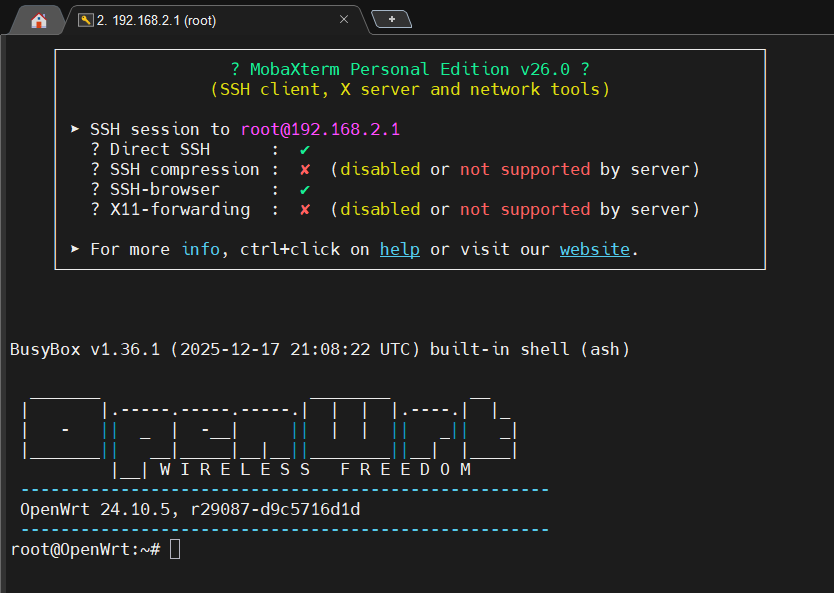

如果你在之前正确安装了 Tailscale 的话，我们在此处的命令行输入 `tailscale` 应当出现相关的回应，而不是指令未找到（command not found）：

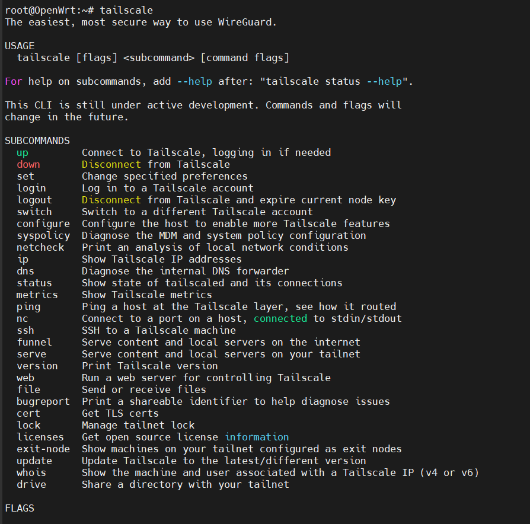

在确定正确安装之后我们输入 `tailscale login` 以进行登录：

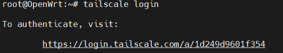

按住 Ctrl 点击该 URL，会自动打开浏览器的 Tailscale 相关界面，注意这里可能需要魔法上网：

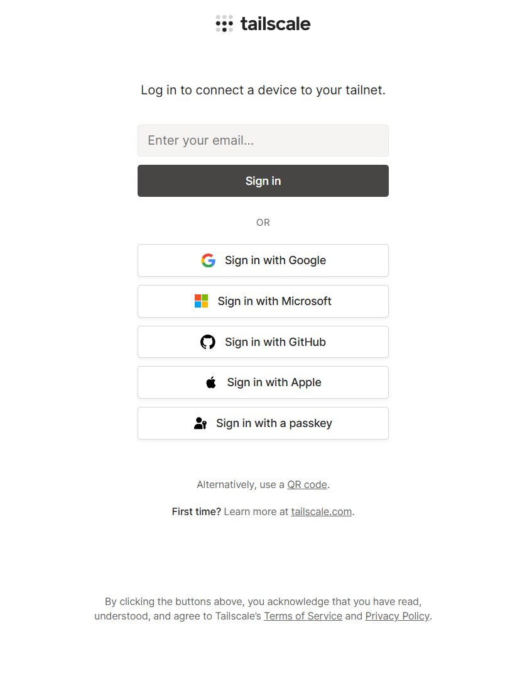

按照提示注册并登录账号就好：

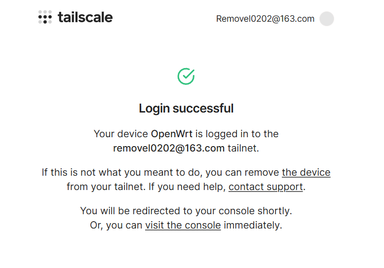

登录好了如图所示。

一般来说，在登录之后该设备会自动添加到你的虚拟局域网当中，比如我这里的就是：

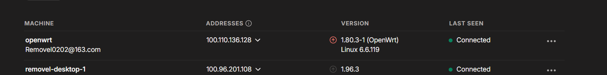

### 2.3：在其他设备上安装 Tailscale

接着我们便可以在别的需要互联的设备（比如你的主力电脑）上下载 Tailscale，并按照类似的方式：到网页上注册 → 登录 → 连接到你的虚拟局域网当中：

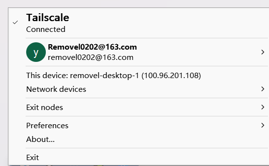

现在在路由器当中能够通过 `tailscale status` 查看当前已经在虚拟局域网当中的设备：

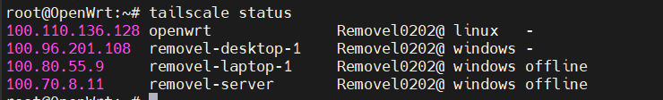

可以看到我这里有路由器本体 openwrt，我的服务器、台式机、笔记本电脑。

## 3：一些注意事项

### 3.1：开机自启

OpenWRT 的 Tailscale 可以手动设置开机自启，否则若路由器重启可能需要手动在命令行输入 `tailscale up` 指令来启动 Tailscale 程序。

### 3.2：直连与中转

虚拟局域网通过 UDP 打洞直连，架构是经典的 P2P 结构。但是实际上会存在打洞失败的情况，导致连接需要通过 Tailscale 的服务器中转，这个时候的延迟会比较高。所以看脸。一般而言都是能直接连接的，在上面的 `tailscale status` 命令输出中，如果是直连，你能看到 `direct` 字符串，否则会看到 rely on XXX 的字符串。

## 总结

在这篇文章当中我们完成了系统的基本设置和 Tailscale 的安装，接下来我们要深入到「如何实现远程追番」的步骤。在下一篇文章中，我们会仔细的讲到如何远程开机、如何部署远程服务等好玩的流程。
