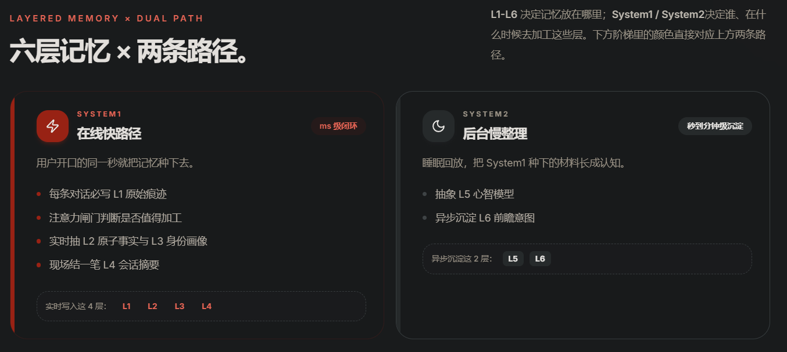
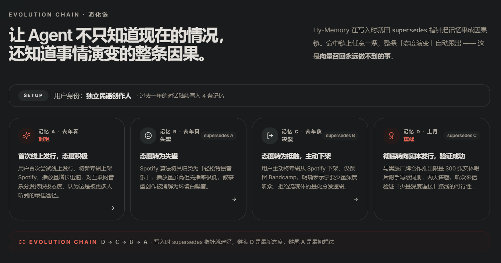

# 关于Hy-Memory的原理与个人思考

## Hy-Memory
### 1：Hy-Memory的主要功能
- 六层记忆框架：将记忆分为原始痕迹、原子事实、身份画像、会话摘要、心智模型、前瞻意图六层，每层独立职责与检索权重。
- System1/System2 双系统：System1 毫秒级实时处理 L1-L4 记忆写入，System2 后台异步沉淀 L5-L6 高阶认知。
- 演化链机制：通过 supersedes 指针将记忆串成因果链，命中任意节点自动展开完整态度演变。
- 记忆合并去重：同类事实自动归并，冲突偏好自动刷新，避免新旧并存形成噪声库。
- 跨 Session 连续记忆：支持昨天关闭今天继续，Agent 能无缝接续长期任务上下文。  
总结：第一：从多个角度划分并持久化了特定化的记忆 第二：使用指针+双系统+去重等操作维护记忆
### 2：Hy-Memory的技术原理
- 分层存储架构：L1 原始对话、L2 原子事实、L3 身份画像、L4 会话摘要、L5 心智模型、·L6 前瞻意图，每层采用不同加工策略。
- System1 快路径：用户发送消息时实时写入原始痕迹、抽取事实、更新画像、压缩会话摘要，毫秒级闭环。
- System2 慢路径：后台异步运行，从行为中抽象心智模型、预测前瞻意图，秒到分钟级沉淀。
- 演化链指针结构：新记忆写入时通过 supersedes 指针指向旧记忆，形成双向可遍历的因果链。
- 注意力闸门机制：System1 中设置注意力判断，决定哪些信息值得加工写入深层记忆。

创新点在于使用指针链表，将一种数据结构转化成了带有逻辑性、可将记忆溯源的存储结构，相较于传统的向量召回，它能够更加的带有逻辑性和时间上的顺序性，它让召回的记忆有了顺序，让ai能够更加清除的知道记忆的全貌与来龙去脉：

但是这种链表类记忆也存在弊端，这个模式只符合单线型的事情发展逻辑，如果需要多线叙事或者出现歧路那么链表似乎不再实用？
### 3：详细了解与分析
#### 3.1：六层记忆：
快速响应级
- L1级：原始痕迹，该原始痕迹是你的每一次对话的内容
- L2级：原子事实：注意力闸门—》特训之后的小模型，由这个快速响应的小模型判断这个原始痕迹当中的事实是否需要记录，比如："你好！"—》显然不用，"我今天写了一篇关于腾讯混元的Hy-Memory的文章"—》显然需要记录成：Xxx用户在Xxx时间写了一篇关于Hy-Memory的文章，然后记录下来。
- L3级：身份画像：用户是否提供了用户信息/有关能够描述一个用户的信息，将其记录，相同的通过记忆力闸门进行处理。在我的项目OneAndOnly当中也由类似的处理方法
-L4级别：对话摘要：每个对话都会产生总结，以便为了后续使用
静默处理级
- L5级别：通过以上信息，勾画出用户的性格与认知框架
- L6级别：从当前的内容与事件等内容推测之后用户的行为
#### 3.2：记忆演化
有一句话说的好，人是善变的动物。在马克思主义哲学当中，任何事物都是在不断运动的，运动是绝对的，静止是相对的。然而，agent存储的记忆对于我们来说是在那个时间点上是静止的，但是我们是不断运动变化的，因此记忆也要不断的更新变化。  

在Hy-Memory当中，记忆不会被不断的更新当中相互冲突，它会在不断的版本更新中保留最新的版本。这样做的好处就是内容会被不断沉淀，直到高度抽象化印象化的记录。  

但是这样似乎也有坏处，它只保留了最新的画像，那么为什么会产生这样的画像？为什么会产生这样的变化？它是否还会记得你之前喜欢的是a但是后面喜欢的是b？我们经常在影视作品当中看到主人公的某个大的变化或许来自于之前日常生活中某个很小的不起眼的变化，这些不起眼的变化在日复一日的累积下量变跃升为质变，它会产生一个大的影响结果。总之意思就是，人的行为有时候不符合逻辑或者情理发展，也许并不是这个人是突然脑子瓦特了，而是因为之前的往日种种小变化不断堆积形成的蝴蝶效应。智能体如果没有注意到这些小的变化，细腻到对这些小细节进行把控的话，或许它永远无法真正的理解人类（咕咕嘎嘎~想要成为人类）。 

举个例子：我一直以来都喜欢吃番茄炒蛋，但是我喜欢吃甜口的，后来随着时间发现我喜欢吃咸口的了。这中间发生了什么会导致这样的变化？也许是我的生活换了地方，或许是我突然发现了咸口的更好吃。但是这样的话智能体只会记录L5级别的记忆为用户喜欢吃咸口的番茄炒蛋，但是在L6级别进行推测的时候不能从这个变化原因推测可能发生的情况。也许现实情况是：我工作压力大—》经常吃饭店—》饭店是咸口所以逐渐吃咸口—》推测：可能出现心脑血管疾病。但是如果是仅有吃咸口的番茄炒蛋似乎并不足以推测出来这个可能发生的事件。当然，可能发生心脑血管疾病的这个推测或许可以从别的事件推出来。但是这是建立在智能体对你的信息细节拿到更多透露处更多的情况。或许如果智能体只知道你喜欢吃什么口味的番茄炒蛋呢？  

总之这里似乎有一种局限性。智能体或许需要从对话当中获取到更多的细节，并将这些细节进行一定程度上的联想与推理。这样才能更好的理解人类，学习人类。  

我们是否可以通过某些结构工程，抓到这些内容，将"快照"变成"流"，回溯事件与时间，给出更加立体的建议？

针对这个，Hy-Memory给出了一个解决方案：记忆演化链条：将每个节点都保存为一个快照，按照某种排序方式将这些节点形成一个链条。在之后的操作比如回忆的时候，就是对该链条进行增删改查。在对应一件事情的时候如果命中了链条上的某个节点，那么该节点对应的整个链条都会被拉出来给智能体。  

这种方式一定程度上解决了我们刚刚说的问题，但是其实还是有局限性的。生活当中的每件事情都是有关联的，不管这个关联是否能被人为的感受到。在马哲当中，世间万物都是普遍联系的，没有完全独立的事物。一个事件对应的记忆演化链条或许会影响别的事件记忆演化链条，但是我们的链条当前似乎都是相互独立的。这种数据结构似乎并完全适合现实当中的联系。链条或许能够非常完善的记录事件的每个状态与变化，但是在联动上似乎缺乏了灵活性。  

事物是复杂的，人在内的一个对象，都需要通过长期的、不同角度的观测和验证，才能从将对一个对象的认知从思维具体到思维抽象再到思维具体的过程。智能体记忆、理解的形成也同样的离不开和人的长期交互。任何想要从仅仅几个事件当中就想要推测未来的行动的行为，都是不理智不符合逻辑的。这种行为的本身脱离了客观规律。用深度学习的话讲或许可以比喻为数据集过少导致训练过拟合。

### 4：总结
总之，根据这些内容我发现，记忆的长期存储有以下特点：
- 记忆的存储模式总是是：细散零碎-》结构化完整化-》抽象化高度持久化
- 记忆的存储形式常常使用到数据结构当中的某类，不同的数据结构会在不同场景下的记忆有奇效：比如openhuman的树模型、my-memory的链表模型。  

基于这种，我有一个猜想：比如在短期的记忆我们是否可以使用双向链表+哈希表模拟LRU缓存记忆？长期的相互关联的记忆是否可以使用无向图/有向图模拟各个记忆之间的联系？

记忆的方式与架构还有很多尚未发掘，我们将来也许能从人本身的记忆模式，仿生并一定程度上修正出一种合适的记忆系统。
