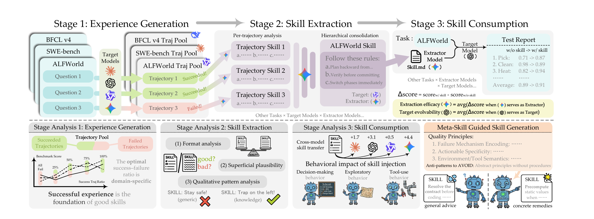
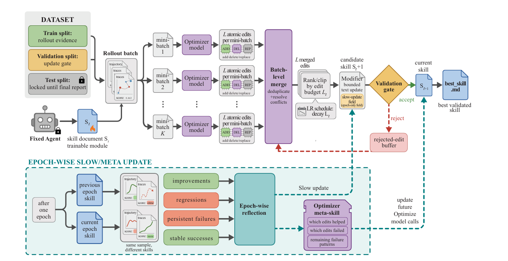

# 论文阅读：模型生成技能的提取、消费与自进化

## 三、论文：《From Raw Experience to Skill Consumption: A Systematic Study of Model-Generated Agent Skills》
### 1、观点1：模型生成技能整体有益，但存在显著的负迁移现象；提取器与目标模型的表现并非一致 —— 一个模型可能是优秀的提取器，却是糟糕的使用者，反之亦然；技能效用与模型规模、基础任务性能无关。
实验设计：
#### 2.1：实验设计哲学：全生命周期
该论文将skill的生成总结使用等生命周期总结为了三个阶段： "经验生成 → 技能提取 → 技能消费"。即工作中产生经验，从经验中提取成果，再将这些成果复用到下一轮工作当中，形成闭环。然而实验将总结出来的skill进行测试看性能是否增长。
#### 2.2：实验模块
总共涉及到5个日常生活常见的任务领域：
1. ALFWorld：具身家庭任务，需物理常识、探索、多步规划；
2. SpreadsheetBench：电子表格操作，需表格检查、公式推理、筛选、编辑；
3. SWE-bench-Verified：真实软件工程任务，需代码理解、故障定位、补丁生成；
4. SEAL-0：网页搜索问答，需检索、证据合成、多跳推理；
5. BFCL-v4：工具调用任务，需函数选择、参数提取、类型匹配、多轮工具使用。  
常见的模型选择：将模型划分为目标模型和提取器，共有以下：
1. 目标模型：GPT-5.4、GPT-5.4-mini、Gemini-3.1-Pro、Gemini-3.1-FL、Qwen3.5-35B、Qwen3.5-9B；
2. 提取器：排除无法稳定遵循结构化协议的 Qwen3.5-9B，其余 5 个。
### 3、实验步骤
1. 生成经验：训练集+测试集，让模型运行，收集轨迹，形成经验池
2. 技能提取：让提取器从经验池提取，使用一个统一好的框架抽成一个领域相关的技能，人工不介入
3. 将上面生成的技能放入目标模型的system prompt当中，再在同一个测试集上运行，并进行评估
### 4、评估指标
#### （1）Extraction Efficacy（EE）提取效能
- 固定提取器 E，看它给所有目标模型抽技能，平均能提多少分
>EE(E) = avg( Δ(E,M1), Δ(E,M2), ... )
→ 衡量：这个提取器稳不稳定、好不好用
#### （2）Target Evolvability（TE）目标可演化性
- 固定目标 M，看它从所有提取器获得技能，平均能提多少分
>TE(M) = avg( Δ(E1,M), Δ(E2,M), ... )
→ 衡量：这个模型容不容易被技能提升

实验结论
- 模型生成领域级技能整体有益但非普遍有效，负迁移不可忽视。
- 技能效用由提取器、目标模型、领域三者共同决定，与模型规模 / 基线性能无关。
- 技能效用不取决于格式 / 文本流畅度，而取决于失败机制编码、可执行特异性、高风险行为黑名单三类深层特征。
- 经验池的成败比例存在领域最优解，纯失败经验最差。
- 一个好的技能有以下规律：技能格式不影响效用，即体现形式效果影响不显著、文本合理性不预测效用，即读起来是否好和用起来是否有效关系不大、具体补救方案比广泛的建议更有效。
### 6、实验创新点
1. 首次全生命周期系统性研究：覆盖 5 大领域、6 个目标模型、5 个提取模型，完		 整回答技能 "是否有用、为何有用、如何用好"。
2. 效用导向的评估体系：用性能增益 Δ替代主观文本评价，提出 EE/TE 指标量化		 提取与消费能力。
3. 颠覆技能质量判断逻辑：证明文本流畅度与效用无关，发现 3 类真正决定效用的		 深层特征。
4. 即插即用的元技能优化：无需修改提取 pipeline，仅用提示词引导就全面提升技		 能质量、消除负迁移。
5. 经验配比的领域化结论：给出不同领域最优经验成败比例，为经验收集提供明确		 指导。

## 论文：《Executive Strategy for Self-Evolving Agent Skills》
### 1、核心观点：
现有智能体技能（手工编写、一次性生成、宽松自迭代）缺乏深度学习式的优化控制，无法在反馈下稳定提升。
提出将技能文档作为可训练的外部状态，用独立优化器模型进行可控文本空间优化，实现冻结模型下的领域自适应。
SkillOpt 是首个系统性、可控的文本空间技能优化器，通过有界编辑、验证门控、拒绝缓冲、慢更新等深度学习式机制，让技能进化稳定可复现。
优化后的技能具备强跨模型、跨执行器、跨基准迁移能力，且最终产物紧凑可解释、部署无额外推理成本。
### 2、实验设计
#### 2.1 实验设计哲学：文本空间可控优化闭环
将技能优化类比深度学习训练：技能文档 = 参数、轨迹编辑 = 梯度、编辑预算 = 学习率、验证集 = 早停 / 选择、慢更新 = 动量，实现稳定、可复现、可迁移的技能自进化。
#### 2.2 实验模块
1. 覆盖 6 大任务领域
- SearchQA：抽取式问答
- SpreadsheetBench：电子表格操作与代码执行
- OfficeQA：多轮工具办公问答
- DocVQA：文档视觉问答
- LiveMathematicianBench：数学多选推理
- ALFWorld：具身交互与序列决策
2. 模型与执行器设置
- 目标模型（7 个）：GPT-5.5/5.4/5.4-mini/5.4-nano/5.2、Qwen3.5-4B、Qwen3.6-35B-A3B
- 优化器模型：GPT-5.5（强优化器）/ 目标模型同源（匹配优化器）
- 三种执行器（harness）：Direct chat、Codex、Claude Code
3. 对比基线（7 类）
- 无技能、人工编写技能、一次性 LLM 技能、Trace2Skill、TextGrad、GEPA、EvoSkill
### 3. 实验步骤
1. 固定目标模型 + 当前技能，在训练集上 rollout 一批轨迹，收集成功/失败案例。
2. 优化器对失败 / 成功轨迹分别分析，输出结构化 add/delete/replace 编辑。
3. 按文本学习率（编辑预算）合并、排序、裁剪编辑，生成候选技能。
4. 在独立验证集评测，仅接受严格提升的编辑；拒绝项存入缓冲作为负反馈。
5. 跨轮次总结长效规律，写入保护区域，保证长期稳定。
6. 输出最优技能文件 best_skill.md，在独立测试集报告效果。

### 4. 评估指标
- 绝对准确率提升：SkillOpt 得分 − 无技能基线得分
- 相对超越幅度：对比所有基线的最优值的增益
- 迁移率：跨模型 / 跨执行器 / 跨基准保留的性能增益
- 组件有效性：消融各机制（学习率、缓冲、慢更新）的性能下降幅度

## 三、实验结论
- SkillOpt 在全部 52 个（模型 × 领域 × 执行器）组合中全部最优或并列最优。
- 在 GPT-5.5 上平均提升 +23.5 点（对话）、+24.8 点（Codex）、+19.1 点（Claude Code）。
- 技能效用不依赖模型规模，小模型受益幅度更高；优化器越强，最终技能越好。
- 技能更新极少即可大幅提升（平均仅 1–4 次接受编辑），最终技能紧凑（300–2000 token）。
- 关键机制缺一不可：有界学习率、验证门控、拒绝编辑缓冲、epoch 慢更新共同保证稳定优化。
- 优化出的技能是过程性通用规则，而非针对样例的死记硬背，因此可跨尺度、跨环境迁移。
## 四、实验创新点
1. 首次将技能进化建模为可控文本空间优化，用深度学习训练范式规范技能迭代，告别直觉式、不可控的自修改。
2. 全套类梯度优化机制迁移到自然语言，让文本学习率、小批量反思、验证门控、拒绝缓冲、动量式慢更新，完整可解释。
3. 6 基准、7 模型、3 执行器、52 格全部最优，效果稳定可复现。涵盖范围广
4. 训练完仅输出一个 .md 技能文件，不修改模型权重、不增加推理调用，跨平台复用。（这个跟我们的设计最终输出很相似，不过我们的输出技能文件更多）
5. 技能文本短小可阅读、可人工修改、可安全上线。
## 心得：
综上，根据这些学习到的知识，有以下感悟：
- 模型的心智就好像是那一堆固定好的参数，由于参数当中无记忆，或者难以使用成本较低的方式通过参数层面固定记忆，那么我们可以发挥模型高速阅读的长处，我们通过注入记忆相关的文本让模型短暂的拥有记忆，那么skill和给定的记忆文本质量将要进行严格的把控
- 在之前阅读过的论文和上面阅读过的论文而言，都总结出了一个核心要点：一个好的skill的内容不应当只注重于格式等表面信息，而是应当切实的记录一些宝贵的经验：具体的动作、禁止的操作、提高效率的技能等。这跟现实生活当中我们真人的学习很像，我们是否可以通过自己学习的方式找到一些灵感？
- 训练、进化的过程应当客观而非主观，并且更新的逻辑并非只是产出-对比-更新那么简单，SkillOpt这篇论文就提供了学习率-验证集-缓冲池-慢更新的一个进化流程
