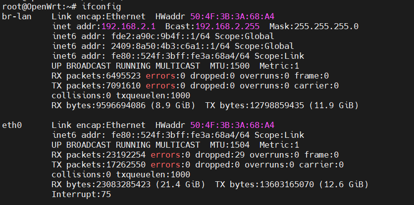
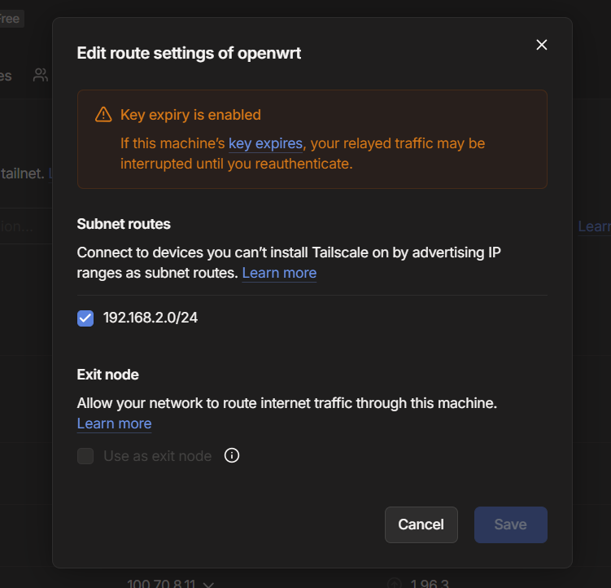
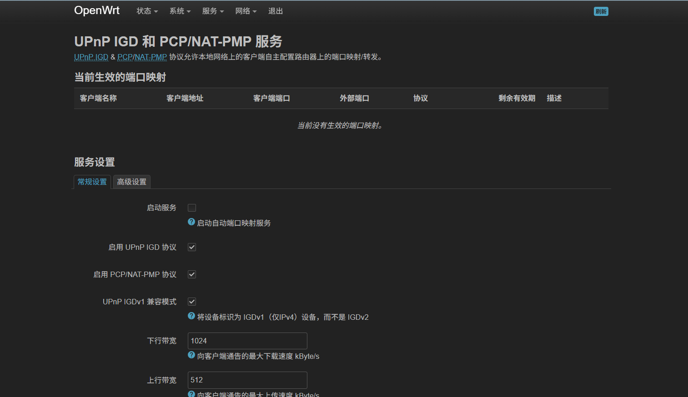
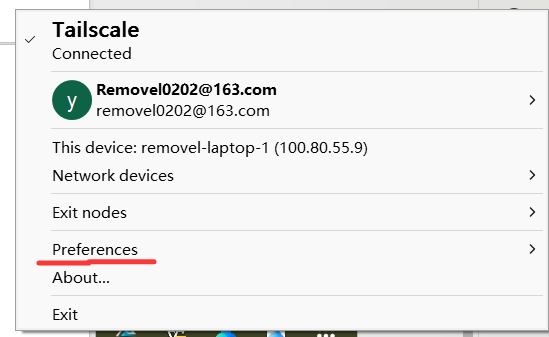
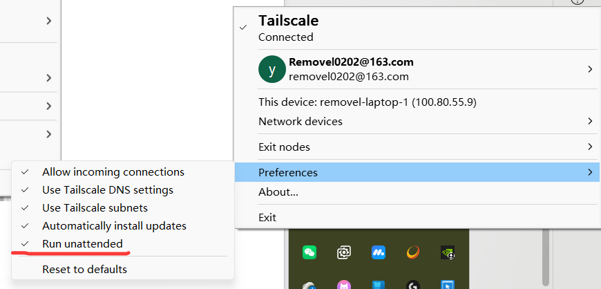

_"Pain is temporary, but gains are forever."——GigaChad(doge)_

# 从路由器选型到远程追番（三）：内网穿透优化

## 前情回顾

在我们上一篇文档当中，我们安装好了tailscale 软件，并将将要使用的计算机等对象加入到了我们创建的虚拟局域网当中。

（注意：ios用户需要一个外区账号来下载tailscale到手机上，国区无法下载tailscale。可以尝试使用侧载方法不通过外区账号来下载，但是这样的话下载的软件由于官方规定原因需要定期重新签名。）

那么此时，在这个虚拟局域网当中，我们的每一个设备都拥有了自己独立的IP地址，从网络拓扑的角度来看，此时这些设备在tailscale的网络下变成了同一个子网当中的设备，它们之间可以直接相互通信而不需要通过路由器等设备。于是乎我们可以利用这些特性向着我们的最终目标进发。

## 问题描述

然而我们大概率会发现一个问题（比如我自身就遇到了，如果没遇到就仅供参考了hhh）：在现实当中的网络拓扑结构或许会是这样的：

- 子网A：路由器a，设备c，设备d，c、d通过路由器a对外部网络进行通信
- 子网B：路由器b，设备e，设备f，e、f通过路由器b对外部网络进行通信
- 复杂外部网络下（比如出门在外时携带的手机、笔记本电脑）的设备g、h，网络处于难以描述或者清晰结构的网络当中。

> [!NOTE]- 网络拓扑示意（补充）
> ```
> ┌─────────────────────┐     ┌─────────────────────┐
> │ 子网A (192.168.2.x) │     │ 子网B (192.168.1.x) │
> │                     │     │                     │
> │  ┌─────┐  ┌─────┐   │     │  ┌─────┐  ┌─────┐   │
> │  │设备c│  │设备d│   │     │  │设备e│  │设备f│   │
> │  └──┬──┘  └──┬──┘   │     │  └──┬──┘  └──┬──┘   │
> │     └───┬───┘       │     │     └───┬───┘       │
> │    ┌────┴────┐      │     │    ┌────┴────┐      │
> │    │路由器a   │      │     │    │路由器b   │      │
> │    │OpenWRT  │      │     │    │ (光猫)   │      │
> │    └────┬────┘      │     │    └────┬────┘      │
> └─────────┼───────────┘     └─────────┼───────────┘
>           │         互联网        │
>           └──────────┬───────────┘
>                      │
>          ┌───────────┴───────────┐
>          │  Tailscale 虚拟局域网  │
>          └───────────┬───────────┘
>                      │
>           ┌──────────┴──────────┐
>           │                     │
>      ┌────┴────┐           ┌────┴────┐
>      │ 设备g   │           │ 设备h   │
>      │ (手机)  │           │ (笔记本)│
>      └─────────┘           └─────────┘
>       外部/移动网络             外部/移动网络
> ```
> *外部设备g/h通过Tailscale只能直连到路由器a/b（网关设备），而路由器下的设备c/d/e/f则可能无法直接访问。*

此时我们会发现，若此时想通过设备g/h访问子网A/B当中的设备，即使该子网的设备都已经加入到了创建的虚拟局域网当中，g/h设备也只能通过tailscale对路由器a/b，即子网对外网关设备显示p2p直连而子网下的设备显示依赖于某个tailscale官方提供的服务器。此时对路由器访问的速度很快，但是几乎无法访问到路由器下的设备。

这里的原因可能有很多。本人也没有搞明白是为什么。可能的情况有以下的原因：

- 路由器开启了某些代理服务，使得tailscale的流量被错误的通过路由器代理到了别的链路上，而那个链路本身的时延比较高
- 防火墙开启导致某些端口收到的来自tailscale的包被屏蔽
- NAT协议不适合Tailscale的软件的数据交换的要求
- 双方之间至少一方的网络本身比如强度、带宽、拥塞程度、时延等网络条件差

除此之外问题还有很多，此处不一一赘述。但是本人觉得最有可能的问题还是NAT导致的问题。

面对这种情况，为了实现我们的伟大目标（tech otakus save the world！雾~）我们必须将该服务升级优化成可使用高稳定性的服务。于是我们使用以下方法，来解决包括上面在内的一些问题：

## 优化一：子网宣告

总体介绍：通过tailscale的子网宣告指令让路由器开放其所在子网，使得路由器下的设备即使未安装tailscale也能够通过路由器的子网宣告来对其进行访问。

步骤：

- 针对在某个子网下的路由器，我们需要通过ifconfig指令得到路由器的IP地址以及其子网下的子网掩码。用于宣告子网命令参数设定：



比如我们这里就可以看到路由器的IP是192.168.2.1，其子网掩码是255.255.255.0（即为/24，计算方法详见《计算机网络》）doge，实在不会截图或者复制粘贴问ai）

- 然后在路由器上启用命令：

```
tailscale up --advertise-routes=192.168.2.1/24
```

对于客户设备需要：

```
tailscale up --accept-routes
```

对于mac/windows而言一般自动会accept，不需要使用该命令，linux就需要。

- 之后还需要在tailscale的console上对应的路由器批准开启子网路由，找到你的网关设备，点击其右侧的 ... 菜单，选择 Edit route settings。勾选你刚刚宣告的子网，点击 Save 保存，如图：



这里我已经保存过了，正常来说点击save即可。

## 优化二：UPnP 服务

总体介绍：在路由器上开启upnp服务，自动建立对外对内端口的映射关系，减少了手动设定端口映射的麻烦，提高远程访问稳定性服务。

（Tips：upnp是什么？你在家庭网络中最常接触到的其实是它的一个子功能：NAT 端口映射。简单来说：

- 自动开端口：内网的设备想从外网访问，本需手动登录路由器做端口转发。UPnP 允许设备自己告诉路由器"请把某个外网端口映射到我这儿"。
- 即插即用：设备加入网络后自动协商，游戏联机、P2P 下载时，UPnP 能在几秒内打开所需端口，结束后也可自动关闭。）

步骤：

- 我们使用miniupnp为例子，在openwrt上，类似于安装tailscale的方式，我们搜索并安装miniupnp即可
- 为了可视化操作，建议同时安装luci-app-upnp（记不太清了，反正是类似于这个格式的名字），之后你能够在service（服务）上看到upnp设定相关的内容
- 其实此时一般而言就没有问题了，如果后续有更高的需要，可以在可视化界面手动设定相关功能即可。重启路由器，此时一般来说就能够运行该服务了，通过远程桌面等内容我们能够看到相关的效果，页面在openwrt上如下：



## 优化三：远程唤醒（WOL+etherwake）

总体介绍：远程唤醒的方式在网上有很多，但是有没有最经济，最好玩的打法呢？有的，兄弟，有的。使用wol+etherwake的方法，我们能够通过ssh到路由器并输入相关指令远程启动计算机，从而避免使用类似于智能插座、X家开机卡、第三方厂商软件等可能需要马内的路径

步骤：

- 进入主机主板的bios界面，一般而言，比较新的主板都会支持WOL操作，具体开启方式请参考你自己的主板厂商的说明书或者向客服询问，确保你的电脑能够支持WOL（Wake On Lan）模式并保证开启了此模式
- 进入你的操作系统，在设备管理器当中选定你的常用的上网使用的网卡，在网卡当中开启数据魔包唤醒、允许网卡唤醒设备、保持网卡运行等操作，具体内容可以从网上查找资料或者询问ai
- 在路由器上安装相应的命令：

```
opkg update
opkg install etherwake
```

之后能够通过该命令通过指定参数唤醒对应设备。（PS：如果你要远程链接的设备都在同一个局域网的网段下，那么其实也可以不使用该命令在路由器上。你可以使用别的软件，只要能够发送数据魔包唤醒设备的都可以。此处举例常用的串流软件moonlight&sunshine，在设定完备的前提下，你可以通过moonlight事先添加你要唤醒的设备，然后使用moonlight上唤醒该设备的功能也能够唤醒目标设备）

- 去你的目标设备查看你之前设定好的网卡的设备的mac物理地址，比如：10:E3:31:98:32:45，用于标定你要唤醒的设备
- 查看你的目标设备连接到路由器的网口是哪一个，这个可以到路由器的操作台页面查找。比如我的就是br-lan。
- 确定完以上步骤之后我们便可以使用命令远程唤醒了，ssh到路由器或者别的方式进入到路由器系统的终端界面之后，输入命令即可：命令模板如下

```
# 远程唤醒：
/usr/bin/etherwake -i br-lan -b [MAC]
```

例如：

```
/usr/bin/etherwake -i br-lan -b 10:E3:31:98:32:45
```

## 优化四：开启 SSH 服务（扩展设想）

总体介绍：开启ssh服务并允许外部ssh到目标设备

> [!NOTE]- SSH 服务配置参考（补充）
> 以下是开启目标设备 SSH 服务的基本步骤，供参考：
>
> **Windows 设备：**
> - 设置 → 可选功能 → 添加功能 → 搜索"OpenSSH 服务器"并安装
> - 以管理员身份运行 PowerShell：
>   ```
>   Start-Service sshd
>   Set-Service -Name sshd -StartupType 'Automatic'
>   ```
> - 确保防火墙允许端口 22：`New-NetFirewallRule -DisplayName "SSH" -Direction Inbound -Protocol TCP -LocalPort 22 -Action Allow`
>
> **Linux 设备：**
> - Ubuntu/Debian：`sudo apt install openssh-server && sudo systemctl enable --now ssh`
> - 检查状态：`sudo systemctl status ssh`
>
> **macOS 设备：**
> - 系统设置 → 通用 → 共享 → 开启"远程登录"
>
> 配置完成后，可通过 Tailscale 分配的 IP 进行 SSH 连接，如 `ssh user@100.x.x.x`。

步骤：我没做过，在出自之外的优化已经足够我使用，这里提供这样的设想，可以通过询问ai或者网上查资料的方式来实现

## 优化五：Tailscale 无认证运行

总体介绍：开启tailscale的无认证运行保证服务可用

步骤：

- tailscale虽然默认开机自启但是在某些情况下会遇到没有登录导致无法开启tailscale的情况。此时如果你通过上面的etherwake的方法开启了目标设备，但是你没有安装上面的方法开放目标设备的ssh服务，那么你这时候会面对很尴尬的处境：连接不到、无法关机。该优化就是针对这个问题。
- 找到你的tailscale的任务栏界面，选择偏好：



- 选择run unattended：



这样会使得tailscale在未登录的情况下也能够运行，防止上面的问题发生。

## 总结

目前就是我对tailscale的一些优化方法。在下一个文章我们会偏向于软件服务层面，正式部署并运行属于自己的远程追番的服务~