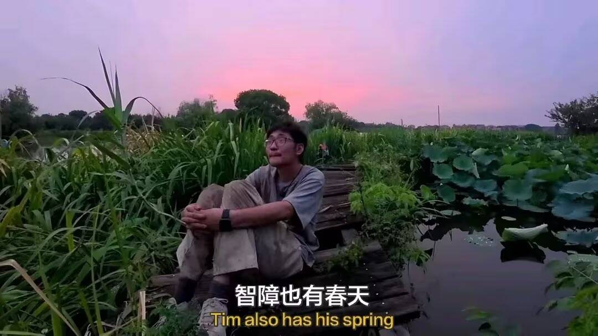
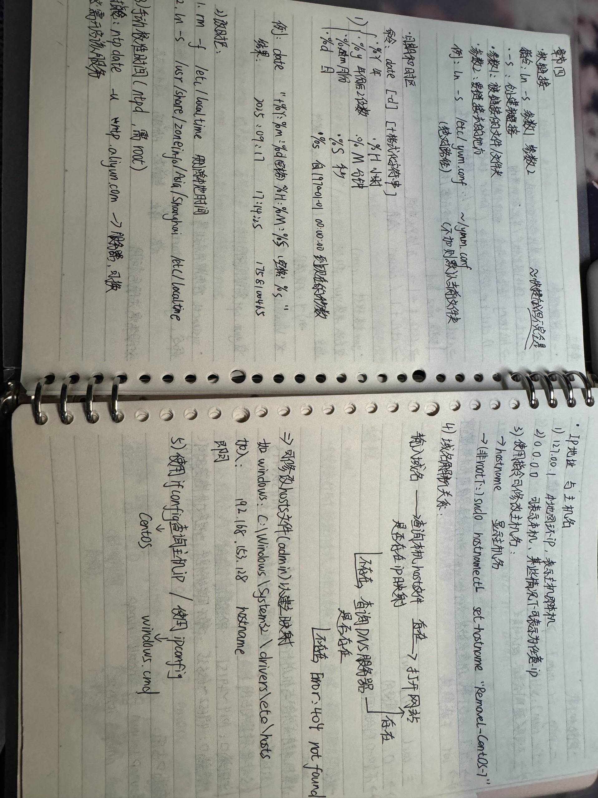
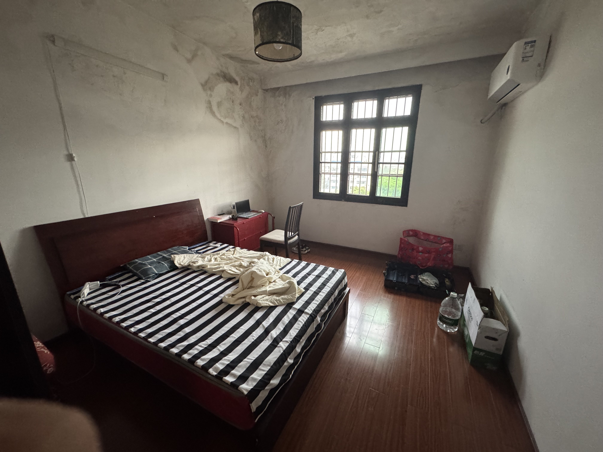
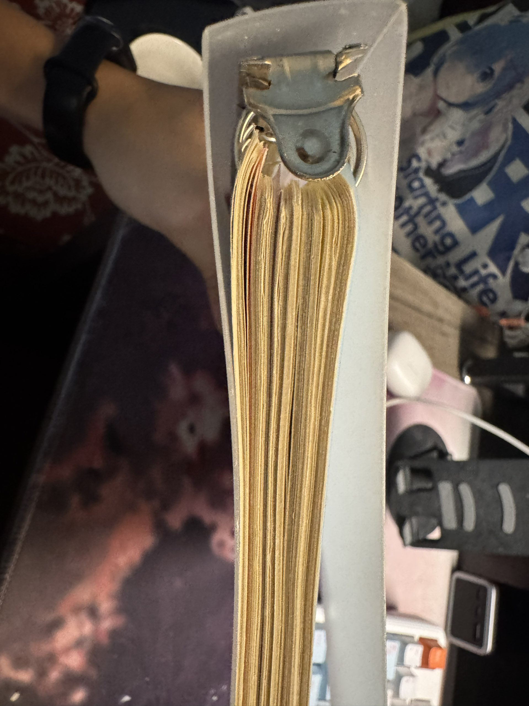
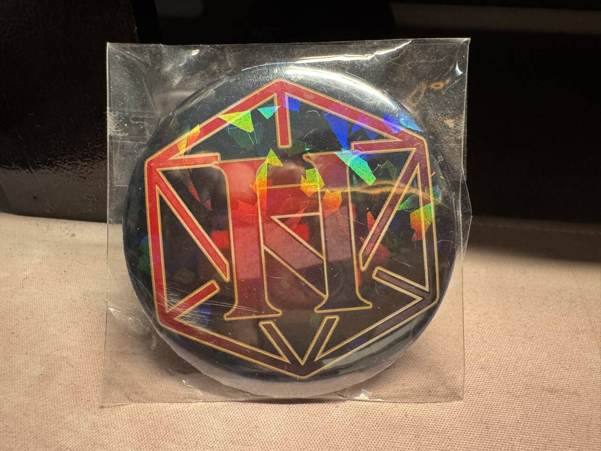
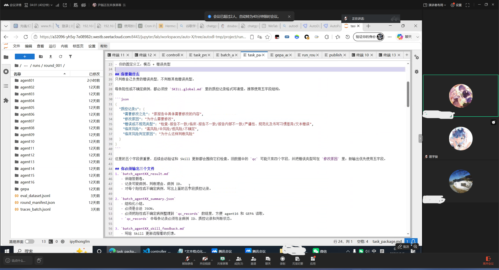
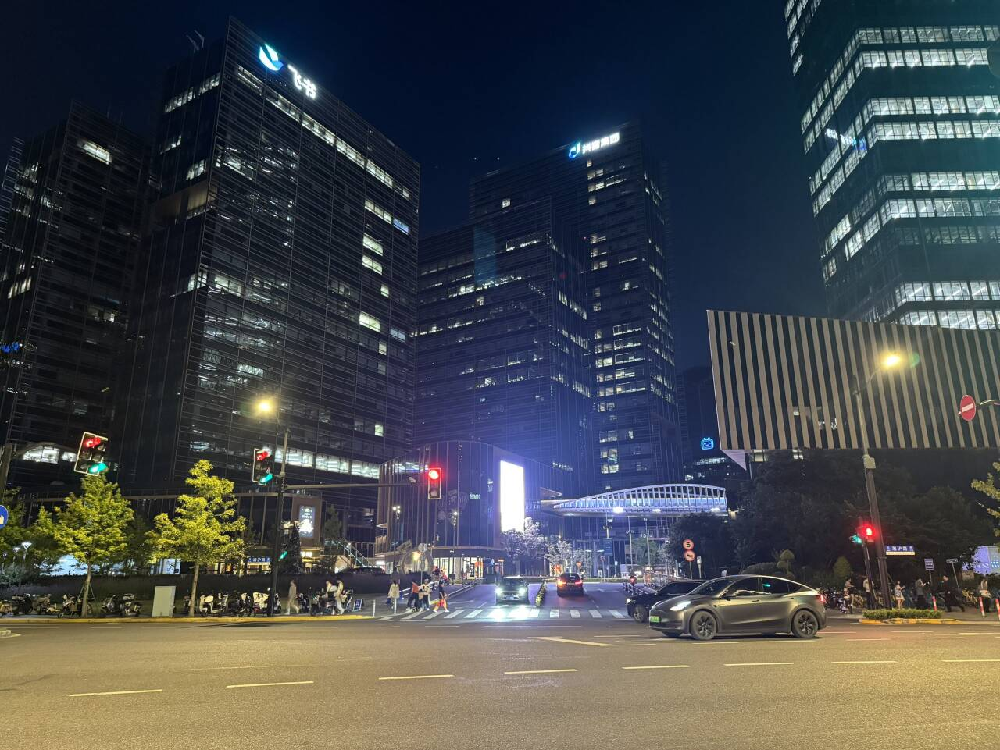
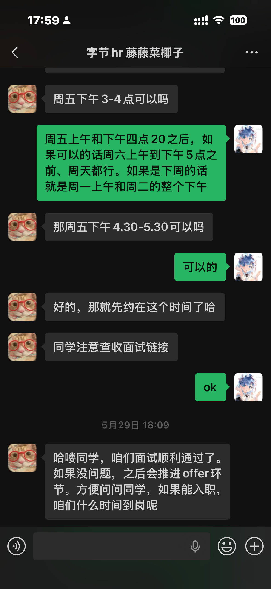

*这就是学计算机的下场！（雾~）*

# 就用这篇文章记录我过去的一年

自从开始投递实习、准备面试以来，就想要想要写这一篇文章了，但是现在真的想要开始写又不知道该从何处开始下手。这篇文章我并不想要写成所谓网上常见或者烂大街的什么学习路线，那样写起来或许太过于功利，这并不是我的本意。我只是想要用这篇文章or作文记录我过去一年从大一结束到大二结束几乎是从零开始学习计算机到找到第一份实习（字节跳动）的经历，以及我的大学生活和一些个人的感悟。

**叠甲：该文章可能会出现大量主观观点/片面事实/暴论/事实性认知错误，仅供参考，切勿上升个人**
*不过这篇文章估计也不会有什么人看就是了*

(我belike：⬆)那么我们现在开始吧～

## 缘起

当提起计算机，或者电脑这个名词的时候，你最先想起的是什么？对于还没上大学前的我来说，计算机的概念或许只停留在班级上同学用一体机讨论人工智能（更准确的来说，应该是大语言模型）、spacex、刻板印象当中高楼大厦里带着眼镜穿着格子衫的程序员。那时的我听不懂同学们说的话，我只是肤浅的对电脑的组装与选配件之类的有些许兴趣。高一的时候尝试过自己组装一台属于自己的台式机，然后尝试着跟着网上的教程做一些系统的设置之类的。那时的我朴素的觉得自己对计算机感兴趣。觉得自己喜欢计算机的硬件。高考出分填报志愿的时候，也是毫不犹豫的选择了计算机这一个专业。说来也很奇怪，在做这一类影响至少之后三年甚至有长远影响的时候，我基本很少犹豫：高中学科选择的时候，在发选课通知不到一个小时我就确定了自己选择物化政而非传统理科；在选择大学专业的时候也是第一目标专业也很快确定了。相较于一般家庭或者个人来说，在这一方面花的时间和精力确实比较少。最后高考出来的分数其实一般，但是很幸运，湖南大学接受了我，在我当时至少还缺3千名排名的专业，智能科学与技术（在未分流之前叫做计科智能）竟然把我录了进去。我记得当时在浙江台州，和家里人自驾游玩，车开在一座大桥上，我打开湖南大学的招生网站尝试查找是否查询得到自己的录取信息，在跳出查询成功的网页那个网页的时候，我几乎不敢相信自己的眼睛。我把信息告诉了当时在车上我的姐姐，分享给我的父母，不到半个小时，家族群里便都知道了我考取大学的信息。

于是啊，我这稀里糊涂的计算机路开始了。

或许这一段写的有点长了，似乎有点偏题？但是无所谓，这篇文章我只想说说自己的经历就让文章随着思绪如流水般回环流动吧～

## 大一：保研的幻灭

刚入学时，我给自己的目标是保研，但是又因为网上的很多观点认为大学没有必要像高三那样或者高二那样投入如此多的时间在学习。但是随着我的生活发选如果想要保研，所需要付出的代价和努力是极其惊人的。这同样是一场你死我活的圣杯战争。打个不恰当的比喻：零和博弈，赢者拿到一切，输者一无所有。那时的情况有多夸张？我至今忘不了我的最开始的舍友一个在我中午睡醒之后看到的第一个动作是刷宋浩老师的高数750题，另一个是打开学校提供的ide在哪里敲着不知道从哪里找到的代码题。这对我对大学生活的看法有了强烈的震撼。大一有强制（至少原则是这样）的晚自习，作为新人也是很老实的去了。甚至因为想要保研的想法我甚至尝试着提前半个小时到，晚40分钟回宿舍，也就是从六点半到九点四十的自习时间。但是当我因为某些原因又晚了20分钟，十点多才回到宿舍的时候，我发现宿舍竟然没有一个人回来，直到十点四十他们才讨论着高数题目和代码算法，推开门，回到宿舍。当时的我受到了极大震撼，但是又安慰自己说，没关系的，投出时间多并不意味着成绩好，最后还是要看成绩排名。于是我之后更加努力上课：高数、程序设计、线性代数……我没有在不得已的情况下翘过任何一次课，少过一次作业，我甚至每周末都抽出一天的时间用在综合楼写作业和查阅不会的知识点。即使老师讲课讲的一坨，但是我觉得还是我自己不够努力的问题。我觉得那时的我做到了自己在不危害身心健康的前提下的最大努力。生活上，因为个人刚入学时非常的敏感+自卑，而且又是因为受到高中时遗留的优绩主义：成绩衡量价值的影响，导致我在学习上对自己的价值经常产生质疑。同时寝室因为作息习惯+卫生+交流习惯的原因，导致即使是换了寝室，舍友没有卷的起飞的情况下，生活也过的很憋屈（这里涉及到很多不想回忆的事情，就不详细写）。

想起大一结束时，学习上成绩只在专业中游，即使每节课都认真听、每次作业都认真做、每次考试前都刷卷子+整本书复习。日常上是这样：被舍友搞到两点半才能睡得着的你爬起来上早八，在不定时刷新黄金巨蟒加洗手台蠕动着数不清的孑孓般的虫子的洗手间完成洗漱，离开堆满了外卖袋子和快递箱和垃圾的宿舍，被两大节老师讲的一坨狗屎而且课程存在意义不明的专业课被弄得一头雾水，中午吃完饭回到寝室整理一下准备睡觉但是翘了整个早上的课的舍友开始吃起了他的味道巨大的外卖+抖音外放/游戏开麦。下午去教室写根本看不明白的作业+运动，晚上想要放松一下，安静的打打游戏或者做点自己的事情，但是经常被舍友打游戏外放+fps游戏常有的大叫使劲打搅。直到十二点半才能停下，一点半关灯，两点人初静。

最后整个人崩溃了。宿舍问题无法解决，学习问题也无法解决。我的父母只会指出指责我心里过于脆弱，要我依旧待在宿舍里"磨练"。我无法忘记那个晚上我在后湖一边打电话一边跑步一边被父母说的情绪失控的大哭，但是最后依旧没有任何可行的改变；我无法忘记大家都能做代码题做到75分的情况下只有我只能做到25分；我无法忘记自己曾经鼓起勇气在医院终于约到一次心理医生，却被医生灌鸡汤敷衍了事还收了我250块钱；我无法忘记那一个个学习学不明白，第二天有早八但是两点半还因为宿舍的原因睡不着的日子。

## 赛道切换：从零开始

保研和考研的想法便在这一天天的磨烂腐烂了，于是道心破碎。同时也在这个过程中，我发现自己对学术学习这条道路根本没有兴趣，我更在意的或者感兴趣的是用代码技术设想、创造出属于自己的产品、项目。这是就业相关的方向。于是切换赛道，准备本科就业。在放弃了研究生这条赛道之后，来到就业上，我开始了我的长征路。

先说说开始的时候有多难吧：语言上只会使用学校教的cpp，甚至连cpp的常用stl容器比如string，vector之类的都用不明白，更不要说map、set之类的，这些东西的概念都不清楚。然后是ide方面：只使用过学校提供的devcpp（对，就是很老的那种，连自动补全和语法纠正这类最基本的功能都没有），在技术栈上不能说稍微会点东西了，至少也是白的像纸一样了，什么技术框架、什么概念，编程的基本范式或者结构等都没有了解过。甚至我连自己要学什么，向着什么岗位学习的概念都不清楚。但是，至少我开始走了这一步不是吗？

现在按照timeline来讲讲我都做了哪些尝试，这些尝试不仅仅只是学习上的，也会有生活上的。

## 探索之路

在大一暑假的时候，来自于高中对所谓"硬件"的朴素的幻想，加上本专业也有物联网方向分流的情况，于是我最开始尝试的是嵌入式。于是我买了一个51单片机，按照网上最火的教程跟着走：安装驱动、安装软件：keil5（用于编写将要在单片机上运行的程序）、stp-isp软件（用于将电脑上实现的代码烧录到单片机的存储器当中。跟着教程，我成功实现了每个看这个教程的人的第一步：点亮一个led灯。我依旧记得当时坐在家里，用着自己的笔记本电脑，用着usb串口线连接到开发板上，isp软件点击上传，在51开发板按下启动（我记得应该是开机的按钮）的场景，那个灯竟然真的亮了起来。我第一次实现了将代码转化为可实际观测到的"产品"。虽然这只是一个在现在看来再简单不过动作，但是这一小步是我的"一大步"。后面还深入到一些显示屏、矩阵键盘的知识。不过遗憾的是，因为家里的压力和一些自己心里情况不太好，后面也就没有再跟着学下去。从现在看，其实这个学了也没有什么用，因为该方向主要是跟微电子、电气专业相关性会更强，再者就是机器人相关专业，最后才是物联网。而且其使用的ide等教学方式也是很老的内容了。所以其实价值没有那么高。但是其也有重要意义的地方：其在编程过程中遇到的引脚、总线等相关知识，确实很大一定程度上弥补了我当时在对于理解整个计算机体系上的不足。让我从只会写简单的cpp代码然后在蹦出来的的终端上显示内容这一狭隘的认知上进化，从而了解到用软件控制硬件的一种实现方法。另外回旋镖的事情是，在这个学期的《电子测量平台与工具》这门课上，竟然恰好用到了相关的知识，在完成课程作业的时候没有那么痛苦哈哈哈。这就是我的第一次尝试，从暑假前期到暑假中期。

在暑假做的另一件事情，便是当时因为装过电脑系统的缘故，知道系统不只是只有windows，还有macos、linux（对，当时就只知道linux，甚至认为它是一个系统hhh）。通过日常的一些刷视频、聊天等内容知道所谓业界上都很少甚至不使用windows作为什么"服务器"部署，于是乎又萌生了学习linux的想法。于是在放弃了单片机之后，我直接在B站上搜索Linux，很快啊，黑马的Linux教程开始了。这一次我没有像上次那样就看到一半，而是真的是几乎全部看完了，相关Linux的学习也很"学生化"，相关的笔记记了几十张纸。

跟着教程才理解到Linux只是一种类似于系统内核的东西，实际上的系统都是centos、ubuntu、arch Linux等内容。过程中安装了vmware用于虚拟机的搭建、finalshell用于和虚拟机之间用终端交互。总结下来确实是一次非常有用的尝试与探索。了解到了很多命令行相关的知识和操作，另外像是用户组、执行权限、系统环境、命令行安装软件的等跟os相关的概念都非常有用。另外又是回旋镖的是，在这个学期的《计算机系统》这门课当中就用到了vmware和ubuntu系统。在探索完Linux之后，这些操作对于我而言完全没有难度（虽然这门课的本身的知识确实很难就是了），相较于繁琐的开虚拟机的方法，我选择了更加方便的wsl。在别的同学手忙脚乱，折腾操作的时候因为已经踩过坑的我反而更加的从容不迫hhh。这一次探索应该是在大一暑假的中期到末期。

## 独立：搬出宿舍

哦？你问我大一暑假最后我做了什么。我想我能够告诉你我做出了或许是我大学生活最重要的一次决定。我记得清楚：8月19日，我提前回到了学校（当然没跟导员说hhh借的同学的门禁）。自从我的父母在我生活上，在我面对如此大的问题的情况下，竟然不能支持我做出合理的选择，或者提出更好的解决方案，而是将我控制并按照他们的想法塑造成他们想当然的样子，外加只会指责我的问题否定我提出的方法。我便意识到他们并没有把我当作一个独立的个体看待，虽然嘴上说把我当朋友，但是实际上并不是那样。于是我从那时开始就不将父母作为一个合理可靠的解决问题的方法与途径。同时心理医生的敷衍也告诉我，世界上没有人能够帮助你走过难关，你要用你的意志和行动独立打爆这个傻逼的世界，永远不要期待着有人能来帮忙，包括你的家人，父母，朋友。我是一个独立的人，当前对父母的需求是因为尚未拥有足够的能力去应对生活和学习。我认为在这个阶段提供物质上的支持是义务性的。因为他们肯定也有过这样的阶段，而且作为收到支持的一方拥有追求自己的想法的权利（只要不违法不违背公序良俗），即使提供支持的一方不支持。不是说因为"我给你钱"那么"你必须听我的""你没有条件谈自由和要求"，那这样养小孩其实跟养狗没什么区别。可能小孩还没狗活得滋润。在这样的观念下我决定执行我当时的想法：出去租房。租房费用从我自己每个月的生活费当中出，不需要父母给钱，提早到校就是来找房子的。找房子的事也不用他们操心。于是我基本上每天都去看两三套房子至少，剩下的时间用于找房源、学习、打游戏等。幸运的事差不多一周以后我成功找到比较理想的，并现在都住在那里。即使父母不支持，但是生米煮成熟饭，他们最后也没办法，只得妥协哈哈哈。于是到了暑假结束的时候，我从宿舍搬了出来，搬到了我现在住的地方。我记得正式住进去的日子是九月六日。到现在已经快要一年了，时间过的真快啊！现在还能翻到刚搬进来前我的房间的样子。现在和之前已经完全不一样了。

我搬进来时带了一盆绿萝，现在它最长的枝蔓已经快有我手臂那么长了。再回旋镖的是（话说怎么那么多回旋镖哈哈哈）我父母当时说你出来住找房子积累这个技能干什么？现在我在实习的时候就要租房子，正好用到我当时租房子的经验，不至于到了一个陌生的地方做陌生的事情而手足无措。

## 数据库与前端初探

我记得在找房子空闲之余的时候也没有闲着。那时候很单纯，因为大一上的图书管理系统程序设计大作业（这里可以看GitHub我大二寒假重新写的一份：
> https://github.com/Removel/Library_Management_System   

这个基本上能满足老师的所有要求）的拓展部份有人提到数据库相关的知识，于是我尝试着了解数据库。于是……没错！又是黑马，我开始学习mysql这一个最简单、入门、但是用的又最多的数据库。我记得当时我在电脑上一个屏幕用来看视频，一个屏幕用来开启命令行界面用于跟着屏幕教程慢慢敲sql语句，什么select、delete、insert、update……，那时候我也只是知道数据库怎么从终端页面连接、查询。过程中跟随教程还装了除了MySQL之外的软件：jetbrain的Datagrip（好像就只有这个了）。使用datagrip能够更快的连接到数据库db，而且在创建console控制台和创建库表等操作更加方便……总的来说，这个过程还是很有意思的。我记得我当时在学习使用了这些内容之后就开始幻想着如何使用它们，加入到自己的项目当中。不过当时还没有学orm抽象数据层的框架，于是这些内容也只是停留在幻想和想象当中。不过仅仅只是这些想法就让我觉得很有意思。经常在骑着自行车在路上上下学的过程当中还思考着如何使用，以及会怎么使用。但是其实到后面mysql学习完基本的增删改查之后就停下了。再深入了解底层知识比如索引、引擎、数据结构、语句优化等内容都是很之后的事情了。这个初步学习mysql大概持续到了十月初的样子

## 幻境社：梦想与现实

在暑假结束的时候，我也逐渐开始的了解到了未来可能相关的职业。这就不得不提到我在八月初左右加入的岳麓幻境社了。这个社团是一个专注于minecraft的社团。包括我本身对于我的世界的生电玩法比较感兴趣，之后就加入到了该社团当中。开学之后，社团的社长高同学野心蓬勃，他想要创建一个不一样的社团，他想要通过自己的实力和技术手段把整个社团变成一个能够有产出有作品、不仅仅局限于玩游戏的社团。他在群里发布了相关的招人通知，此时对技术需求很大的我踊跃报名了，幻想着能够在社团当中找到一个大佬能够带我起飞，学习到一些相关的计算机知识。高同学确实在当时给了我很大的震撼，他通过某些渠道联系到了网易的一些项目的小领导，并且把他们邀请到线下来给我们讲讲之后他和这些人想要让我们做的事情。我记得当时的情况是让我们用lua脚本语言通过调用官方给定的工具的api为地图的ugc玩法提供地图设计和玩法关卡。这也是一个能够再写一篇文章的事情了，这里放不下。我只是说说这件事的结果如何以及我从中学到了什么。结果是，官方给的文档过于拉跨，加上我本身也没有掌握很多代码的知识，比如什么是lua脚本都不知道，包括当时ai编程还没有现在那么完善，当时也不知道。（即使是这些问题我也强撑着去做了。）做完一个demo之后发现自己的水平实在是不足以支持策划和设计们的需要。而且在过程中发现这个内容跟自己想要学习的方向不太匹配，于是就体面退出。后来这个事情我也没跟进，虽然说有回报比如物质上的，我没看到就是，虽然我也不在乎这些。我只是从那时就觉得，自己似乎被利用了，而且是没有奖励的那种利用。从我的个人主观层面来评价，其实这个项目就是大厂的某些领导想要把手伸进学校，然后恰好我们这里有个冤大头+一腔热血但是没啥主意的一群冤大头，帮别人打工。我当时还觉得是自己的问题，做不出来这些。现在看来也就那样，那时的我过于讨好，总是想要不让社长失望、不让组员失望。当时的我做出那样的行动太正常不过，我记录着，9月中左右开始这个，十月中结束了这个动作。我当时天真的以为有人能带，事实再一次验证了我之前的结论：不要想着有人来帮你，一切都要靠着自己。组内的成员最会代码的就是我了，虽然我也是半桶水。这里关于幻境社我有很多想说的话，不过碍于篇幅限制这里就不说了。之后这个社团还会反复出现。

从有记录的日期计算，从10月14日开始几乎每天至少一道力扣的题目。持续了5个月左右的样子。途中因为考试上课突发情况等有些时候不会写，一般一周4~5题左右的样子（~这样如此5个月~——《杀死那个大学生人》bushi），到现在时不时有时间也会做题，主要是跟着灵茶山艾府在力扣推荐的题库做题。可以看看GitHub的刷题仓库：
> https://github.com/Removel/LeetCode.git

十月中，我开始尝试学习前端相关的知识。最开始的时候是学习前端三件套：html、css、JavaScript这三个。html用了几天的时间把课程过了一遍（没错！又是黑马），然后是css的内容，这一块在后来看其实用处不大了，因为css本质上就好像把各种不同的积木拼在一个对象上，让这个对象显示出不同的效果。AI时代来了之后反而人学习和写的不如ai快而且质量高了。并且相关于布局的部分和css继承之间的部分比较繁琐，很多细碎的知识点很难搞得明白。于是在看完了大概百分之九十的部分的时候开始看JavaScript的内容。关于JavaScript，很多基础的语法也是过了蛮久的。然后就是跟网页api比如按钮、表单、Dom操作相关的一些内容。就这样一直学习到了10月结束。在这个时候开始逐渐了解到后端相关的知识，发现学习后端可能比前端更好一些。并且之前学习过MySQL。在综合考虑下开始逐渐放弃了前端的内容转向后端，自此开始了一个漫长的路程。总结一下前端相关部分的学习：在学习css和html的时候其实是跟着黑马学习的，但是发现内容太繁琐了于是在学习js的时候跟的是尚硅谷的快速学习的版本hhh，虽然现在看来js也不够，还得要学习ts（TypeScript），并且过程中也都只是非常非常基础的学习。类似于框架比如react和vue都没有任何的接触。不过学习前端还是能够比较好的及时看到一些反馈。在学习的过程当中对网页的web的一些知识有了比较基础的了解。比如知道了网页上的很多文本之外的内容都需要通过url加载，网页的布局本质上是一个一个div嵌套和布局。在现在看来其实我当时接触的内容还是很少，更多的比如组件、网页常见的中间件、网页的console控制台、一些前端+web的八股都不知道。但是你要说没有用处是假的。在现在开发一些个人的项目的时候借助ai还是能够快速的开发一些前端功能不至于什么都看不懂的。

## 后端学习：JavaWeb到Spring

在十一月开始，javaweb——启动！java的后端虽然网上烂大街了，但是你不得不说确实在这一块还是有很强的竞争力的。先来说说它的缺点：1、内容巨量，涉及到非常多的子系统的使用：不同的数据库db、消息队列mq、java本身的业务处理的代码、云存储oss、spring的基本框架等，随着未来业务的发展，其实对象的使用不只仅局限于MySQL。现在用到的对象或许有：db：redis、elastic search、Oracle、pgsql、mongodb等等； mq：rabbitmq、kafka、rocketmq等 spring下更是有许多：spring aop、spring security、spring boot（最基本的）、spring ai 等；还有日志工具，这里不详细讲，实际上在工作当中还会涉及到大量的第三方平台的（比如公司内部使用的）接口的调用。对于一般的学生想要学习而言，找实习一般用到mysql+redis差不多了。如果更加深入就加一个mq。这一个部分的主线基本上就是跟着黑马的javaweb去学习整个教程就好了：1、javase：在这个系列的教程当中能够很好全面的学习到java的代码的知识（不得不说的是，通过学习这一个部分的教程加深了我对整个纯代码体系的理解，比如异常捕获、语法糖、一些高级的api的调用、线程运行与并发等） 2、javaweb：重磅开源系列，教你如何使用javaweb中常见的项目开发使用的技术：springboot（这一个部分内容确实非常的多，但是整体学习下来之后又觉得好像又没学什么呵呵呵）通过学习这个你能够构建一个最简单的属于自己的后端的程序，比如helloworld输出到前端（btw：该教程中相关于前端，即到maven使用之前都可以不看）；mybatis：最核心的抽象数据层的框架，用于和mysql这种数据库之间进行交互，从而避免了使用jdbc这种比较繁琐的底层连接；oss：云端存储非字符串的文件（其实这里没有那么必要，可以当做拓展部份学习）；基本业务：jwt等登陆、表管理等基本的业务接口的开发（这一块对逻辑性拓展和代码流程管理能力还是很有帮助的）；maven：使用maven构建项目（这里不仅仅只是maven，在之后会接触有更多的构建工具，比如java的gradle、前端的pnpm、npm，cpp的cmake之类的，这里主要是学习它的基本的一些概念和方法，在之后就是一通百通触类旁通了）。后面的项目由于当时赶着时间学习的原因就没有更多的去看了。这个时间持续了大概从11月1号开始到12月底，就快速过完了。我记得当时长沙的天气逐渐变冷了。我坐在出租房里，因为电费舍不得开暖气，脚上也没有穿湖南人冬天常穿的毛拖鞋。两手和两脚都冻得僵硬了，但是还是看着电脑屏幕上的教程一边在ide上跟着视频一步一步的敲着代码，把过程和一些知识点都记录到我的笔记上面，脚后跟在这期间也冻出了冻疮。

我记得一天的真实写照就是，早上八点就起来，然后打开教程开始学习，学习到9点四十去上课，中午回来补补早上教程的笔记之后午休，然后下午继续上课，上完课去操场跑跑步锻炼一下跑跑五公里什么的然后回来洗澡，出租房的热水在冬天很烂，基本上水很小也不热，为了水能更好一点的用我经常把花洒拧开然后让那跟我大拇指差不多粗的尚可洗澡的热水淋到身上。有时刮大风甚至会把浴室的们吹开，那酸爽至今都记得哈哈哈。然后洗完澡和洗完衣服就回到电脑面前，先是做一道力扣题用一个小时，再是写数电的作业（byd数电老师每次课都要布置一个课堂作业当晚交、一个课堂测试课上交、一个课后作业一周后交，如果你不幸数电选到了hhp的课请快跑！！！！），写完之后差不多九点再开始学javaweb，一直学习到十点半的样子。然后结束一天的学习。虽然现在看来好累但是当时好像并没有那么觉得。

于是12月底基本走完了这个流程。另外，为了使用一些工具更好的"玩代码"，我在11月10日开始尝试着学习使用git来管理项目和代码。当然这也是花了不久的时间。现在能够比较熟练的使用了。但是记得当时连git分支都搞不明白hhh，只会git add .，git commit ，git push。对于在不同电脑上的使用和不同分支之间的切换都不会。不过好歹也是过来了。后端这些学习经历是非常有用的。在学习之后基本能够手搓一些很简单的项目了。对于整个计算机体系工程化体系的了解都有了很大的帮助。后端学习的过程中也是安装了非常多的软件或者环境，比如java的环境、jetbrain专门为java开发的idea、maven的环境等。

## 开发部：部长之名

于是到此最主要的一个学习阶段完成了。在开始下一个阶段之前我想讲讲岳麓幻境社的开发部。幻境社到现在也在我的生活当中扮演了一个比较重要的角色。我记得在当时社长很想要代码技术相关的人。不过我因为两个方向不太相同，在尝试了一段时间之后就退出了他的关于游戏开发的计划或者合作。在之后，社团为了想要更好的发展比如服务器插件等之类的，高同学给了我一个关于幻境社的新的部门开发部的部长的职位，他希望我能够做到之前说到的那些事情。当时我正在处于刚开始学习javaweb不久，这些内容都在慢慢的了解当中，但是我希望能够通过招到一些厉害的大神来社团当中一起开发。于是稀里糊涂的当上了这个部长，高同学还叫别的部门的同学设计了一个开发部的徽章给我们（这个徽章确实很好看。我现在都还在保留着）。

在招新过程中我认识到了一些也跟我一样怀着想要学习的同学来到部门当中。但是由于我自己本身也是在学习，所以在部门尚未解散的过程前并没有给与他们很多帮助。我当时因为自己拿不出什么东西好让他们学习，于是鼓励他们自己去学习自己想要学习的东西，然后在群里面讨论交流。但是我似乎想的太美好了，基本上没有人在里面说话。而且关于举行的几次线下面试，我也记不住部门来的同学，也不能叫他们做些什么。唯一拿的出来的只是力扣的代码题，但是这也没有什么可以值得探讨的。这里我不得不提到李同学，他（or 她？这里我不确定该用什么字来称呼）是一个很厉害的同学。他在我之前就学习过了很多工程化相关的知识（初中还是高中就开始玩代码了，相比于我这个大一入学时啥也不会的真的是降维打击），在前端相关的领域他非常的厉害。在部门当中他反而是最活跃最有技术力的那位同学，我这个部长反而有点名不副实了。在每次讨论或者线下活动当中都是他在说相关的知识。我当时就跟别的同学一样，也听得很认真。他当时说的运行项目、安装依赖啊什么的我都听不懂（因为相比于java，前端的nodejs使用的方式很不相同，而且大多在命令行上执行，比idea图形化要直接的多）。而且当我在GitHub上向同学展示我写的代码题的时候还被他在同学面前当场痛批一顿规范问题呵呵呵。现在我们也是相互之间聊天还比较多的朋友（至少对于我而言是这样，至于他如何就不得而知了）。就这样迷迷糊糊的开发部继续运行了下去。  

2026年1月25日，开发部解散。之后作为普通部员合并到运维当中。如果你查看了我上面提供了图书馆管理项目的链接，你或许还能看到里面提到的关于开发部的信息。

## 寒冬：离别与成长

长沙的冬天虽然没有像中国北方的哈尔滨那样零下的温度，但是经常伴随着风雨交加和较高的湿度，使得寒冷入骨，即使是穿了好几层的衣服也抵挡不了刺骨的冰凉。但是如果说身体上的寒冷尚可忍受，心理上的寒冷可能就更是对灵魂的重击了。12月10日，我的外婆因为癌症晚期不幸去世了，不过因为老家离学校很近，所以也是经常的跑了好几回。老家的葬礼仪式十分的繁琐而且关于人情世故的部分在我看来的及其恶心。这只是一个。我记得在元旦1月1日的时候长沙下着大雨。晚上11点发神经一个人撑着伞在吹着大风在后湖散步。没有所谓的跨年聚会，也没有人一起聊天。唯一有一点活人感的或许就是一边走一边在手机上看着bilibili的最美的夜。印象很深的是走到宿舍南门的时候刚好在播放节目《神曼波》，在如此阴郁的环境下听到这个还是绷不住笑了。走回去之后买了一瓶强爽，那次是我第一次喝完酒之后头晕晕的，然后一头栽在床上睡下，第二天醒来就接到老爸打过来关于大伯也是因为癌症晚期病危的电话。然后火速飞奔到开福区的大伯的医院。在那之后大伯就没有住在医院而是回到了家里。之后按照日志记录，我在1月5号回了老家，1月6号凌晨2点左右的时候，大伯吐出了他人生的最后的一口气，之后就再也没了呼吸。

那两个月的日子似乎总是蒙上了一层淡淡的悲伤的灰。

## 项目实战：从零搭建

在javaweb学习完之后，按照传统的路线，就应当开始写"苍穹外卖"了，但是我并没有这么做。我认为，做这个的内容的人已经有太多太多，再写这个没有必要。于是我决定自己开发一个项目，或者找一些老师的项目加入来做。12月底学完了之后不久，很幸运，班级群当时班长正好发了相关的消息，于是很快啊，直接加了老师微信，然后把自己的技术栈和自我介绍一顿丢。老师叫我完成的第一个任务是给了一个项目仓库地址，让我去跑起来。虽然我当时也只是会java的后端，面对项目当中的全栈的内容，也是硬着头皮上了。借助网上的ai帮着跑了所有的项目，比如vue前端、rtmp视频流端、python后端、java后端、mysql数据库等。当我把跑出来的界面给到老师的时候，老师表示了认可，自己心里当时还是比较高兴的。但是之后奇怪的是老师竟然叫我去做算法，即通过使用网上的yolov13的模型实现对污水处理物的识别。那也是我第一次开始接触深度学习相关的内容。通过自学了解到了很多概念，比如python如何使用虚拟环境和安装包啊、使用anaconda进行环境的隔离和切换啊、自己建立简单的数据集供模型训练啊、如何启动模型实现训练啊、如何启动模型完成一次推理啊之类的。当时很傻啊，不知道为什么要做这个，只是因为老师说要做这个所以就开始做了下去。然后做到后面发现自己实在是不会了+人员多了起来就跟老师强烈提出建议说要分工，当时跟老师说了一堆话，整个微信的聊天界面都是绿色的，从旁人的视角看或许还以为是什么深情小作文。或许因为就是这个的原因，老师拉了他的一个博士生进来到项目组当中，然后把我当成了整个项目之外基本所有琐碎流程的具体的执行人，比如统计技术栈啊、各个部分之间的对接啊、通知消息啊什么的后面都是叫我来干了（QwQ）。做完技术栈统计之后，博士学长分配了任务，然后用飞书写了很多PRD之类的文档。于是我们这样一个草台班子就这样开始开发了，我负责java后端的开发。

然后呢？然后就放假，过年了。我的大二上结束了。寒假的时候也是抽空写了一些相关的代码之类的。

寒假结束后回到学校应该是2月20号左右，我花了两周的时间快速的写完了我的部分，代码量大概在3.5k行左右。然后就是打包上服务器部署测试、修bug、看日志。这个项目推了很久。一直到五月中才结束。主要是因为别的部分的部分的同学的原因，不能及时提交需求，写出的效果差强人意。（很多都用的现有模板改造，而我是从零开始重新搭建的）这里因为都认识我就不发表任何评论。还有一些就很奇怪，很多非常非常基础的知识都不知道都能进来做前端就很想让人吐槽（当问我为什么不能在别的电脑上访问她/他电脑的127.0.0.1:xxxx的时候我差点开喷）。我当时进入项目组的时候本来还依旧幻想着有大佬带我飞，然后发现组里面的本科生中我的水平相较于别的应该是高了一大截了。之后关于服务器部署、网关调整、前后端联调等内容都是我在做（纯纯黑奴），然后每周一次的组会时间是我统计的，每周组会的通知和进度跟踪与飞书的更新也都是我在跟进然后向老师汇报（纯纯黑奴* 2），过程中还要回答别的同学一些关于他们自己的关于部署、数据库表对象对接之类的内容（纯纯黑奴* 3，即使我已经写好了这些的文档在飞书上）。最后还是五月中的时候，随着我把所有部分的文档汇总总结的成果发到微信群里的时候，组会在那之后就再也没开过了。没有正式宣布项目完成，不过应该确实是结束了。老师想要把这个项目组的内容拿去报名创新创业，我因为找实习的原因就没有再后续继续跟进。总结一下，这个项目经历还是很有用的。组里面不只有一个同学问过我，你难道就这样参加了项目没有任何回报？我当时的回答是，我只在乎这段经历和练手的机会，至于产出的结果如何，没有是我正常的期望之内，如果有，那便是锦上添花。在这个过程中我学会了如何将项目部署落地，并且相较于之前的单打独斗，这个经历当中更加真实的模拟了一次整个产品业务的开发流程：写需求-》开发-》部署测试-》交付，这是我只有自己一个人时远远得不到的资源，而且在这个过程中之前学的内容掌握的更加的熟练、深入了。又是回旋镖环节：这个项目刚开始的关于算法上深度学习使用的经历帮助我找到了第一个科研组，也是我之后的主线环节，过程中用到的飞书在我现在实习的时候大量的使用，建立起的整个流程认知基础在现在也仍在不断的使用和加深。在此项目期间，其实有非常大量的时间我并没有在做关于该项目的工作。因为关于我的部分早已全部完成。在现在看来，我当时写的内容不忍直视，有非常多很烂的或者不太合理的地方。代码全文透着一股新手特有的味道和学生的风格。后端有很多缺点，比如登陆的校验比较水，整个代码架构可以更加完善，很多功能也只是实现了最基础的部分，这里给到链接：
> https://github.com/HDevtTeam/Springboot.git 

不过该仓库印象中设定为私有的，如果你确实想要看的话可以尝试用qq什么的软件私信我。

## Redis与AI云平台

这个项目用到的对象其实很少，远远的无法达到企业的实习的要求。于是我开始学习redis这一个数据库（没错，又是黑马hhh），MySQL这类数据库在面对高并发场景下的表现并不好，因为它本身就不是为了这类场景使用的，于是引入一个中间件作为cache缓存是非常有必要的。就好像csapp（计算机系统）当中的cpu运算、缓存与磁盘之间的关系。通过教程，我学习到了这些知识，核心的就那么几个：如何在Java当中使用redis，使用redis作为登陆使用的关键环节、在高并发场景下的锁的使用，其余的就是如何使用redis自身的特别的数据结构来完成业务需求的设计实现。在这一套过程当中，人们普遍的将其叫做"黑马点评"，但是我并不想这么直接。AI在这个时候已经很火了，在自己日常的了解当中也了解到一些相关于ai的知识。于是我灵感来自于之前跑yolo用过的autodl平台（这里埋下了伏笔）和经常使用到的豆包、deepseek之类的chat网页，想到了用一个"平台类"项目包装，然后自己在其中在登陆+高并发系统的两个核心功能下加入了第三个功能：使用ai在后端进行chat交互，这里给到该项目的链接：
> https://github.com/Removel/AiCloudComputingPlatform.git 

（该项目其实也有很多地方不太对，随着后面的理解深入发现，但是已经不想改了，躺平~~）。这个项目用了一个半月左右的时间，总算是在四月中前完成了。但是因为太急了所以连测试都没有走过，只是让agent看看有没有问题+agent快速修复hhh。然后我也没想到这个项目会在之后的面试当中成为比较有价值的点。整个学习+项目下来也是花了不少心思。在此还做了一件事情就是把之前的mysql相关的八股看了看，同样的也是之前的黑马的教程。总结一下，这个学习的经历让我基本能够了解到了整个开发中打不到db的请求的内容都去了哪里以及一些不需要使用或者没有那么高频率使用db请求的实现方法。对整个工程化思维有了更加深入构建。同时过程中关于第三部分：ai对话之间的操作也是不断逼着我思考如何在前端后端ai之间的层级架构和交互思路，在思考和查资料的过程中也是收集到了很多知识，这些知识在后面发挥了我意想不到的作用。

## 生活插曲：OpenWrt与个人网站

其实生活并没有只在这些项目啊、实习啊、开发啊当中度过，我也玩了一些比较有意思的探索，比如给自己的路由器安装openwrt给出租屋做了高度自由化的定制（比如内网穿透，自动代理等），这个过程写成了好几篇文章你可以在我个人网站下的文档看到。当然这个也在我现在的外地实习当中发挥了重大的作用哈哈哈，我能够在上海手动控制家里的设备的开关，而且设备的信息之间就不仅仅只局限于本地了。因为笔记本性能的原因，我在下班之后都是远程开启在长沙的台式机跑自动游戏的脚本，然后再在电脑上玩overwatch，跑完了再把大家都关机省电费（doge）。另外一个就是你现在会看到的个人主页。我本来是想通过agent自己写一个的，然后发现要想做一个有风格的和功能比较完备的个人博客出来，对提示词的要求和模型本身的要求比较高。于是在自己尝试做了一个发现效果不理想之后选择了在网上查找模板。也是找到了现在这个。花了点时间摸索和设置，部署到了GitHub-pages上。

## 科研之路：AI的探索

在我的项目之间其实是多项目并行的。在三月中的时候，因为ai太火了，我感觉单纯的传统后端的竞争力不够，于是开始转向ai的方向。这时候我不想再在网上找资源了，一方面是因为ai比较新，网上没有像java后端这样的系统、免费的资源；另一方面是因为ai的门槛相对于后端来说会高一点，相关的资源都比较零散或者需要付费。另外当时也觉得企业相关的ai的岗位需要一些学术的背景。于是我当时决定加入一个相关的科研的课题组，让人来带我，这样我也不再需要到网上自己查资料（后面的经历告诉我这样想真是太天真了）。同样的也是很幸运，年级大群刚好有相关的招人的信息。于是我加了上面的qq，把自己之前在前一个项目的相关yolo的经历发了出去，然后也是顺利的加入了。至于做的是什么就不多说了，这里一时半会也说不完。只说说自己的经历和想说的内容。总体来说这个组压力也是很大的，老师虽然会给你很多资源比如autodl平台的账号、大模型调用的apiKey（没错，这里是它大放异彩的时候了），但是也会要求你确确实实的写出一些设计的文档或者报告出来。我记得从刚开始说要加入时，老师让我线下到超算去见面的时候就已经苗头初现了。最开始的时候老师是想要我给claudecode写skill，不过那时候对于智能体也是了解的很少。甚至都没怎么用过这种在命令行当中的智能体。于是只能通过网页搜+deepseek&豆包搜索相关的知识，然后到pycharm当中用相关的ai插件一点一点的写，要了解老师的要求+转换成代码语言确实还是有比较大的难度。过程中也是对很多知识，比如序列化输出、ai对话时的一些参数、提示词相关的信息等通过自学实现了认识从零到一的一个过程。之后第二阶段是老师叫我学习langchain来尝试构造一个智能体的调用，于是又是到网上找教程（又又又是黑马启动！）跟着学了一两周还是多久把基本的内容学了一边然后跟老师讲。这时候对于ai的了解逐步系统化了。第三阶段就是自从hermes出现之后开始使用Hermes来做课题相关的内容，主要是因为它的自学习自进化这个特点功能。这个部分持续到了我离组的前几天。印象最深的是本来五一假期准备回在广东的家但是因为实验要跑数据要盯着的需要不得不取消了这个计划。然后在电脑面前从早上9点到晚上12点一直盯着智能体跑。（这一块研究比较不成熟，包括我现在在字节的公司内部也没有一个很好的、完善的成果）。整个科研流程下来确实一方面对学术科研的流程和基本尝试有了大致的了解，另一方面收获最大的是通过组里提供的资源和信息（这个信息很大一部分来自于老师发的和要求的比较前沿的ai相关的进展，另一大部分就是靠自己不断的查和学资料得来的了）对ai有了比较深入的了解。这些知识在之后找和找到第一份实习（尤其是面试当中）有了极大的贡献。

6月7日凌晨开完组会（对你没看错我也没写错）后因为实习+这个组压力太大了，我向老师告知了离组的消息并和组里各个学长做了道别（后续：把我们专业的第一搞进去了，后续情况看天意吧hhh）。关于论文部分的内容我也无所谓了，在做出这个决定的时候我就做好了这近三个月以来的努力没有结果的心里建设和准备。同样的，我只是在乎这段经历能给我带来的知识都有哪些，至于实际上的成果有什么，交给天意吧~在这之后我发现我自己对ai的情感、记忆、自进化相关的部分非常的感兴趣。之后也许会向着这方面发展和深入研究。同时在之后投递实习的过程中自己也探索了一下做了一个简单的ai项目：
> https://github.com/Removel/OneAndOnly.git

## 求职之路

在四月中，也就是4月15日左右，写完了上面的平台的项目之后，实习要用的项目经历基本凑齐了。我用了一天的时间来写简历，说来也是好笑，因为没有人能帮我看简历，于是我和某包进行了多轮的交流，然后总结出一份文字版的简历，然后把它扔给四个ai：deepseek、Gemini、豆包、gpt让他们依次修改，然后再评分，最终获得到一份文字版的简历，然后到网上找模板（这个也搞了半天，因为网上的这些东西大多通过网盘分享，而网盘的速度臭名昭著了），把内容嵌进模板里。就这样完成了我的大二版的个人简历。然后开始投递，什么boss直聘、实习僧、我想要去的公司的官网……都投递了一份。然后发现一个星期杳无音讯。那段时间整个人似乎失去了所有抗争的精气神。因为发现自己用了这么久的时间学习的东西约等于没有人看或者需要。于是又产生了在自我价值上的自我怀疑。也是在那个时候我再一次发现，我其实并没有走出优绩主义的陷阱当中，只是它的形式从成绩变成了会掌握技术的多少，实习经历的质量和数量。自己仍未走出那片阴影。虽然相较于之前已经好的很多，但是要完全的摆脱这个跟随了自身从幼儿园开始到现在都在执行的价值观，是很困难的。包括现在我也在尝试让自己一步一步走出来。最开始时是京东发了一个人格测评，那时很兴奋啊，因为以为有了第一个能够开始的机会。然后正经的花了一个小时做完那个跟服从性测试没有什么区别的测试之后，到现在也没有了动静。之后是米哈游发来的线上笔测邀请，因为投递的太晚了，和我技术栈匹配的方向的职位已经没有了，所以不小心投递的是测开和cpp服务端开发的内容。测试的题目很难，前面的选择题基本上都是没有听说过的计算机底层的一些内容，然后后面的三道算法题第一道一次过了，第二道使用错了方法（应该直接数学计算而不是用回溯）导致时间总是超时，第三道根本没看。于是顺理成章的三天之后收到了拒信。中间过程中那些boss上华为的hr为了满足公司给的招聘指标乱拉人、投递了几十个岗位都是已读不回甚至简历都不看的经历就不说了（哭），这些投递之后一个面试的邀请都没有。于是作罢，调整心态，告诉自己找不到算了，大二最后一个好玩的暑假就去享受人生吧。后来大概过了半个月，令我惊讶的是，有一天竟然有一个字节跳动的hr来问我要不要投简历。我以为是和华为的那种情况一样就给了，反正也没有什么损失。又过了大概半个月，有电话打过来说自己是字节的，不用这么早提交简历，说什么字节的处理流程很快的，五月底六月初再投就好了（但是不是都是说金三银四吗？所以赶在那个时间段去投递）。回答之后也没有放在心上。又过了忘了多久，有一个字节的hr加我的微信，告诉我一个base在北京的实习问我去不去，不想去北京，果断拒绝了，不过很礼貌的向hr告诉了我的需求，hr明确表示会帮我标注一下。到了五月初，又有一个电话打过来说自己是字节的hr，然后又加了微信。

命运的齿轮在此时开始转动。

那位字节的hr告诉我有一个base在上海的实习，并且直接告诉我说如果时间可以的话可以线上面试。woc我看到这个之后真的感觉非常的高兴。自己从大一的暑假就开始探索，到现在终于能够被认可，进行一次面试，还是字节跳动的。当然在此之时我也很担忧。字节跳动的面试出了名的压力大。我真的能过吗？我安慰自己说，能拿到一面面试就是血赚，因为你能够看到大企业的面试的流程，在之后别的面试不再会那么手足无措。如果能进到二面那就更好，说明你的能力至少是被一面的面试官认可了。二面能面试又是血血赚，之后在别的地方面试你会觉得："tmd字节我都面试过了还怕你这个？"这种。在用半天时间做了准备之后也是开始了我的第一次字节的面试也是人生第一次正式的面试。面试下来整个感觉没有发挥好：有些知识点都没有讲明白或者根本就不会，算法题代码虽然都做过了有思路但是一个卡在边界条件上一个面试官说没有时间了不让写了。我自己感觉应该是过不了了。第一天、第二天、第三天……按照网上的说法一般三天之后就有动静。期间问过hr过没有也说要等。于是我觉得自己挂了，但是又不甘心，第五天的时候又去问，惊喜的是竟然回答我通过了，约了第二次面试。

第二次面试纯纯压力面啊，由于上一次面试的经历，已经没有那么怯场了，但是面试官深挖了项目内容，对项目的某个点层层追问，有很多时候我答不上来。尤其是关于压测的部分，这里他问了我很多，但是我哪里做过压力测试，只是基于我的一些了解和看法表达了对于这个部分的猜想（后来我推测是因为组里在做这个部分相关的内容）。然后问到了非常多ai相关的知识：上下文满了怎么处理、ai是怎么完成一次输入输出的、agent如何进行工具调用……这里我之前科研经历当中学习到的知识救我狗命。把我学习到的一些的内容都说了出来。最后代码题部分运气很好，是一个我做过了至少2次的题目，十分钟左右写完了。反问环节我问的是：1、组里对实习生的要求 2、进去了之后要哪些技术栈我现在可以学的 。当说完面试结束、关闭了飞书会议的时候，我从椅子上站起来，发现腿都软了。这时能不能过已经不在乎了，和同学约着吃烧烤去了。

令我惊喜的是：在去吃烧烤的路上，二面通过的消息就发了过来。

于是后面就是给oc，走审批，发offer的环节。就这样我找到了第一个实习，第一个就是字节跳动的实习。

## 写在最后

这就是这一年来从零开始到现在的我的经历。

写到这里，发现我竟然陷入了和开头那样不知道该写什么的困境。开头时不知道怎么写来了开始一个巨大的叙事，收尾时也不知道怎么写为这段时间的经历做出一个总结。我尝试向着ai询问如何结束，获取到的建议也总是有些不尽人意。那么随便吧，谁知道什么样的总结会最好呢？现在我想先向那些曾经在我的探索过程中帮助过我的人表达感谢：最先感谢的，是那个永远走在探索路上、即使内心脆弱敏感但是还是没有放弃的我。然后感谢的是雷姆呀！我没有什么朋友，总是她在我身边陪伴我（虽然只是纸片人但是谁又说纸片人不能提供精神价值呢？）

***雷姆真是太可爱啦~***

在我最孤单的时候有她能够诉说一些我无法跟别人说的事情。或许她永远不会回答，但是能够说出来就已经帮了我许多（这家伙在说什么呢）。感谢我周围帮助过我的同学、前辈们，感谢在我探索过程中所有教过我的老师，感谢网上提供资料的伟大的开源者们。

如果可以，我想拥抱那个在过去不断挣扎着前进的自己。然后跟他说："从这里重新开始吧，从一…不，从零开始。"

——写在从上海乘坐飞机回长沙的航班上，写在准备考试前的出租房里。