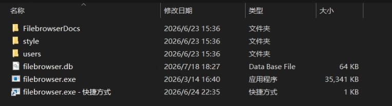
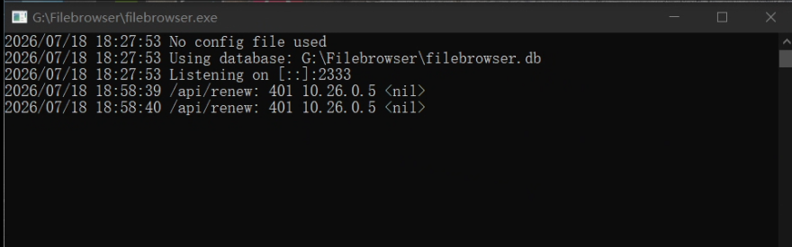
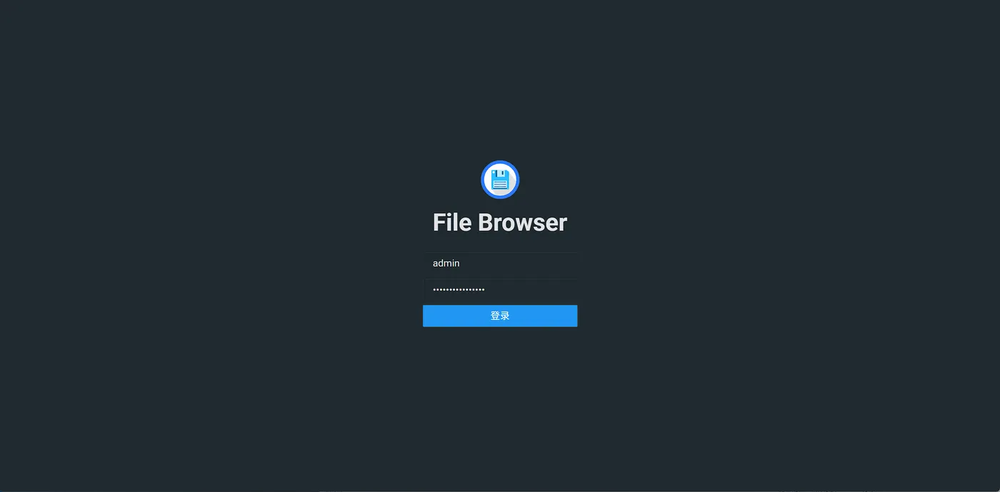
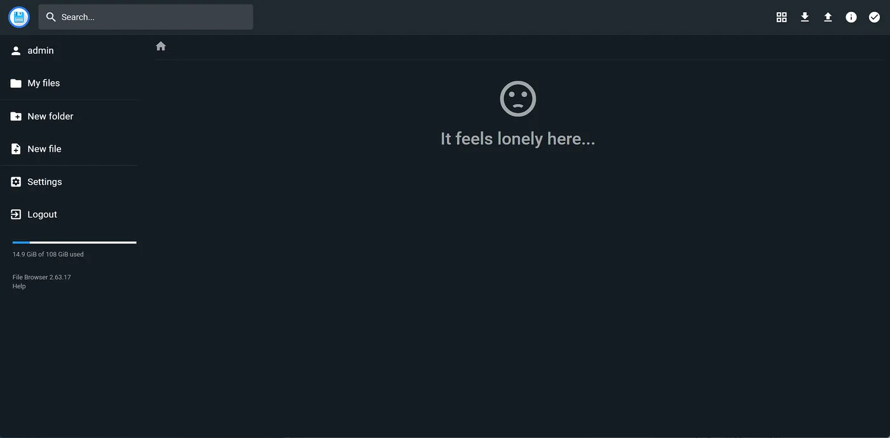
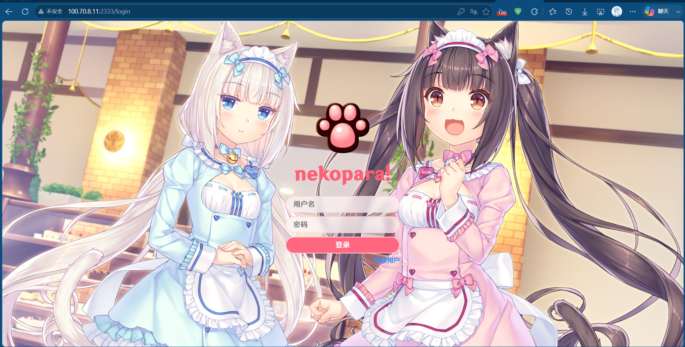
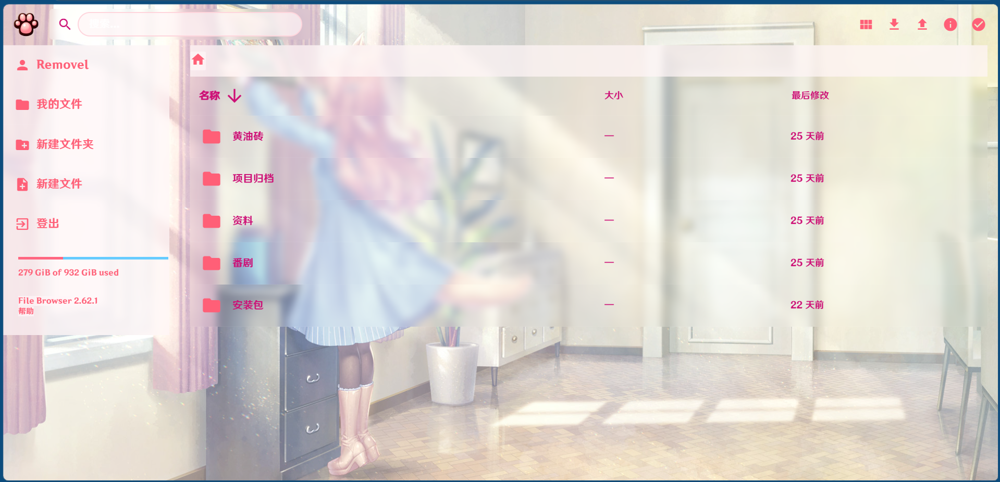
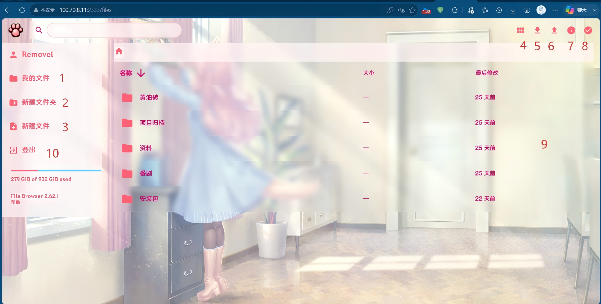
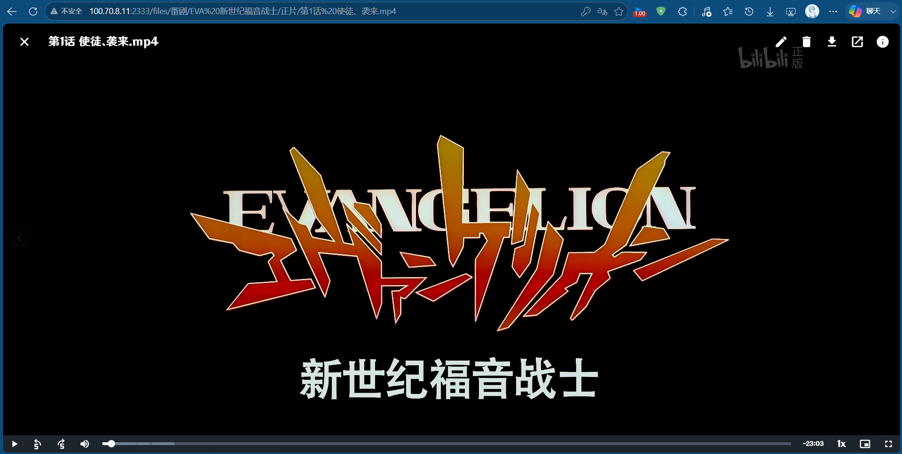

# 从路由器选型到远程追番（四）：服务部署

## 前情提要

在上一篇文章我们执行好了对内网穿透的优化，大大增高了内网穿透过程中的使用体验与数据传输稳定性。到了现在，我们目前已经走过了很长的一段路程，终于来到了最后的环节：部署服务。  
那么，我们现在拥有什么？
- 一个能够通过外部网络，在不使用公网IP的情况下可以从路由器访问的家庭内网
- 能够通过虚拟IP高稳定访问的设备
- 能够通过命令手动控制路由器下的设备开启
- 通过虚拟局域网IP+端口访问到对应设备的相关服务并执行相关操作

那么现在显而易见，我们还需要的，便是最后的部署服务。

## 服务概念与引入

此时其实已经从硬件-》软件开发。我们只需要开发对应的服务，然后通过设备暴露在对应的端口，我们便可以通过在虚拟局域网当中的IP+端口号对该服务进行访问。我们可以提供的服务非常多样。理论上，所有现在你能看到的服务：前端页面、后端接口、音视频提供、文件管理、游戏服务器等，都能够通过部署，让别的设备访问。以下是比较全面的服务类型列表：

| 服务类别 | 作用 |
| :--- | :--- |
| **前端服务** | 前端页面部署，你看到的所有网页都是前端工程的体现 |
| **后端数据服务** | 涉及到后端与数据库信息等，存储用户业务数据，在正规的业务当中还会涉及到消息队列、缓存等相关内容 |
| **文件与附件服务** | 类似于nas、网盘服务。 |
| **域名解析服务** | 我们常说的DNS服务器便是提供这类服务，将请求域名通过查询转化成IP地址 |
| **邮件收发服务** | 我们常说的163、qq、gmail等邮件都是通过邮件服务器和相关协议（比如SMTP等）执行的 |
| **安全防护服务** | 相当于“门卫和保安”。设置访问规则，拦截恶意攻击，保护服务器里的数据不被黑。 |
| **时间校准服务** | 让所有服务器“对表”。确保你凌晨下单的时间、支付扣款的时间在所有系统里完全一致，不乱套。 |
| **监控与告警服务** | 实时反馈线上服务情况，有异常、崩溃等问题立刻上报相关人员 |

除了以上服务外，还有很多，此处不一一列举。同时上面的服务有很多的内容都非常的正式，一般在企业当中才会用到。我们个人用户而言，并不需要如此多的服务。该系列以来的目标都是只有一个：远程追番，即实现番剧的本地化存储、番剧的远程访问（在线观看、下载、上传等操作）。  

## 需求分析与方案选择

于是我们只需要完成以下功能即可：
1. 访问网页时能够提供一个结构清晰、美观的前端页面供我们和后端番剧相关的服务交互
2. 能够通过后端服务提供接口的调用，包括简单的登录认证、简单的crud操作、简单的文件上传、下载等内容

这是一个功能需求比较少的小型全栈项目。理论上讲，我们可以自己手动开发：

| 项目类型 | 技术栈 |
| :--- | :--- |
| 前端 | HTML、CSS、JavaScript、TypeScript、Vue、React等 |
| 后端 | java、spring、mybatis、redis、go、GORM、kitex等 |

鉴于现在ai的发展，我们可以快速的开发出我们想要的功能，但是使用ai+自己开发理解这些概念对于大部分人来说门槛还是比较高，没有必要。我们可以将目前的已经有的一些开源软件配置好来使用即可。此处我们使用知名度比较高的开源文件管理服务FileBrowser。  
它有什么优点：
- 免去繁杂的数据库配置：使用sqlite作为数据库使用，免去了用户手动安装配置数据库比如MySQL、Oracle、Postgresql等
- 通过exe文件一键启动前后端服务：免去了用户手动编译、构建、启动的过程
- 较为完善的功能：它高度完成了前端交互页面、后端文件管理服务的绝大部分功能
- 高度可自定义化：可以通过自己或者第三方代码包安装个性化主题。

## 那么我们开始吧

### 安装方式

git的url如下所示：
```bash
https://github.com/filebrowser/filebrowser
```
或者跳转到其官方网页：
```
https://filebrowser.org/index.html
```
依照其描述有多种安装方式：
- mac命令行:
```
brew tap filebrowser/tap
brew install filebrowser
filebrowser -r /path/to/your/files
```
- windows命令行:
```
iwr -useb https://raw.githubusercontent.com/filebrowser/get/master/get.ps1 | iex
filebrowser -r /path/to/your/files
```
- docker容器部署：
```
docker run \
    -v filebrowser_data:/srv \
    -v filebrowser_database:/database \
    -v filebrowser_config:/config \
    -p 8080:80 \
    filebrowser/filebrowser
```
这里可以参考网上的其他资料：
> https://zhuanlan.zhihu.com/p/1961438217296389474
> https://blog.csdn.net/gitblog_01154/article/details/151437827
> https://developer.aliyun.com/article/1744763

注意这里由于涉及到docker的使用，虽然确实这样部署很简单，但是不是比较熟练的同学会难以理解相关命令，故不推荐使用该方案（除非你已经认为docker的使用轻而易举啊~），推荐手动下载安装使用。

### 手动安装与首次启动

- 手动下载安装：
```bash
https://github.com/filebrowser/filebrowser/releases/tag/v2.63.18
```
到其中选择自己的平台下载对应包，并解压到自己的指定的文件当中。示例如下：


在最开始时可能不会有style和user文件夹，我们只需要保证有下面的.db文件（数据库）和.exe文件（服务启动）即可。

我们执行.exe文件会跳出命令行界面，如下所示：

最后面两条是使用时的日志。可见图中的端口号为2333。由于不是最初的启动，所以初始密码等相关信息在这里没有呈现。按照正常流程，第一次执行启动操作时会给到初始密码。

### 访问 FileBrowser

这时候表明服务已经打开。我们可以通过多种方式访问。
- 本地访问：在浏览器输入url：localhost或者127.0.0.1:2333(你的端口号)即可跳转页面
- 其他设备访问：先获取到服务部署所在设备的IP，然后再在浏览器输入url+端口号：比如114.141.198.10:2333，即可访问（前提是你的IP正确并且内网穿透操作成功）  

输入url后可以看到类似初始的访问界面：

其中用户为admin，密码为在初始启动时命令行操作台中对应的字符串。在登陆进去后通过setting相关操作，尽快为自己创建账户。  

最开始的账户界面如上

### 文件存储结构

在windows系统当中，该filebrowser的文件存储结构如下：
```
FileBrowser/
├── filebrowser.db
├── filebrowser.exe
├── FilebrowserDocs/
└── Users/
    ├── %Username1%/
    │   ├── dir1/
    │   ├── dir2/
    │   └── ……
    └── %Username2%/
```

### 主题美化

当然，我们可以通过引入相关style包来对其个性化美化，比如下面：


***~nekopara！~（QwQ）喵！***

我们需要引入相关包，将其放在style文件夹下，style文件夹和.exe、.db文件应当在同一目录下。style包当中有以下内容：
- img文件夹：用于浏览器使用到的各个部分的图标
- custom.css：核心修改页面框架的表现方式
- favicon.ico：网站的ico图标
- manifest.json：相关的使用到的设定配置文件  

***此处感谢B站的up：GTX690战术核显卡导弹 提供的美化包：***  
> https://www.nekopara.uk/archives/416.html

在放进项目文件夹重新打开界面之后（记得打开f12到网络界面选择禁止缓存）可以重新看到美化调整后的页面。

### 功能概览

个人设置相关的内容多而杂，但是每一个又比较简单，就不赘述。现在简单讲讲如何使用：

1. 我的文件：当前文件夹信息，左边对应当前情况
2. 新建文件夹：在当前文件夹下创建新的文件夹
3. 新建文件：在当前文件夹下文件
4. 更改文件陈列方式：列表-小型方块排列-大型方块排列
5. 下载：选定文件之后能够下载到本地
6. 上传：点击后可以选择单个文件上传or文件夹上传，对于文件夹当中重复的内容/文件重复的内容可以自己选择跳过/替换等
7. 信息：点击文件后可以查看对应详细信息
8. 多选模式：点击后开启多选模式，可一次选择多个文件
9. 文件列表：所有的文件会在此陈列
10. 登出：等处当前账号回到登陆界面

## 常见坑点

### 端口冲突

启动服务时可能遇到端口被其他程序占用的情况。前面参考链接中的文章有提到如何通过命令行自定义端口号，例如：

```bash
filebrowser -a 0.0.0.0 -p 你想要设定的端口号 -r /path/to/your/files
```

将 `-p` 后的端口号改成一个空闲的即可。

### 防火墙拦截

如果远程设备通过虚拟局域网 IP + 端口号无法访问 FileBrowser，大概率是 Windows 防火墙拦住了。到「Windows 安全中心 → 防火墙和网络保护 → 允许应用通过防火墙」中，将 `filebrowser.exe` 加入放行列表，或直接在「高级设置 → 入站规则」中新建一条放行规则，指定端口号。

### 首次密码丢失

启动时命令行会打印初始 admin 密码，如果你没有记录下来且已经滚动过去了——坦白说我没有太好的找回办法。所以强烈建议：

1. 首次登录后立刻在 Settings 中创建**自己的账户**
2. 同时将密码记录到密码管理器或笔记里

如果以上两步都没做、密码又丢了……只能把 `filebrowser.db` 删掉重新运行一次 `filebrowser.exe`，让它重新生成数据库和初始密码。代价是之前的所有用户、设置、文件索引都会清空，所以**一定做好首次记录**。

## 完结撒花

到此我们所有工作全部完成，现在只需要获取到番剧资源然后把它们放到自己创建的文件夹里，就能够在网上线上远程追番啦~


关于如何获取片源、如何裁剪、各个环节上的一些额外的操作，将会在番外篇当中补充讲到。  
从路由器选型到远程追番系列到此结束~  
完结撒花，感谢陪伴！