# 番剧杂谈——《上伊娜牡丹，酒醉身姿似百合花般》镜头语言赏析

## 引言
距离上一篇番剧杂谈文章写出来已经过去很久了，这一段时间以来还是追了不少的的番剧的，有时间或许都会慢慢的写一些杂谈类文章出来。这一次我们先不谈及与人格、哲学、社会、心理等相关过于严肃或者思想深度需要比较高的问题。我们单纯从最原始的感官感受——视觉之美来讲讲《上伊娜牡丹，酒醉身姿似百合花般》  

说到这一部番剧，大家都戏谑为《利群与青岛》。实际上，和这一部番剧类似题材还有很多，比如“恋人不行”、《利兹与青鸟》、《莉可利斯》、《超时空辉夜姬》等。相较于别的番剧，这一个番剧更加擅长于通过人物行为细节、人物之间的对话，以及在这一篇文章当中将要着重讲到的镜头语言来表达人物之间非常细腻的心理。每一个人物我认为都有其与众不同的特性。相较于别的番剧，这一个番剧在观感上会显得更加“文艺”，“小资”，以至于在观看的时候我经常会不由得发出感叹：这是大学生该有的生活吗？（包括但不限于：几人合租一栋别墅、换算成rmb几千块钱的东西随便买、到处旅游等）还有同样作为计算机专业的学生，感觉剧中人物的牡丹、郡上学姐等，丝毫没有展示出两位祖师爷赐福的痕迹。这个番剧由于监督的不同风格所以导致番剧的放送风评时高时低，但是这并不影响它的画面表达之美，以及使用画面来反映人物心理，用镜头表示想要对观众说的话。  

## 镜头语言赏析
***本次镜头赏析由于内容太多，所以基本某一集选一个印象深刻的镜头语言进行赏析，其他的还有非常多，此处不一一列举，非常推荐自己观看一遍，看完后再来看分析会更加清晰哦***

***非专业赏析，只从本身感受出发，聊聊看法***
### 番剧开始的OP
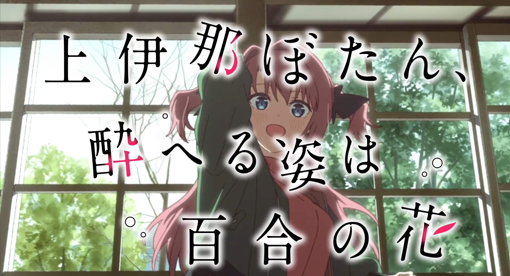
不同于以往其他番剧的op风格，本番剧的op使用了类似于手持相机拍摄mv的质感，在过程当中除了画面当中人物的动作变化之外，画面本身也在不断地晃动，相较于业界一贯的风格而言，这样的op风格给观众的观感会更像是少女们自己拿相机拍摄的生活vlog，这样从理解的角度上，观众会有一种在现实生活中观看他人拍摄的vlog的感觉。不知不觉当中拉近了观众和番剧之间本来跨着一个维度的心理距离。同时op当中的光影变化+暖色色调+op本身比较悠长舒缓的音乐，三者从视觉、听觉两个维度营造了一个非常温馨的氛围。可以说通过op可以快速将观众“拉入”或者说“代入”到动画主人公的日常生活的环境当中。是该部番剧不得不品的一环。

### 第三话10分04秒
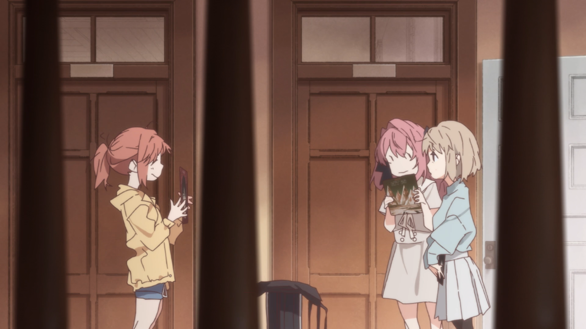
画面左右两侧用两道深色粗竖柱完全切割画面，形成窥视框 / 栅栏式取景,从画面上将三个人使用三个柱子（其实这里非常明显的能够看出来是楼梯的扶手常有的柱子）分割成两个部分，一边是牡丹+伊吹，另一边是茜。这样的构图非常有意思。从空间上看，可以看到，牡丹和伊吹在一起的同时她们和茜之间还有明显的一段距离，再加上楼梯柱子将画面分割，这里我认为实际上反映了伊吹跟其他人之间虽然同住一室但是仍有心理距离的一种没有那么亲密的疏远状态。这也恰好反映了动画前期伊吹只跟牡丹关系比较亲密，在别人之前有一种“放不开”的情况。这种感觉只有类似于她的人才能体会得到，此处请原谅我的语言拙笨，无法准确形容描绘这种感受。  
其次，这样的视角也打破了第三面墙。假设我们是摄像机，那么我们当前的位置可以推断得到是在上楼梯的最后的阶段，趴在楼梯边上的一种接近于“偷窥”的视角。我们并非直面三人，而是隔着遮挡物偷偷观望，制造「偷听、偷看」的私密偷窥感。对应剧情情绪，在分享爱好时的一种羞涩、紧张感。    
过度解读：紧闭的大门是否又影射了伊吹此时并未对其他人敞开的心境？

### 第四话7分25秒
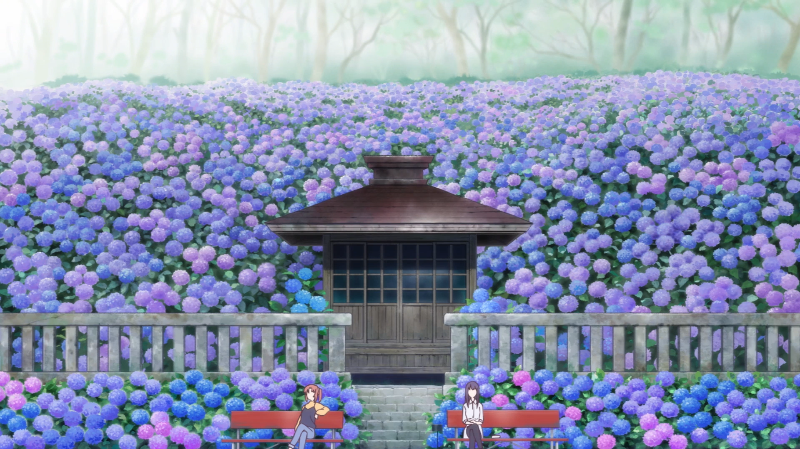
这个画面可以从多个角度来分析：
    1. **画面结构层次**：画面拥有非常明显的结构：中间日式木屋、石板台阶为垂直中轴线，左右完全镜像：左右对称的红色长椅、等距白色栅栏、成片均分的蓝紫紫阳花花海，背景树林雾气均匀铺展，是标准中心对称式静态构图。
    2. **画面色彩语言**：整个画面的主要色调非常明显的由蓝紫渐变绣球花海组成，背景树林雾气则是一种非常柔和的颜色，给画面增添了一种非常温馨的氛围。该色调偏向于冷色调。一方面迎合了剧情上早上参拜的情节，另一方面该色调也同时衬托了郡上学姐此时较为忧郁的心情。大量的花海和画面中下部分人物的大小形成鲜明的对比，结合上面的画面结构层次给予了观众一种强烈的视觉冲击。
    3. **图中环境元素**：非常有意思。图中的花大概率是紫阳花（在中国叫做绣球花/八仙花），这种花的花语，在蓝色的时候在中国寓意浪漫、忠贞，但也有“背叛、善变”的含义，象征爱情中的复杂情感；在紫色的时候在英国，绣球花的花语代表了一种残酷的爱和转身离开的冷酷。粉色的则代表一种希望。粉色给人浪漫的感觉，所以让人想起美妙的恋情或者是纯洁的爱恋。这种花在日式文艺作品中又常隐喻朦胧、含蓄、难以言说的暧昧情愫。这几种放到剧情当中都非常契合其中郡上学姐的情况啊（不要再迫害我郡上学姐了啊喂喂！）同时石墙、日式木屋等给人以规整、严肃、坚硬的印象，那么这里我认为是反映了两人都对于她们情感的一种克制、拘谨、内敛的现有情况。  

实在是太有意思了。

### 第五话6分37秒
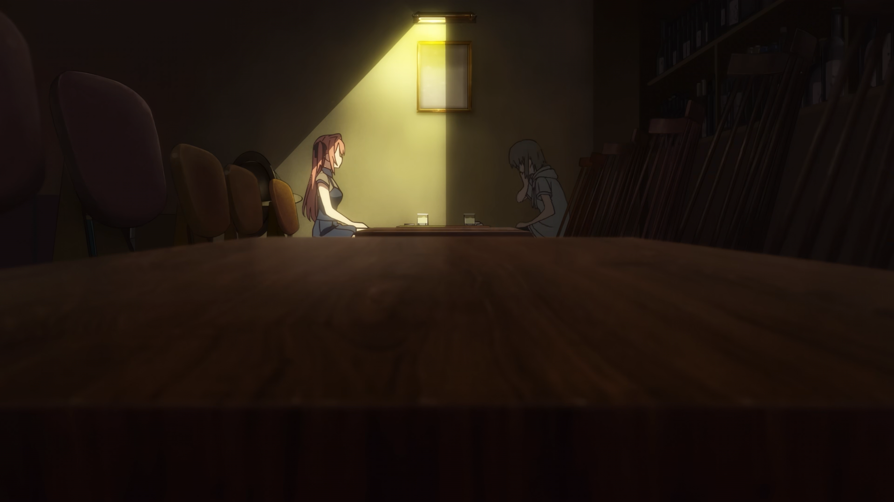
woc这个画面神了。  
从构图上看，类似于我们刚刚讲到的第三话的镜头，机位上是极低前景仰视角（桌面前置低角度）镜头紧贴前景木桌桌面，以桌面大面积深色木纹占据画面下半区，压低机位，形成压迫式前置遮挡，拉近观众与空间的距离，制造沉浸式旁观感。从人物区域上看，这里完美的通过一个灯光投射形状，将牡丹和伊吹二人分割成两个部分，然而灯光的消失边界又恰好和桌面+座椅透视线相接，从几何上看非常的完美（强迫症狂喜），我们又知道，在影视作品当中通过灯光表示人物心理是一个非常常见但是又非常有用的手法。这里将二人：伊吹置于阴影下，牡丹置于灯光之下，影射了二人此时截然不同的心境。伊吹此时因为酒的原因和过去导致她到目前为止都尚未解开心结，正处于一种封闭、害怕、无助的负面情绪当中，黑暗不仅将她身躯吞噬，也同时将她的心笼罩其中，而牡丹处于光明之下，是温柔、宽容、同情，是愿意、想要帮助，将伊吹拉出黑暗当中，（难道这不是很神圣吗！）
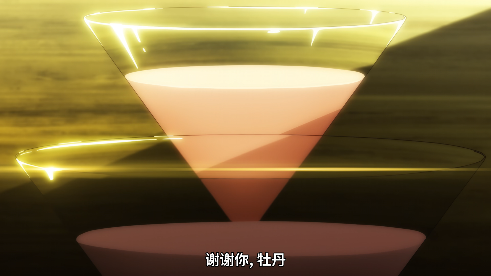
那么我们从这里能看到，图中位于更上方的酒杯是牡丹的，位于下方的是伊吹的，这里光亮开始照到了伊吹的酒杯，反映了牡丹的光正在逐渐驱散伊吹的黑暗，伊吹在牡丹的帮助下逐渐走了出来。

### 第五话20分23秒
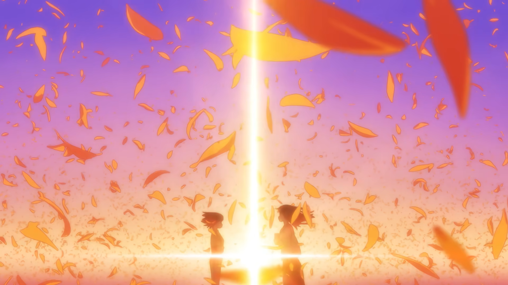
郡上学姐此时选择了跟伊吹袒露情感，但是她从未将是否选择我说出最终，她们之间因酒而起，于是她向其问出，“如果我不用开车的话，你就会跟我一起喝吗？”，看似询问，实则告白。伊吹在此时并未回答，她也不知如何回答。能和她喝酒的只有牡丹，但是如果说不，那样又会伤到学姐的心。此时两个人的情感都到达了顶峰的冲突状态，具体表现为画面花瓣飞舞、大风起兮，以及一道光（你的名字既视感），这是学姐对伊吹态度的具象化，随着期待而不断发光发亮。  
但是伊吹最终沉默，学姐也知道，她再无可能。她们都是温柔的人，学姐明白了之后并未迫使其回答，而是主动选择了退场。于是画面暗淡下来：
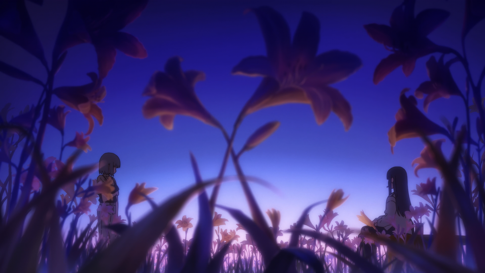
伊吹和学姐都是温柔的，她们都选择了对对方伤害最小的方式，向对方表示了自己的回应。伊吹拿起学姐的香烟，放在自己嘴中抽了一口，大家都有自己的所爱，伊吹饮酒，学姐吐烟。之前学姐为了伊吹也拿起了酒，现在即使伊吹并不选择学姐，但是她也为了学姐拿起了她的烟。（实际生活中请不要这样做！抽烟&喝酒都尽量不要碰！！！）  
于是画面回暖：
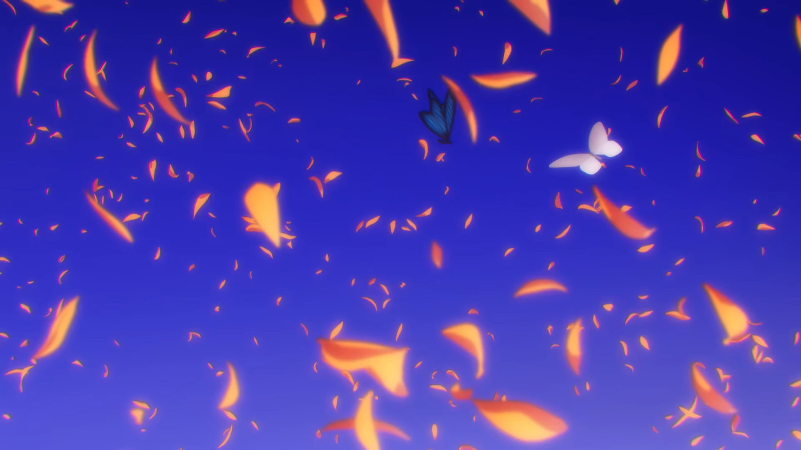
***真的推荐去看动画啊！！！***


### 第八话20分42秒
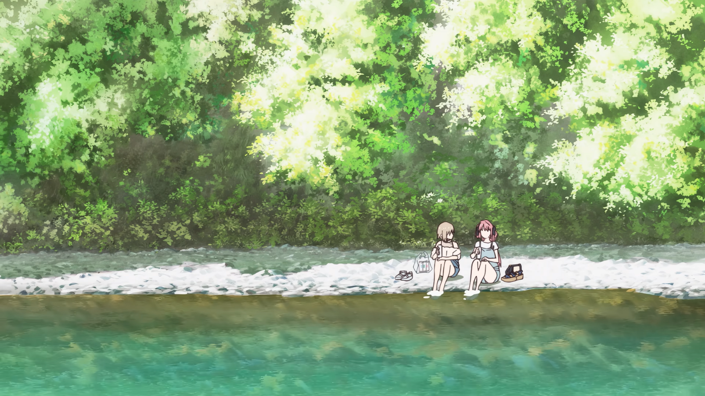
也是非常规整的一副画面。画面整体分为上中下三个部分，最上面是树林，中间是河滩，下面是偏向青绿色的河流。但是三者之间又不是生硬地过渡，从树林到河滩中间是由一些阴影+阴影下的更偏向深绿色的色调过渡，另外从河滩到河流则是通过棕色的滩边折射过。而主要人物在整个构图当中位置位于左下的位置，另外通过一些其余的物件，在视觉上形成了一个比较稳定的三角形构图。  
然而这样丰富的绿色系+水流的暖青色系等暖色调都给人以一种夏天的阳光下的感觉。是一副“勃勃生机万物竞发”的生命活力感。河水在岸边较为安静而在河道中则不断向下流动。流水象征躁动、纷乱的心事；前景平静无波的岸边水代表两人此刻难得安稳平静的时刻。溪水漫过双脚，冰凉水流包裹肌肤，烦恼被溪水冲淡，燥热被溪水冷却，享受一刻安定。

### 第九话20分52秒
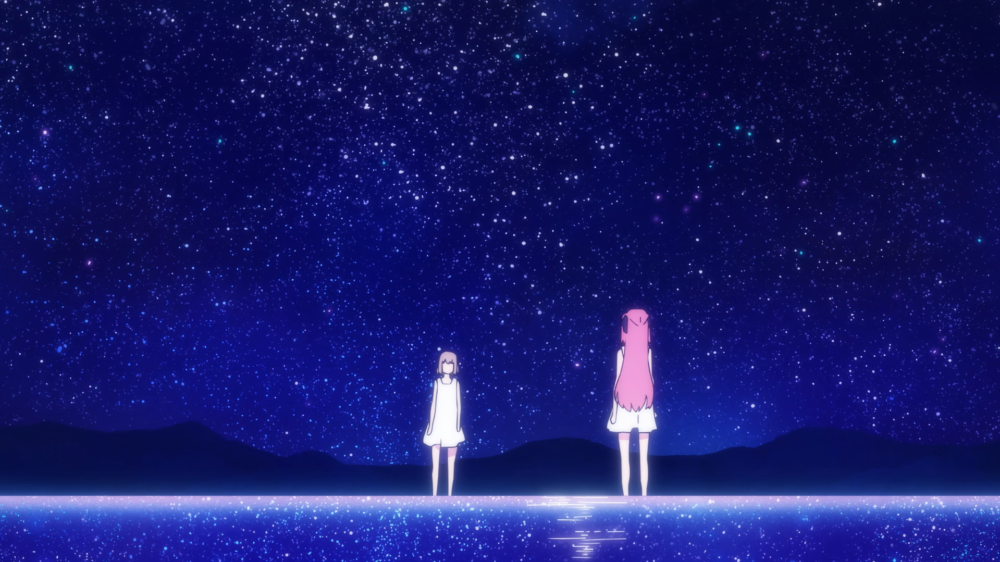
如果是我写在原作中，可能我会说：用夜晚的星空与银河见证我们的誓言，愿我们的爱情亘古不变，海枯石烂。  
爱情的迷人在于其灵魂与灵魂之间的交互、融合。星空下的对视是无声的纯洁告白。伟大，无需多言。  
在这里伊吹和牡丹的关系正式更进一步。从上面的星空到下面对星空的倒映，整个画面有一股神圣感和纯洁感。如此绚丽的场景给观众带来梦幻一般的感受，同时也反映着这两人之间的关系的品质。

## 过场卡分享！
这个番剧的过场卡质量很高，单独拎出来都是插画级别的：
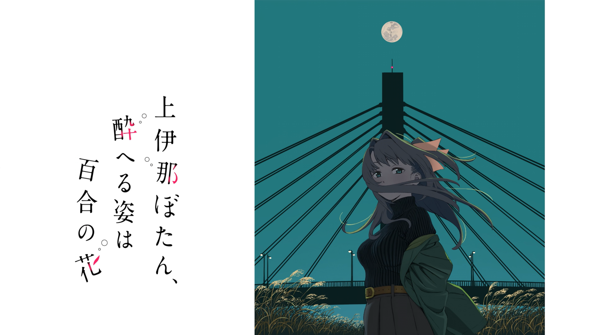
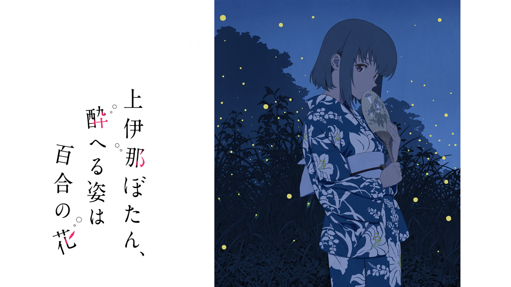
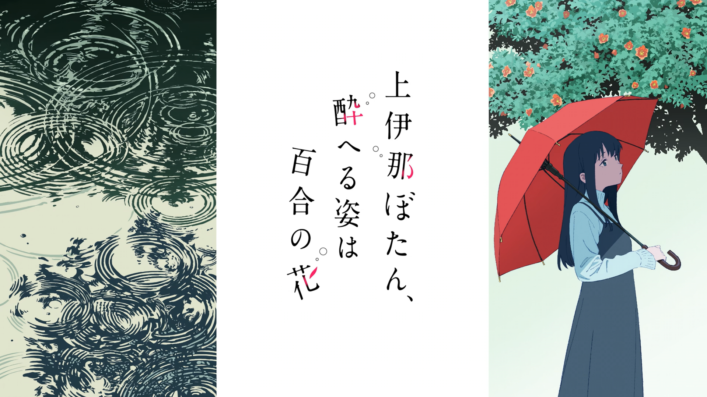
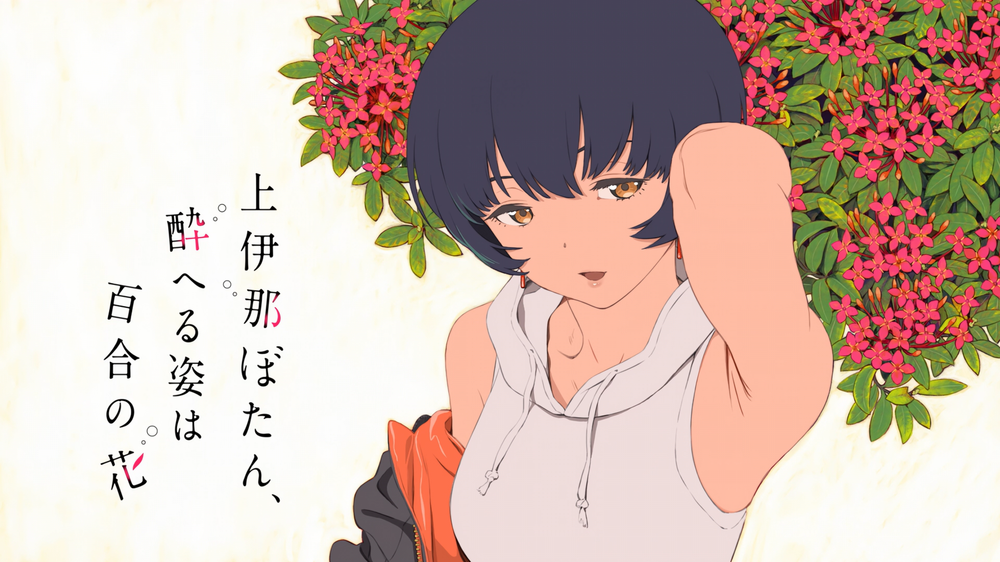
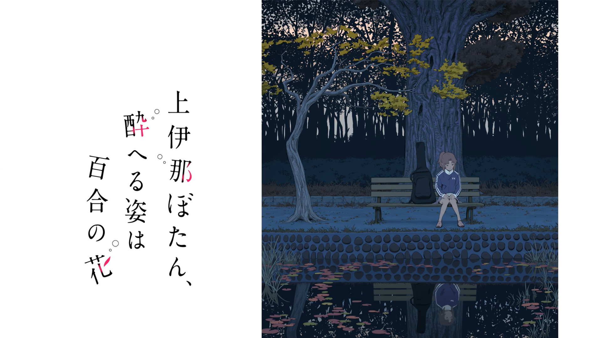
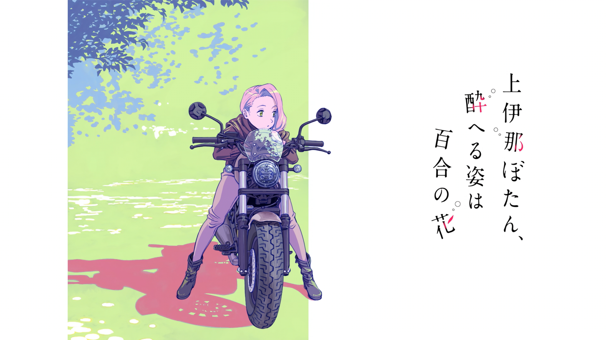

## 总结
除了上面提到的一些内容外，还有很多细节由于篇幅和时间原因写不完，在动画当中的ed部分还会补充对应人物的相关的背景过往信息。番剧中三对情侣（牡丹&伊吹、郡上&景岚、茜&八重花）都有其丰富的心理，向深处挖掘我们可以看到一个又一个鲜活的、有趣的人。  
用ed的部分歌词来结尾吧：
```
我透过酒杯望向另外一侧，  
用视线追着流云的你，  
美得仿佛连整个世界都为之改变。  
在那微风吹拂的午后，  
并肩而立的影子，  
悄悄期待着。  
```

**愿祝福世间一切美好，愿每个人都能遇到自己的对的那个人**
