***woc怎么不小心写了这么多字***

## 引言
okr，最近在追番的时候同时在看非常多的番剧，比如《瑞克和莫蒂》、《转生成为史莱姆》第四季、《异国日记》、《灼眼的夏娜》等，但是每个番剧都有其特点，比如《瑞克和莫蒂》由于是美漫风格+各种无下限玩笑，所以其实在睡前看并不是最好的选择，《转生成为史莱姆》这个已经众所周知的成为了开会的番剧，《异国日记》虽然小众宝藏但是面对上了一天班只想要好好放松的我来说心情未免会有一些沉重了，这个番剧也许在周末之类的有空闲的时间慢慢品尝，现在用晚上睡前时间来欣赏这部非常具有现实意义的番剧实在是暴殄天物。《灼眼的夏娜》又太多了（其实是太老了+太长了目前看下去的欲望不大hhh）。那么最后无意中想到了忘记在哪里被人安利的番剧《药屋少女的呢喃》，这一看就着迷了（画风好啊，睡前看养眼啊~）。我周五下班之后也是从11点直接追到凌晨3点，然后早上爬起来继续看直到下午，晚上睡觉之前又开始看，看到凌晨两点，然后周日早上起来还在看，看一个上午，晚上即使第二天要上班，也是冲着把最后的几集追完。就这样一个周末不带倍速的看完了全两季共48话的内容。然后因为没得看了产生了巨大的戒断反应，一直到现在写下这篇文章为止，都还有一种恍惚感。记得上一次这种感觉还是看天降之物的时候（或许未来有时间了也会把这个也写一下）。总而言之，如果让我来评价一下这个番剧，我会认为这是一部非常好的作品。接下来就从五味“药引”来讲讲为什么会觉得好以至于“迷药”的原因以及聊聊番剧当中的内容、情节与角色吧。(≧∇≦)ﾉ

***友情提醒：建议完整看完番剧之后再来看这篇文章，否则可能会有剧透的情况发生呀~***

## 味酸｜草蛇灰线，伏脉千里——伏笔与时间线
时间与伏笔是最先入煎这种药的一味酸。那么这里是我们最开始讲的伏笔与时间线，这个部分我认为是整部作品的核心&特点。我们可以从很多的地方发现前后文相互照应的情节，这也是在追番过程中我经常看到有人二刷番剧的原因（tips：第一次追番如果可以的话记得关闭弹幕哦，否则很容易被剧透导致观感不佳）。在这部番剧当中，虽然表面上是“中华风”、“药”，但是其实实际上是一部披着这些外皮的推理番。我觉得整个番剧最有特色的点就是作者有一个很大的谋篇布局的能力。他把番剧主线剧情埋藏在了众多的小案件当中，每一个小的案件都不是闲笔，它们最后的结果或者发生的事件、原因等都会和主线相关系。这一点在众多轻小说当中基本都见不到或者有这种特色的都是凤毛麟角。契柯夫曾经说过：“若是第一幕墙上挂着一把枪，最后一幕它必须开火。倘若不会开火，一开始就不该摆放。”。当你随着主线剧情推进，“渐进式披露”之后，你便能够想起之前的那些细节，然后惊叹，WOW!  
那么由于两季的内容很多，那么这里就根据当前动画的主线剧情从时间线来讲讲从第一季第一集猫猫被拐卖入开始之前到第二季最后镇压叛乱结束时的整个流程，以及作者为了讲好这个故事都通过了哪些案件来埋藏信息或者串联信息。
### 阶段1：在猫猫的父辈，包括罗汉、罗门、先帝、子昌他们之前所发生的事情：
- 世界观基本设定：猫猫所在国家为荔国，荔国在世界观设定当中似乎位于世界的中间位置，其东西方都有国家，在剧中，荔国的西方更偏向于现实当中的波斯、阿拉伯等中东国家（似乎也其实并没有那么西hhh），荔国的东方则更偏向于日本这边的国家。从服装设定、服饰等就可以看出来。剧中在讲堕胎药的时候就明显的可以看到西方的队伍的商品大多是香料、地毯等颇具有中东特色的产品；在樱花和猫猫去宫城北侧听故事的时候则能看到子翠讲的遥远的东方则具有非常鲜明的日本特色。
- 在很久之前，西方迁移来了一个族群，族群当中有个能力很强的女人，她嫁给了现在荔国的部落的酋长，在她的带领下，这个族群掌握了很多先进的生产技巧（第二季猫猫被绑架之后我们能够从剧情了解到）逐渐壮大并征服了其他族群，最后最终建立国家。她就是荔国最初的“王母”。跟着王母征战有功的有三大家族，这也是荔国当中对应的三个类似于“刀”字的含义。他们之间不仅在战功上声名显赫，另外在血统上也跟王母有关系，他们都是红绿色盲，对应的优势便是在夜晚会有更加敏捷强大的视力，并且该症状随着男性相关的染色体（原谅我已经忘记了基本的遗传相关的生物知识）将性状遗传下去。其中一族在目前的动画就已经解密，赐姓为“子”，也就是子昌所在的一族。（实际上，子昌所在的一族并非组内主要力量，主要的对象还是神美夫人所在的一族，这也能解释为什么动画第二季后期的剧情明明身为一国重臣的人竟然不敢对妻子重拳出击的原因之一）。
- 王母在掌握政权之后，由于百姓及其很多大臣的刻板印象下，普遍认为应当由男性掌权，而非女性。所以王母迫于舆论压力将掌权位置交由男性。为了其一族能够牢牢掌握政权+血缘保持一定程度的正统性，王母通过"选定之庙"将后续男性掌权者的血缘和思想把握在自己的手中。具体的方式为：由于红绿色盲在男性遗传上会更加的明显，并且该病症也没有那么常见，于是在选定之庙当中通过相关的颜色+提示，只要能够到达终点，即可选择。或者在动画中也提到，如果携带妃子能够通过，那么该妃子也能成为皇后（显然其携带了色盲的基因，证明其一定程度上和王母血脉相关）。当然我们聪明的猫猫通过超于常人的药理学知识+逻辑推理成功在没有患有该病症的前提下推导出答案并和当代皇帝与壬氏共同达到终点。

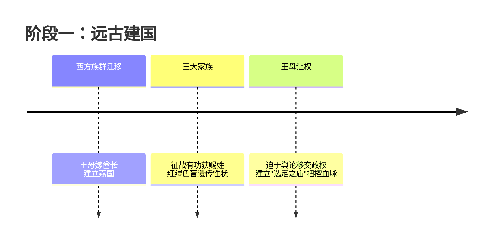

### 阶段二：接着时间来到猫猫的父辈，包括罗汉、罗门、先帝、子昌他们所发生的事情：
- 子昌原本无缘政治，因为其属于子族的外族，但是由于其出色的能力被族人识别出来，并托举到皇宫当中，一路成为皇宫重臣&子族话事人。是时国中奴隶贸易泛滥，被当作奴隶的人，男性会被“去势”，即阉割；男性和女性被卖到外国去能够获取到巨大的利益。另一方面穷苦人家为了生存也会卖掉孩子。于是各大家族贩卖奴隶之风盛行。为了遏制这种现象，女帝（注意这里是先皇的母亲，先皇的能力并不在政治，于是表面上先皇执政实际女帝持政）将子族的千金，即我们剧中看到的神美夫人作为上级妃加入到后宫当中（注意这里子昌其实一直都对神美夫人爱得深切，我们在后面的爱情线会慢慢讲到），实际上是作为人质以胁迫大家族停止相关奴隶贸易。在这样的严打下，奴隶贸易之风逐渐平息，但是继而又出现问题：奴隶太多没有地方去导致社会稳定性下降不利于发展。于是当时作为朝廷重臣的子昌为了表明忠心，以扩充后宫之名，提出建议将作为奴隶的对象纳入后宫，两年出宫，期间可以学习到一门手艺作为出宫之后的谋生手段（哇，是皇家技术职业学院）。一方面缓冲了社会流动人口不稳定因素过大的问题，另一方面提高社会劳动力素质提高先进生产力（叽里咕噜说什么呢这是）。子昌扩建后宫的过程中留下了偷偷出入的密道。
- 于是大量人口进入到后宫当中。此时我们可以先对后宫有一个基本的了解：先帝身边有阿多妃、神美夫人等妃子。可是先帝炼铜，于是乎，先帝临幸的是神美夫人的婢女、以及后来的皇太后（此时作为某位上级妃的婢女），并由此生下两个孩子，神美夫人的婢女生下的孩子是女孩，在剧中提到，生下来的若是女孩则会被否认为公主，而是被认为是与当时并未去势的医官私通的产物，于是孩子+医官被驱逐出后宫，这个侍女则是后面动画中提到的“大宝”。由于此后宫还下令，凡是以后的入后宫的医官都必须去势阉割，这也导致了后来没有人愿意到后宫当中任医官一职（也就后面佛萨一般的猫猫的养父去了）。另外一个即皇太后生下的对象则为剧中现在的皇上。由于先帝炼铜（这种原因是因为常年在其母亲即女帝的控制的情况下导致的，同时被其摘下花苞的女生终身无法出宫，这也招致了后宫老一辈对先帝及其现在后宫其他女人的悲愤），阿多妃这些其实没有碰过。所以后来阿多妃给到了当今皇帝，神美夫人被下赐给子昌。
- 在两个孩子出生之后过了很多年，女帝去世、先帝衰老，由于先帝一直对那个被流放出去的女儿心怀愧疚，于是请求当时的重臣子昌娶那个被流放出去的女儿为妻子。子昌为了神美+无法拒绝先帝于是接受了这个请求，之后生下了现在的翠苓。子昌以翠苓出生之后，要求先帝下赐神美。（更多的细节在爱情部分会讲到）最后也是如愿抱得美人归。可是神美却认为这是皇家对她的嘲弄，其原本想要生出龙子成为皇后，但是皇帝动的是她的婢女，最后还将她打回故乡。于是人变得扭曲，导致后面的悲剧。
- 神美在下赐之后，和子昌孕育出了楼兰妃，也是我们剧中看到的子翠。注意，翠苓原来就叫子翠，但是由于神美看不起这个孩子，认为其是“肮脏的血脉”，于是将名字给了子翠，原来的子翠改名翠兰。为了报复皇室，从这个时候开始谋划主线剧情。
- 在大量招进宫女之后，罗门等一行人为了提高素质，防止婢女们因为缺少卫生常识导致的一些问题，撰写相关文书并粘贴在后宫当中。
- 里树妃作为家族政治工具，因为知道先帝炼铜，九岁时被送入后宫作为上级妃，然后没过几年先帝还没来得及摘花先帝就死了，其被送出去出家。
- 接着便是壬氏相关的信息：那一年皇太后&阿多妃同时临盆，皇太后生下的是先帝的儿子，也就是和当今皇帝同辈，是为皇弟；阿多妃生下的是当今皇帝的儿子，也就是壬氏。但是由于当时的后宫医官人手不足却两人都有生产经验不足、难产需要手术的风险，罗门只能被送往优先级更高的皇太后身旁。那一天两个孩子出生了，阿多妃失去了她的子宫再也无法生育。但是她为了孩子更好的生存，暗中将同时出生的两个孩子进行调换。也就是说，现在的壬氏被当成皇弟被皇太后抚养，真皇弟在阿多妃身边被抚养。后者在后面被猫猫推导出被蜂蜜药死了。而壬氏则健康成长到现在的时间线。所以说壬氏其实是当今皇帝的儿子。他和阿多妃长得很像（剧中猫猫曾经就觉得非常像，另外猫猫被绑架壬氏去找人时也明显的可以知道阿多妃短暂替代了壬氏处理工作）。在那之后作为后宫医官的罗门因为这个生产问题背锅，被削去膝骨逐出宫廷。
- 之后是猫猫：猫猫的母亲名叫凤仙，是当时青楼的头牌，擅长下棋，只要靠着下棋就能赚到不少钱。猫猫之父罗汉是罗氏家族当中的一个下棋天才，但是其在识人等对外社交的方面非常的烂，任何人在他的眼中都模糊不清。 在其叔父罗门（猫猫养父）则是家中唯一关心理解他的人。在他的帮助下，罗汉尝试以"棋"的身份标识所有人，于是所有人在他的眼中都成了棋子的样子，所有的社交、出谋划策都被认为是一场棋局。他的天赋就展示出来，进宫中作为朝廷的臣子。后来在外出应酬相关的政务的时候遇见凤仙，此时凤仙成为了他的眼中唯一一个不是棋子而是具有清晰人脸的人。二人以下棋为交流方式，之后凤仙做局让自己怀上罗汉的孩子（即猫猫），但是此时由于朝廷宫中事变导致罗汉被放出到京城外3年。于是凤仙的计划落空。在青楼，被摘下花朵的价格减半，怀上孩子的价格直接跳水。于是凤仙在那之后被作为普通妓女不断接客，然后染上性病：梅毒。由于潜伏期没有得到较好的治疗导致后来非常严重只得卧病在床。猫猫则被隐去这一层身份，由凤仙的禿，即梅梅等人（后来的头牌）关照，再后来由猫猫养父罗门抚养。罗门归来后知道看到血书才意识到这一点，但是为时已晚。罗门以为凤仙被赶出青楼。后回到宫中，在剧中最后做到了军部军师的身份，和子昌被认为是宫中的两个举足轻重的人物。（***TIPS：在if线当中，有相关讨论说到，老鸨是凤仙的妈妈，猫猫的外婆，这里似乎能够解释的通为什么在凤仙沾染梅毒之后依旧在青楼中被照顾没有被抛弃***）

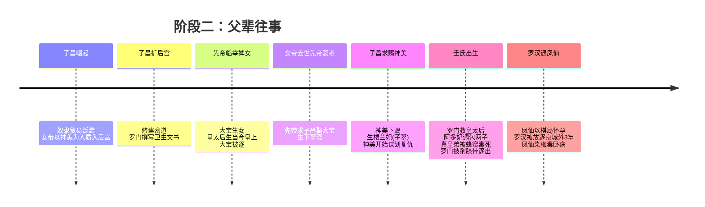

### 阶段三：主要的时间线：动画故事主线剧情：（***注意：笔者认为关系不大or比较独立的案件就不写了，但是它们都很精彩！！！***）
- 猫猫在青楼长大，并跟随罗门经营药店。猫猫在一次送药的过程中被人贩子抓住，然后被拐卖到后宫当中。
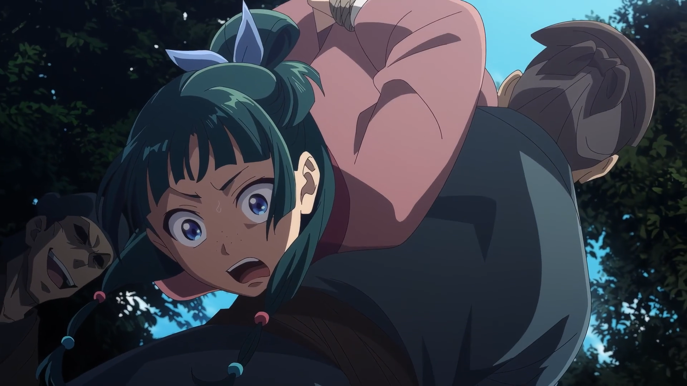
通过同样为宫女的小兰（朋友&好闺蜜，随着时间逐渐感情好起来的）知道了皇子们接连死亡的事情，其后通过自己推理得到真实的原因：贵妃们使用的增白粉会导致中毒（此处有现实依据：古代相关的增白粉常常使用重金属铅，对人体的危害极大，尤其是婴儿），后来猫猫通过字条等操作不经意间引起了壬氏&玉叶妃的注意，后被加入到玉叶妃旗下作为侍女。实际上，这里的原因在后期剧情其实有提到。由于先帝时期的宫女被先帝临幸之后终身无法出宫，导致其实罗门当时说的有害物品的张贴内容反而提醒了她们，被用于偷偷向后宫倾泻其怒火与幽怨。
- 神美，为了报复皇室，尤其是先帝，和后宫的老宫女们暗中联合，在后宫当中计划了大量的阴谋，尝试报复，对象为长得像先帝的壬氏+后宫妃子们+皇帝后代。
- 一位武官，名为浩然，其为人正直，非常勤勉，掌管祭祀相关的内容。但是味觉障碍，死于盐吃多了导致中毒死亡。于是祭祀相关的内容再无人明白。此处应该是翠苓下了点手偷偷引导了一下。最终导致浩然的死亡。
- “在园游会上对里树妃下毒的犯人是在外廷护城河入水自杀的女官”这一消息在后宫传开。但是，壬氏对一介女仆毒杀里树妃的理由产生了疑问，于是命令猫猫调查死去的女官曾经侍奉过的柘榴宫。在侍女长风明的指导下，猫猫开始帮忙大扫除。之后，猫猫看到里树妃来拜访柘榴宫，于是她解开了一个大谜题：当年皇子死亡的真相：凤鸣因为缺乏常识导致将蜂蜜喂给了阿多妃的“孩子”（实际上为先帝之子）。蜂蜜对婴儿有毒导致其最终死亡。凤明家乡生产蜂蜜，其知道后自首。
- 阿多妃年龄到了离开后宫，后宫四大上级妃变为3个
- 凤明自首后，家族商业有相关的宫女都被遣散，其中把猫猫贩卖进来的贩子有关，于是猫猫被遣散。回到青楼之后在一次外出中遇到壬氏，被赎身为自由人（爱情线部分会详细讲到hhh，非常美味的一环）。
- 猫猫被壬氏重新雇佣到宫中，作为侍女。后宫此时新来了一位上级妃——楼兰妃，子昌与神美之女。
- 仓库当中由于库存为面粉，在封闭环境当中面粉的粉尘浓度过高。巡夜的士官出于善意送走了假装走夜路的女官翠苓，翠苓送其烟管。士官结束之后到仓库当中尝试使用烟管，但是火星点燃了面粉导致爆燃，仓库爆炸发生动乱。翠苓趁此混乱机会将祭祀用的器件替换为质量更差的次品。
- 仓库爆燃之后，高顺说“有吃了河豚而陷入昏迷状态的官员”，但据说料理中并没有使用河豚。猫猫解决了这个问题，并发现了真相其实是购买的毒海藻。陷入昏迷的官员是掌管祭祀器具、负责祭场设施检查的核心官员。其昏迷之后，在下一次祭祀之前出现了真空。
- 再之后就是朝廷中负责礼器的工匠不明原因去世了。在这个案件当中，猫猫意识到了使用的工件其实并不耐高温。所以实际上此时祭祀场所的相关器件已经被替换or增加了导致危险的蜡烛。
- 在综合多个案件之后，在资料库调查的猫猫意识到有人要害祭祀者，在祭祀的场所中，祭祀者会站在一个超大的柱子下方，综合上述案例，实际情况变为：用于束缚柱子的工件被翠苓等动了手脚，加上了蜡烛加热不耐热的工件，然后又由于其余的工件被替换为质量差的，导致柱子会掉下来直接砸死在下面的祭祀者。意识到这个之后猫猫立刻前往，并在千钧一发之际就下祭祀者——壬氏，并导致腿部受伤。（女儿奴罗汉看到心疼死了&这一个部分发的糖真的很美味啊(≧∇≦)）
- 在那之后发现了这一切的主导者是翠苓，但是正准备执行抓捕的时候，翠苓喝下“毒药”已经死亡。按律法，罪臣遗体不得下葬，停放一日一夜后执行火葬。她利用爱慕自己的年轻医官担任验尸官；对方心神大乱，没有细致查验，直接判定她毒发身亡。实际上是使用能够伪装死亡的药剂，然后通过替换棺材尸体等一系列操作在停放尸体的时候直接脱身。但是也因为副作用导致左半边身躯麻痹。
- 关于罗汉娶回凤仙的事情会在爱情线部分详细讲到。
- 第二次游园会结束之后，猫猫带着玲丽公主在宫中北侧的树林捡到了一只猫。抓猫的过程当中遇见了子翠。两人在这里有了第一面的接触。这里猫的出现其实非常奇怪，因为宫中一来很少有动物，二来即使养了动物也都会进行绝育，无法繁殖后代，三来宫中的管控比较严格，基本不会有外来的动物。实际上这里是子翠不小心让一只猫从秘密通道跑了进来，然后在抓猫防止泄露秘密的过程当中猫让猫猫看到了。于是这也就能够解释为什么她们会在这里相遇的原因。后来这只猫被养在后宫太医处。
- 梨花妃在之后也怀孕了，在异国的商人在宫中贩卖商品的时候，梨花妃的侍女长买了很多精油相关的物品，其会对梨花妃的健康造成一定的危害，可能造成流产。后来被猫猫发现。在剧情当中解释了梨花妃及其侍女长的关系，她们是姐妹。因为不满于自己明明条件更好但是还是梨花妃当上了妃子所以心怀怨恨，尝试用这种方式暗中使其流产。在猫猫调查的过程当中认识到了诊疗所的女官深绿，她是当年先皇时期留下来的宫女，对后宫众人等心怀怨恨，和翠苓等一行人共同谋划阴谋。
- 在楼兰妃之父子昌的邀请下，壬氏去参加狩猎，猫猫也作为随行者暂时离开了后宫。她与壬氏、高顺，以及高顺的儿子马闪一同前往子氏一族统治的子北州。子昌在那之前和西方的使者暗中合作，使用最新的枪械武器尝试刺杀壬氏。（当然是失败了喽）壬氏&猫猫在这一章情感升温了很多（石流龙：我吃饱了！），猫猫也是在这个时候了解到壬氏并非宦官，而是具有极高身份的官人。
- 回到后宫之后，猫猫的朋友小兰即将出宫，为了开辟人脉，子翠提议到浴场上帮妃子们搓澡。后来小兰在搓澡的过程中被一位妃子赏识，被推荐到那位妃子的家乡去做婢女。在番外当中也讲到小兰有了很好的待遇，也找到了她自己的爱情（瓦~竟然没有刀真实太好了）。实际上，这个时候子翠会在这里是因为翠苓假装宦官进入到后宫的浴场工作。她们这样能够更好的交换情报与信息。
- 玉叶妃即将生产，但是猫猫发现她胎位不正，于是去找了罗门回到后宫当中临时作为医官。他很快整理出当前后宫的问题点，并为了让在手习所学习的女官们也能练习抄写，专门制作了范本。猫猫将其送到手习所后，从老宦官口中得知，罗门在被逐出后宫之前也曾做过同样的事。某种违和感浮现在猫猫的脑海中：一个简单的宫女（子翠）怎么会能有这么高的文化？能够使用如此高级的笔记本还能将昆虫描绘的如此精致、还有许多非常巧合的场景她都在。结合种种，于是她前往了诊疗所送酒精，然后发现翠苓此时正在此处。为了防止事情败露，猫猫被翠苓绑架。翠苓以复活药&子翠为威胁（演的一出戏），通过北侧密道将猫猫带离后宫。并一路回到她们的家乡。猫猫被绑架离开之际将毛毛（之前捡的那只猫）很感兴趣的药大量放在了后宫密道外的树旁，通过字条将对象指向翠苓。

### 注意：从这里开始双线叙事：不妨将猫猫经历设为线A，将壬氏经历设为线B。

线A：猫猫被带离出宫之后通过水路到达子翠的家乡，并在路上就发现了子翠、翠苓其实是一伙的。她们把猫猫带到家乡的村落之后，也没有对猫猫做出什么很坏的举动，因为她们其实并不想把猫猫代入纷争当中。她们通过祭典活动向猫猫讲述了这片土地的传说&狐狸面具的含义。后来一天猫猫和响迂（神美一族当中高位的妇女，和楼兰她们关系很好）发现有一片麦田长得不如周围但是不如的区域正好是一个矩形，猫猫推断为旁边的仓库的灯光导致日夜不息的照射使得小麦出问题。她们前往了那个仓库，然后不小心在里面发现了里面正在制造当时刺杀壬氏用的枪。然后正好此时神美来到，神美准备直接通过鞭刑杀掉猫猫，但是被楼兰（也就是子翠）说猫猫能造长生不老药救下。猫猫因此被囚禁在一座被大雪与坚固城墙包围的“要塞”之中。

线B：罗门一行人通过发现毛毛不见了最终找到了线索。壬氏（我已急哭版）在调查的过程当中了解到当时有人看到翠苓在北侧墓地合掌祈祷。那是曾被先帝宠幸、并在后宫迎来最后时刻之人的墓地。便带人前往，发现深绿此时也在，并且身上也带有猫猫消失时的酒精气味，于是尝试从她身上查出更多的东西，但是深绿见到壬氏样貌酷似年轻先帝，当场精神崩溃，尝试饮毒药自尽，后来被救了回来。即使是这样深绿也没有透露任何信息。壬氏从其祭拜的对象——大宝，查到跟楼兰妃相关（如果忘了请回到第二阶段查看宫廷往事），于是前往楼兰妃的宫殿，发现真身早已不在宫中。实际上，楼兰妃为了她们的计划做了以下准备：1、携带大量婢女入宫，并且都形貌相似——用于防止壬氏记录或者外人看出来少了人+伪装（实际上壬氏还是太强了，都记住了） 2、用物奢华，妆容极重——即使相似但是依旧存在细小的差距，于是需要用浓妆来掩饰细小的差距（壬氏依旧看识别出来了）。在发现楼兰妃失踪之后壬氏严查楼兰妃的侍女，但是她们都不知道去了哪里。然后下令严密排查所有通道并发现了北侧密道。  

线A：猫猫在被囚禁的要塞中每天都在制药，重复着研发、测试、汇报进度的生活

线B：猫猫失踪的消息同样传到了女儿奴罗汉的耳朵当中。罗汉及其养子罗半通过调查国库流水、市场金属、粮食等信息发现这些货物即使不在大灾之年价格也发生了较大的上涨；调查到子昌家乡的堡垒要塞在不受控制的扩张，确定了子昌贪污叛国的相关有利证据。于是二人到壬氏处请求出兵剿灭叛贼平定叛乱。

线A：某天，为了让猫猫逃走，响迂想出了对策，却很快就被看守发现。听到骚动的翠苓出面调停，正当大家松了一口气时，神美现身，现场气氛顿时改变。看到神美一边盘算着要折磨猫猫、响迂、翠苓，还是看守，一边露出享乐般的神情，猫猫愤怒之下不由得说出了神美最在意的痛处。暴怒的神美命令将猫猫带往拷问室。但是在楼兰的掩护下让猫猫的刑法取代为蛊刑——虿盆，作为食物链顶端的猫猫并没有受到伤害，反而使用燃尽的草药灰驱逐毒虫，用发簪杀死毒蛇然后用室内的火炬全部烤了吃掉了（不愧是你）。子翠深知无法抵御这次进攻，偷偷来找猫猫将其释放并告诉她禁军要来，她要去遣散火药制作的工匠并炸毁火药库。猫猫下定决心帮助楼兰妃，并将壬氏赠与的发簪送给子翠，约定之后一定要还回来。

线B：壬氏带领禁军兵临城下，准备向子昌神美的要塞发起攻击。罗汉确定进攻方式为先引发雪崩埋住要塞的兵器库，然后带领兵马从侧边偷袭而非正面攻击以减少人员伤亡。在夜晚停雪时正式发起进攻。

这里两条线汇合：  
是日夜晚正式发动进攻，正如罗半所计划，将兵器库用雪崩掩埋，然后子翠又将火药库炸毁。于是攻克过程如摧枯拉朽。壬氏在楼中找到猫猫。并让李白把猫猫等人带离要塞。自己则继续前往面对本次叛乱的始作俑者。子昌在这里其实非常伟大，用壬氏的话来说，子氏家族随着国家历史以来已经逐渐腐朽不堪。子昌通过让自己扮演一个最坏的角色，让神美在逐渐嚣张跋扈的过程当中将这个大家族提纯：正直善良的人因为受不了离开这个家族，剩下的都是烂到根子当中的，子昌用这方法将这帮人全部铲除，保护大家族能够继续保留下去。然后子昌被杀。接着神美在与爆发了的子翠对峙的过程中因为枪炸膛而死。
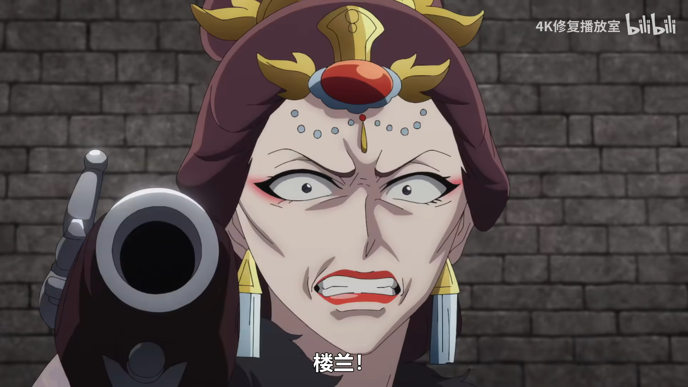
子翠为了完成所有人的心愿在壬氏脸上划出一道划痕。在了结完这些事情之后于雪夜的堡垒上翩翩起舞（one last dance~），赶来的马闪发现壬氏被伤害之后对子翠开枪，子翠中枪倒下翻过护栏外，落入山中不见踪影。  

之后子氏家族被清算。猫猫因为雇佣结束回到了青楼当中作为药师。小兰离开了宫中，罗门从临时工变成正式员工留在后宫当中。玉叶妃顺利生下皇子成为皇后。响迂等这些和事情无关的小孩避免了被清算，都通过假死药得以幸存。其中响迂因为药的后遗症导致直接失忆忘记之前的经历，并换名为赵迂，在猫猫的药房帮忙，其余的则是壬氏兑现和楼兰生前的约定，保全这群没有参与谋反的孩子，由阿多妃收养在离宫。剧情最后告诉我们子翠并没有死，猫猫送给她的发簪挡住了那枚子弹。她去到了东方，换名玉藻，用发簪换了一只玉蝉，开始了新的身份的生活。

### 至此，动画全两季主线结束。
- 后续会有什么？我们或许能够从一些细节中推出相关的信息：动画中提到子翠对昆虫非常的感兴趣也非常的了解，在猫猫被绑架到子翠家乡参与祭典的时候，子翠吃到了一只非常怪味的蝗虫，而子翠当时只是吐槽了一下然后将虫吐掉了——这预示这之后是否会有蝗灾？

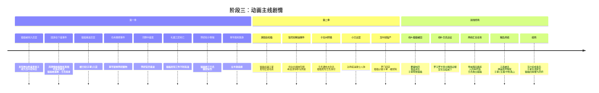

## 味苦｜药道求索，人生行路——作品当中的经历与事业
在剧情当中，猫猫的身份&角色一直在不停的变化：先是青楼药房的药师，然后是宫中执行洗濯的宫女，在之后是玉叶妃的宫女，不过是因为药学造诣不断被外借的对象（我想起了一个同样也是因为某个方面很厉害同样的也被不断出借的动漫人物，不过这个人是男的），然后又回到青楼成为妓女，之后被赎身成为自由人，再被雇佣到壬氏宫中，考取女官没考上变成侍女，至此到子氏动乱之后回到药屋。可以说她的经历与事业充满了曲折，但是不断的在螺旋上升。在动漫尚未制作播出的小说后面的篇章当中，猫猫又回到了后宫。不过在这里我更想聊的是在玉树妃下作为侍女的这一部分，以及关于爱好和工作之间的有趣关系。

### 1. 论领导力、团队凝聚力与团队智慧——为什么是玉叶妃在最后成为了皇后而不是别人？  
在皇宫的后宫当中，我们可以认为，皇帝的性资源是后宫最重要的价值来源，基本所有人都要围绕着如何更好的获取并利用这个资源来取得利益。（注：下文仅作趣味职场类比，不对应真实古代皇权制度）我们可以将后宫职能与现实对应起来，在现实映射当中，皇帝是业务的客户（甲方），妃子是整个部门/团队的大leader，侍女长是其下的组长，负责配合leader（妃子）调度团队内成员，执行相关操作以获取到对应业务资源，其余的普通侍女则是团队成员（干活牛马）。一个妃子想要在如狼似虎、明争暗斗当中的后宫中成为最后的赢家，当然离不开一个具有强大凝聚力和执行力的团队。作为妃子，面对别的妃子的情况，你需要发挥强大的领导力与洞察力，一方面执行好对外的工作，防止竞争对手抢夺资源，和别的leader建立合作友好关系；另一方面执行好对内的工作：提高部门内员工素质，有些核心的工作交给信任的人处理，知人善用，慧眼识珠。作为侍女长，在面对leader的工作时需要辅助帮忙，监督执行状况，做一些“核心的”工作，并且落实监督日常工作完成情况，定时上报leader情况等；作为侍女则是需要做好本职工作，完成派发下来的各种任务，并如实反馈想法、新idea、执行工作过程中的情况等。  

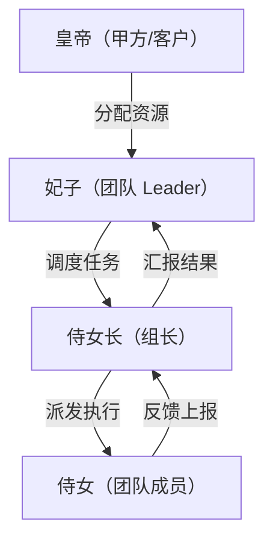

这种团队模式非常行之有效。我们可以看到，缺少了任何一方的作用，整个团队就会失败，或者说在竞争当中比不过别的更好的team：我们可以看到在动画当中除了玉叶之外还有多个反面案例：  
- 里德妃：
    1. 本身不符合甲方的需求，难以获取到业务线资源
    2. 没有能够掌控团队的核心领导力，导致其宫女都轻视其存在，本身长期被欺负。人心不齐

（***不过对于一个孩子而言讲这些还是太过沉重，我们更多的还是应当表达对她的怜悯而并非对她的批评***）
- 梨花妃：
    1. 没有较好的团队洞察水平，面对自己下面的组长，经常被屏蔽，导致对基层干活的人没有掌控力，宫女生病被放到仓库当中也不知道，有人来拜访也是先由侍女长自行判断是否接见再告诉leader。
    2. 团队成员工作素质水平不高：在政策明令禁止使用增白粉的情况下依旧继续使用，导致了梨花妃一度接近死亡边缘，饮食上不听从权威观点一意孤行导致在身体虚弱时依旧大鱼大肉致使消化系统负担极大。
    3. 团队人员过多导致冗余，团队效率，个人掌控力下降。不可控程度与风险上升

（***但是最终还是数值强大力大砖飞，这个真没话说2333***）
- 神美：
    1. 对于业务资源的执念过于深重，导致在可以脱身的时候没有及时断舍离
    2. 领导力心胸狭隘，目光短浅
    3. 自身性格原因导致偏执，将团队方向指向了错误的方向（这里更加指向的是在后期出宫之后的情况，这里其实说法并不严谨，不过本文本身便是趣谈，做做类比即可）

（***可恨之人必然有其可悲之处***）  

那么是否有正面案例呢？答案是肯定的。我们不妨看看那些成功案例：
- 皇太后：拥有足够的野心和能力，在机会来临时能够把握跃迁机会：当时先皇面对她的上司的时候由于心理原因导致业务资源即将浪费，此时她主动把握机会，将资源拿到自己手中，翻身成为新的领导阶级。
- 阿多妃：通过更加有效的方式获取到资源：大多数对象单纯的通过外观来博取皇帝的注意，而阿多妃则从灵魂、性格、三观等方面，更加深刻高效的获取业务资源。

那么玉叶妃之所以能够成为皇后，她做对了什么？

1. 作为领导拥有的长远的目光、广阔的胸怀、过硬的基础素质：即使当中被梨花妃羞辱，她也没有对人家怀恨在心，陷害他人等
2. 拥有一个非常强大的团队：她的团队成员都非常的优秀，一来团队成员的工作素质极高，二来团队成员精简化人数更少，三来团队的凝聚力极强，非常少见到团队内讧，四来由于扁平化管理，鼓励思想交流，成员之间能够直接和leader沟通，交流效率高。五来团队成员素质高，组长能够快速获取并理解leader意图，并派发任务到下方具体人员执行。
3. 能够快速根据业务需求与外部情况做出调整，人员变动，思考周全：比如怀孕之后在买衣服时就能够从猫猫的话结合情境快速想到需要购买更多样式的衣服。防止被推测；看到猫猫有如此能力当场“签合同”招入员工。并在多场景下使用该能力解决问题。；在人手不足时果断招人，并保证人员素质。
4. 因为她善。（doge）
    
至此我们纵观全局，能够发现最终最能符合条件的，只有玉叶妃。那么当上皇后便是水到渠成的结果。成功之道，就在其中~

### 2. 爱好与工作，我们该如何看待？
很多人常说，爱好是爱好，工作是工作。以爱好为工作，会失去本身对于爱好的兴趣；而工作又没有爱好时，那么工作会使人痛不欲生。把工作当爱好，这里有多个含义指向：1、这里的工作指的是广义上的工作，即将工作这一行为当作爱好 2、这里的工作指的是狭义的工作，即将工作当中的内容作为爱好。前者我觉得太变态了，简直是天选超级牛马打工人，资本家的珍宝；后者我认为是一种非常强大的能力。有这种能力的人或许本身并没有相关的爱好，但是在工作之后做到了“干一行爱一行”，这种人无疑是强大的，值得敬佩的。我们需要向这些人学习。

剧中的猫猫明显的属于我们刚刚讲到的爱好成为了工作的人。但是我们需要注意的是，她并没有出现我们说的对“药”这一对象失去了兴趣的情况。这是为什么？我们不妨看看现实生活中的一些常见案例：原本喜欢摄影的人，在成为了专职的摄影师之后，便有的不再喜欢摄影；原本喜欢画画的人，在成为米画师，或者为了工作考级考证的时候便逐渐放下画笔；有些喜欢弹奏乐器的人，在演出当中逐渐消失了热情。观察这些我们在生活当中经常见到的案例，我们或许能够窥见一些原因：他们原本只是通过这种方式来表达自我，通过爱好来释放分享自己的内心情绪，比如悲伤、成就、快乐、苦恼等。但是一旦进入到职业当中，这种表达自我的方式就被套上了他人的约束，爱好行为的本身形成了由本身内驱力执行转变为被外强迫力执行，并且自身的情绪表达在整个过程当中被扼杀。也就说，将爱好转变成为工作之后，爱好便失去了它最开始那份让你喜欢的东西。

那为什么猫猫没有出现这种情况呢？深入到番剧当中，我们不难发现，猫猫工作的过程中，工作内容并不仅仅只是“药”，更多情况下是家务等体力活；其次，作为尝膳官，这份工作的内容就是品尝食物是否有毒，这其实实质上并没有改变猫猫原始尝药时的那份目的——尝试不同的药物，体验中毒的感觉，检查是否有毒对于猫猫而言只是一种附加的、微不足道的步骤。就好像游戏赢完一把要多加一步“点击赞赏确定按钮”那样。同时作为尝膳官本身的职能时为了保他人生命健康。也就是说对于个人的情绪表达从未离开失去。

再者，猫猫学习医药本身混杂着生存体验，动机不止 “好玩”目的是自救，看清底层女性被病痛、毒药随意摆布的命运。她的求知欲叠加了现实关怀：她希望分辨毒药、懂得医术，保护自己，也保护身边弱势的人。单纯的兴趣容易被工作消耗；附着现实意义、生存诉求的热爱，韧性要强得多。单纯 “喜欢摆弄草药” 是消遣；而 “通晓药理可以看穿阴谋、抵御加害、救人活命”，是带有现实重量的追求。

于是猫猫的爱好成为工作产生一种正向的循环：爱好本身对工作有益，工作产出能够继续帮助爱好深入发展。而中间的副产物则是世俗上的与非世俗上的回报。这便是我对猫猫情况的一种解释。

回过头来，我们似乎也能理解了那些“做一行爱一行”或者“爱好成为工作也没有失去兴趣”的人。他们将工作的内容与产出结果转化为了一种自己的情绪的表达&反馈，通过这种正向循环，他们能够持续的保持自己的爱好，同时也能够持续的保持自己的工作。在我们的人生中，这种行为模式我们或许能够效仿，让自己过得更开心、更有价值。但是实际上这种模式非常难得，并不是说我们能够轻易的找到然后就能做到的。这里希望能够看到这里的读者天天开心呀！找到自己的那一份正向Loop！(๑・̀ㅂ・́)و✧

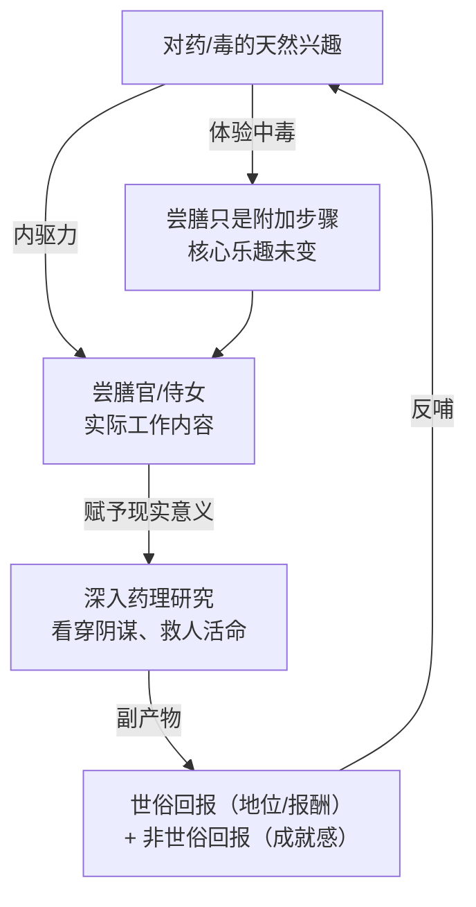

## 味甘｜深宫相伴，知己温情——那些来了走了的人
说到这里，我其实更加想要聊的是猫猫在宫中结识的两位好伙伴：子翠和小兰。作为一名在现实生活当中≈没有朋友的人，对于这种深度密切的关系，其实我是非常羡慕的。这里猫猫的两位朋友，都像一盆燃碳，慢慢的烤化了猫猫心中对外的冰壳。

先来讲讲小兰：小兰和猫猫最开始的相识更偏向于纯粹的利益交换：小兰提供八卦情报，猫猫作为回应给小兰茶会上剩下的食物。但是随着剧情发展，猫猫也主动的为犯错的小兰挺身而出，开始为了他人承担风险。在那之后她们成为了很好的朋友。我相信如果她们没有生活在那样的时代环境下或许会成为一辈子的挚友。然而在猫猫被绑架救回来之后，小兰已经出宫并有了一个好的去处。小兰离开后宫前误以为猫猫和子翠都受到拔擢而先出宫，因此委托赤羽把信件转交给猫猫和子翠。并希望之后能够有一天能够再次相遇。虽然我们都知道这基本是不可能的事情。站在旁观者的视角，这份普通人之间的再平常不过但是又十分真切的友情实在令人遗憾。相遇往往没有约定，离别也是毫无告知，平常人之间的友情大多如此，有缘再见。动画当中并没有提到小兰的社交情况。但是她比猫猫还小，被父母卖进宫中，独自一人在后宫当中生活，一切都没有依靠。她没有猫猫那样的才华被人赏识，也没有子翠那样隐藏的身份。或许猫猫和子翠便是她在后宫枯燥生活的为数不多的光。（说实话看到那么小的孩子就说要找工作的时候我真的心里一酸）相逢短暂，后会无期。

然后便是子翠。我们通过对比能够发现猫猫和子翠在经历上有着很多共同之处：她们的成长当中真正意义上的“母亲”这一角色是缺失的；她们都对某种事物有着这样或者那样的爱好；她们都有着为了别人的一份“善意”，但是又由于成长环境不得不将其隐藏。对于子翠而言，在宫中作为宫女的身份和猫猫等人一起的时候才是真正做自己的时间，作为楼兰妃、在故乡作为神美的女儿的时候做的都是别人强加给她的身份面具。我愿意相信子翠在和猫猫相处的过程中找到了真正的的自我，并且是猫猫给了她最终揭开自己面具的勇气的机会。猫猫和子翠在命运上都被赋予了沉重的枷锁，但是她们不同的选择最终导向了不同的结局。如果她们能够早点相识，结局或许会不一样？相较于朋友，她们的关系更像是“知己”。可悲的是，在她们彻底相互了解对方之后，便要迎来基本永远的分别。这里聊聊子翠最后给自己的新的身份的名字“玉藻”：在日本神话当中也有一个角色叫类似的名字：“玉藻前”；故事当中这是一位绝世美人，聪慧过人，善于伪装，潜伏宫廷搅动朝堂风波，身负多重身份，最终被追杀、消失。这与子翠的经历非常相似。玉藻在剧情的最后将发簪换成了玉蝉。在我国文化当中有以蝉的羽化比喻人能重生的意象。死者将玉蝉陪葬放入嘴中寓意精神不死，再生复活，生者佩戴玉蝉表示高洁。同时玉藻相较于之前替换了发型等外在形象。作者借由这几个情节无疑在向我们读者表示：过去的那位子翠已经死了，玉藻抛弃了过去的一切，迎来新的身份，新的生活。

或许多年之后的猫猫看着乘凉的冰块，会想起那个因为小兰失手打碎冰块，三人在宫里吃冰淇淋的一天。
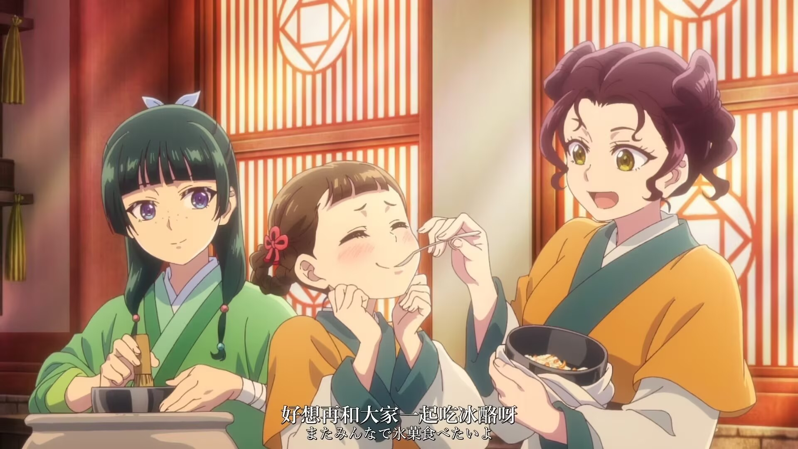
同是天涯沦落人，相逢何必曾相识？原本是陌生人的三人机缘巧合下走到了一起，最终又因机缘巧合下互相离别。与朋友相处的期限从来不由我们自己掌控，我们也不知道明天和分别哪一个会先到来。但是我们并不必为了最终的离别而叹息，友情的影响早已在我们自身的每处角落留下了踪迹。我们的生活是在无数概率碰撞下的结果。那些在我们人生中就是会有很多来了走了的人。我们每个人都有自己要走的路，只不过我们在停下脚步小憩休整时，会在那些角落里看到当时留下的点点滴滴，那是不可多得，弥足珍贵的甘甜。
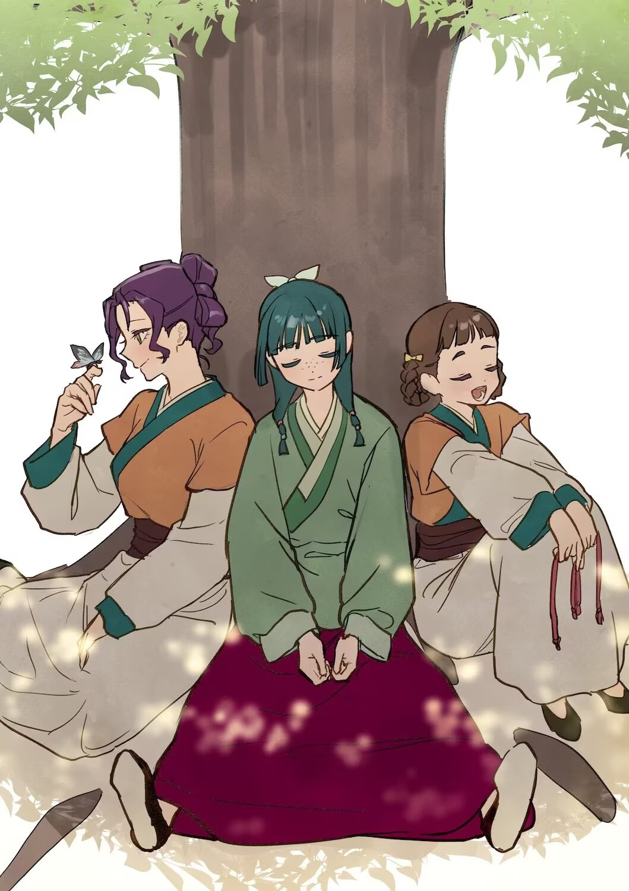
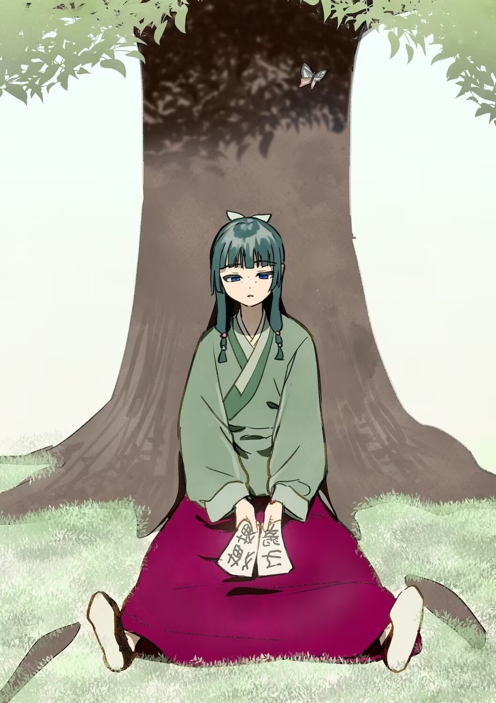

## 味辛｜繁情百绪，爱恨纠葛——爱与恨与悲的交织
在本作当中，我们可以清晰的看到里面有多条主要的爱情线：壬氏&猫猫、罗汉&凤仙、李白&白玲、子昌&神美。这里直接让ai梳理一下关键节点了：
1. 罗汉&凤仙：
    - 患有脸盲症的罗汉，一生只能看清两个人的脸：凤仙和他们的女儿猫猫。两人因棋结缘，凤仙是罗汉眼中唯一的色彩。
    - 凤仙为爱主动委身于罗汉后，罗汉却被派往外地留学，音讯全无。凤仙误以为被抛弃，自尊心让她独自承担后果，沦为暗娼并染上梅毒。
    - 罗汉归来后得知“真相”，悲痛欲绝，开始了漫长的寻找与悔恨。他将对凤仙的爱，部分投射到了女儿猫猫身上。
    - 在猫猫的巧妙安排下，罗汉与凤仙重逢。此时的凤仙已面目全非、意识模糊，但罗汉立刻认出了她，泪流满面。
    - 罗汉拿出随身携带多年的棋子，并坚持要为凤仙赎身。据说宴席庆祝了7天7夜。这段跨越十多年的悲剧爱情，终于在结尾迎来了迟到的温柔。

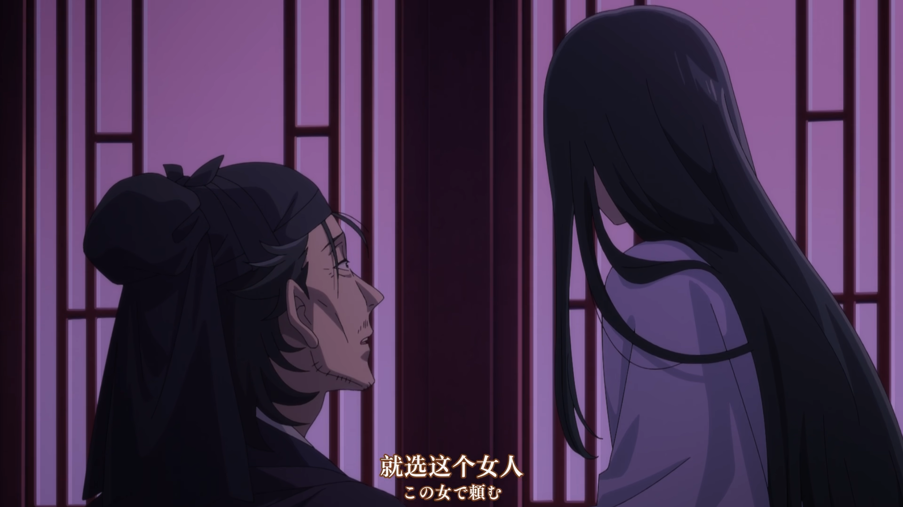

2. 李白&白玲：
    - 猫猫为了离开宫内，委托身为武官的李白，并让李白到青楼中见到了对绿青馆的花魁白玲，并对她一见钟情。
    - 当听闻白玲可能被人赎身时，李白心急如焚，这促使他下定决心要为白玲赎身。
    - 不懈的努力：李白为此向猫猫咨询，并开始拼命工作，努力攒钱。但是面对壬氏提出直接帮他给2w两白银的建议他选择了拒绝，并认为应当由自己做到。
    - 白玲也对李白情有独钟。两人是两情相悦，李白为白玲努力奋斗的故事，也成为权谋剧中一抹难得的亮色。

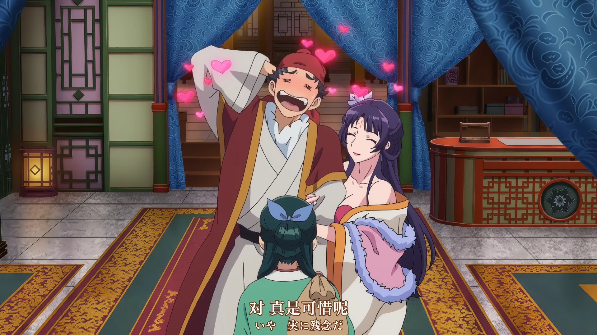

3. 子昌&神美：
    - 神美与子昌本有婚约，但神美因家族原因被送入后宫成为人质，两人被迫分离。
    - 在后宫，神美因被侍女抢先临幸而成为笑柄，自尊心粉碎，性格逐渐扭曲。与此同时，子昌为了能接回神美，努力获取权力，他不惜修建密道私自进入后宫，向神美提出二人私奔，甚至先迎娶了先帝的私生女。
    - 神美最终被下赐给子昌为妻。但子昌的“努力”在神美看来是背叛与羞辱，这段婚姻从一开始就充满了怨恨与控制。
    - 神美将怨恨发泄在家庭中，苛待子昌的其他子女，腐坏家族风气，并策划了一系列阴谋。而子昌出于愧疚与执念，对神美一味纵容，最终导致了子氏一族的覆灭。

4. 壬氏&猫猫：我命令你去把番剧看了！还搁着省流呢！（

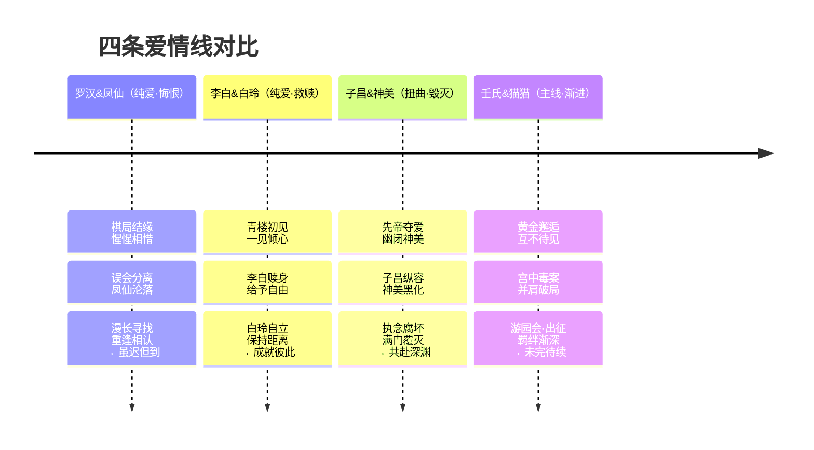

爱情这种事情在从古至今的众多小说中的谈论都经久不衰。作为一名没有谈过任何恋爱的牡丹（哭）对此也只能浅浅的聊聊一些关于爱情观的观点。其实在这四条线当中都有其可以讲的地方。接下来让我从每一条线都讲讲一些自己的感想：

第一条线是最普通励志李白白玲线。在这样一部充满了推理、悬疑、权谋的作品当中能够出现如此纯粹而又单纯的爱情线真是十分的难得。感触最深的时候是李白在需要一个自己完全搞不定的赎金的时候，面对壬氏提出的建议，他竟然拒绝了。他认为迎娶自己的心上人应当要靠自己的双手与努力。即使对方是当时社会地位普遍比较底下的妓女。在后面的剧情也能看到李白靠着自己的努力在一步一步往上爬。先是仓库管理，然后是小队长，然后能够跟着壬氏作为护卫到子昌那参加宴会，最后到跟着壬氏出征平定叛乱。作品没有特别的将他的情况说出来，但是随着我们的深入细节的调研我们能看到他成长的路径。后面通过猫猫的话我们也能看到白玲对于李白的态度，总之就是两情相悦。（太好了是纯爱！我们有救了！）

第二条线是子昌神美线。相较于李白，子昌也是纯爱战神，但是他爱的方式和选择都出现了错误。子昌和神美的悲剧在于：子昌做的每一件事（修密道、求私奔、娶他人）都打着“为了神美”的旗号，却每一件事都踩在神美的自尊上。而神美将后宫屈辱转化为对家族的报复，子昌则用无底线的纵容来补偿愧疚。爱情一旦沦为自我感动的牺牲，或是补偿愧疚的工具，就会牢牢绑住两个人。他们之间最缺乏的不是爱，而是沟通和对彼此边界的尊重——子昌从未问过神美要什么，神美也从未走出自己的怨恨。同时对于爱的过程中同样的不能丧失自己的原则。要守护好自己的最后底线不能越过。放到现实当中就是另一方对自己一方有违背自己原则的需要，比如安全问题、法律问题等。纵容并不是表达爱人的方式。地狱的魔鬼才会不断鼓励人满足人自己的任何需求。

第三条线是罗汉凤仙线。这也是本作当中最具悲剧的一对苦命鸳鸯。明明对方都是自己的唯一，但是命运造化弄人将两人分开，所幸结局是美好的，也是给了观众一个好的答卷。令人印象深刻的是，即使凤仙已经变成了那个样子，但是罗汉依旧能够立刻认出来她的身份。一个最认不出来人脸的人，比任何人都快的认出了一个难以认出的脸。他认出的依据真的是外貌吗？恐怕未必。真正的爱情是一种生理性、超越视觉的“识别”。爱情不能只看外貌，也要看灵魂与本质。外貌会随着时间的流逝改变，但灵魂与本质却是一个人难以变化的唯一主键（primary key）。

最后便是壬氏与猫猫，他们能在彼此的眼中找到那个最真实的自己，而且从来没有一方对于另一方的极端行动。爱情的开端是一场意外，但决定它走向悲剧还是圆满的，永远是当事人的“选择”。

***壬氏和猫猫不要在这里看分析了，我命令你去作品里直接看！（咕咕嘎嘎！）***

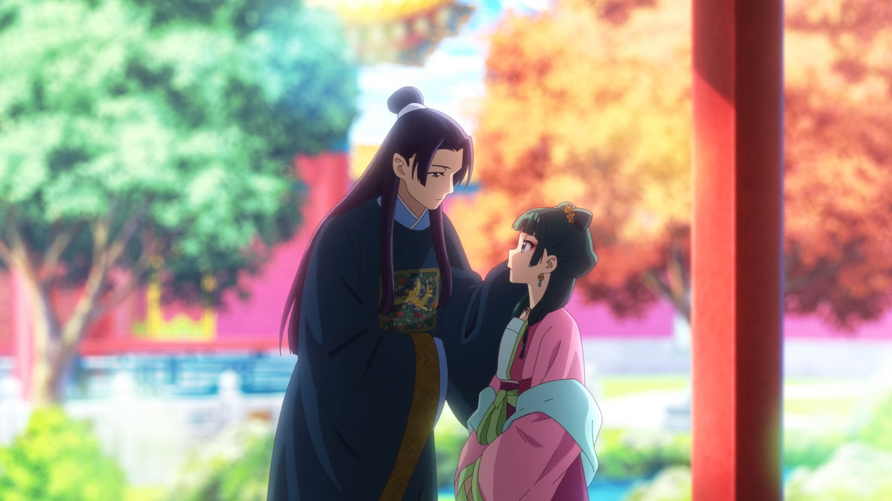
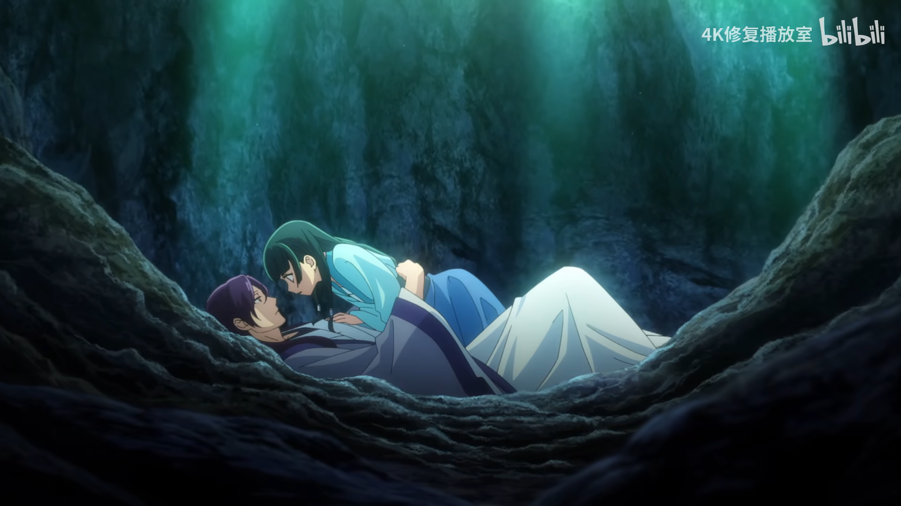

愿各位都能够找到那位命定之人~

## 味咸｜众生百态，风骨天成——剧中人物众生相
对于这部作品而言，我认为其做到了一个非常好的点就是它拒绝了将人物塑造的“脸谱化”。剧中基本每一个人都有多个方面的人物特性，在标识个人鲜明特征的基础之上又存在关于该角色的矛盾点。比如我们都知道猫猫的特征是非常喜欢药、毒，对此之外的内容不感兴趣，但是其面对小兰犯错误、子翠的请求时，又显得非常真实。又比如说壬氏，对外的特征是风度翩翩、形貌宛若天仙，但是其又拥有小孩一般的一面：在和猫猫独处时会提出一些小孩的要求，在独自一人情绪低落时的处理方法就是小孩一样；又比如说高顺，总是给人非常沉稳可靠的形象，但是面对毛毛时又会有铁汉柔情的一面，专门准备小猫吃的食物喂猫，甚至在找猫的时候学猫叫。非常精妙的是作者这样塑造出的人物形象极少有违和感，作者使用了很多方法来讲这些矛盾的形象合理化的放到了一起。人物塑造此时就非常有血有肉，形象立了起来。

那么作者是如何实现的？我认为方法如下：
1. 反差源于不同场景下的切换的社会面具
- 猫猫在药房和毒物面前是专注的“研究狂”，但在后宫社交中显得“真实”——因为前者是她自我选择的领域，后者是她作为“侍女”不得不应对的人情世故。她对小兰的包容、对子翠的仗义，恰恰说明她并非不懂人情，只是选择性投入。作者的巧妙在于：猫猫的“冷漠”不是缺乏共情力，而是她把共情额度留给了真正值得的人。在不同的场景下，常常需要一个人切换不同的身份，因此就会出现了矛盾的地方。作者通过这种常见的方法，将某些角色的真实形象和假装的形象都放到了一起，这样在后面确定出来是真实形象的时候，对于读者的冲击，由于已经有了之前的预设，所以能够较快的接受，同时还能产生“哇原来是这样”的效果。

2. 从“外在标签”到“内在核心”的层层剥开
- 壬氏的“小孩一面”之所以不违和，是因为作者先立住了他“身不由己的统治者”这个核心困境。一个从小被当作政治工具培养、不能表露真实情绪的人，在唯一能卸下防备的猫猫面前表现出幼稚，反而成了他悲剧性身份的解释——那不是“幼稚”，而是被压抑太久的“本我”在安全区的表露。观众不会觉得他崩人设，反而会觉得“原来他也只是个渴望被关注的人”。作者用这种非常自洽的逻辑现在之前的剧情上做出铺垫，之后再“稳稳地接住”。

3. 用小细节撬动大形象
- 高顺学猫叫找毛毛这个场景，是“以小见大”的教科书级处理。沉稳可靠是他作为“壬氏监护人”的职业面具，而喂猫、学猫叫则是他作为“普通中年人”的生活留白。作者没有用大段内心独白来解释高顺的温柔，只是通过一个动作就让形象瞬间立体——温柔不需要理由，只需要一个被看见的瞬间。很多时候人物的塑造我们并不需要写的有多么详细，我们只需要写出那些在生活当中那些非常具有代表性又容易被忽视的细节即可。又比如剧中也有细节：玉叶妃总是自己焚香而不是让侍女来做，这种小细节就体现了她是一个对生活有掌控欲、对品质有要求的聪明人。这些细节在作品当中可能不会以特写的镜头展示出来，但是如果你知道了以后再去看一遍，会有一种发掘到宝藏的惊喜感。

就这样作者用这些方法勾画出了一个存在于他的笔下的后宫和那些形形色色的人啊。

## 总结&想说的话
到此五个部分都讲完了，这一篇文章写到这里也快用了一周。基本就是每天上完班回来睡觉前11点左右谢谢。同时在写的过程中我也意识到，所谓的后劲其实是我对番剧当中那些人物之间的深度联系、不平凡的生活经历与现实当中沟槽的生活和社交现状的对比产生的羡慕、落空感罢了。我太过于渴望这种单纯而又美好的世界，这是我在现实世界基本拿不到的。我们面临的对象、要处理的事情实在是太多了。或许这也是为什么我喜欢追番的原因。暂时的忘记这些烦恼，单纯的欣赏一段不属于我的时空的故事。

让我们敬请期待10月份的第三季和12月份的剧场版吧！