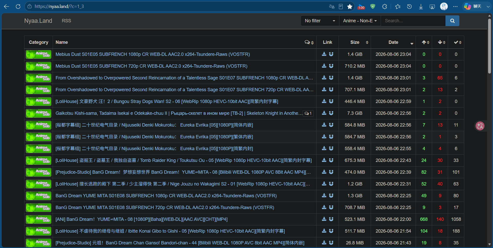
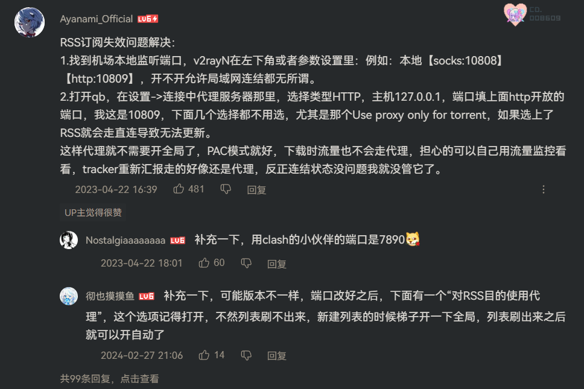
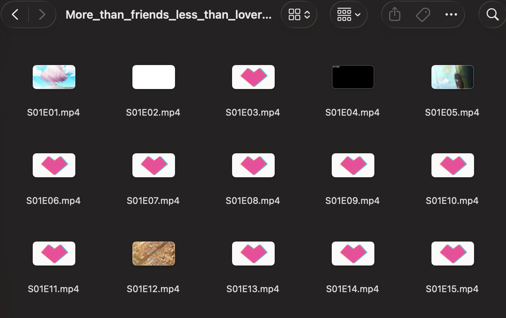
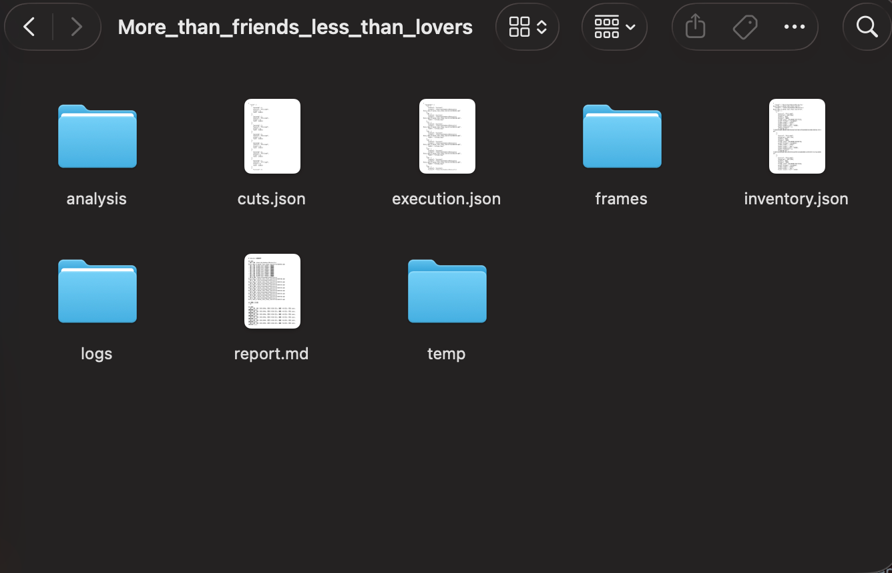
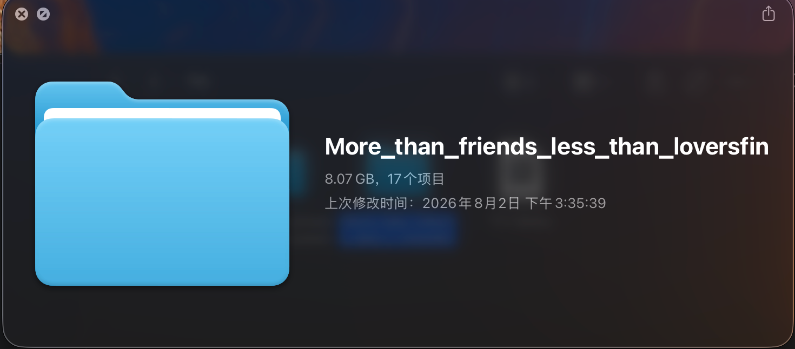

***“那么，古尔丹，代价是什么呢？”***

## 1、为什么我不用现有的方法？
那么在之前的四篇文章之后，相信大家或多或少已经搭建了一套属于自己的“私人影院”。但是对于我这种人来说，获取资源的方法其实很少，一方面确实网上又很多方法，但是都需要很多比较繁琐的操作，对于我这种日常需要上课or上班or开发个人项目的牛马而言，付出这些心智去接收和理解那些内容是一件非常奢侈的事情。目前来说总结一下网上的主流方法如下：
1. 使用迅雷等p2p软件，通过bt种子等对象直接获取到视频资源
2. 通过一些圈外小众圈内大众的网站直接下载视频资源，比如nyaa.land
3. 通过网上一些开源的软件通过配置一系列内容实现自动追番：
    - 比如B站教程
        > https://www.bilibili.com/video/BV1Bx4y1V7M4/
    - 又比如一些GitHub的开源软件比如jackett：
        >https://github.com/Jackett/Jackett.git
    
这里还有很多不一一列举。当然这里如果你是依旧充满了兴趣与活力的同学，不妨确实可以尝试通过上面的那些内容来构建你自己的专属的数字资源。但是对于我这种老咸鱼&ai轮椅享受者，使用以上的内容需要付出的时间精力还是比较无法接收的。  
比如说第一种的p2p资源，我自己使用的过程中会遇到这些问题：
1. 迅雷本身使用就不熟，很多功能需要一定的时间去探索才能使用
2. p2p进行服务下载的时候，可能因为我本地网络的设置原因，会导致在下载过程中使得别的正在运行的需要网络的功能暂时断网。
3. 磁力bt等种子也需要找，对于番剧这种而言比较麻烦

对于第二种网站直接下载，我也不太想使用，你可以看到类似的网站如下：

不难发现，网站的资源很多，但是这里会比较分散，虽然质量高但是想要一次性收集完，是一件比较困难的事情。并且对于我这样的强迫症而言，一次收集不把所有对象都收集完（并且是名字、资源属性相同的那种）会非常令人抓狂。于是我也不想要使用这种方式。虽然你可以直接编写一个脚本来直接爬取资源，但是这种网站一般可能存在不稳定（说不定那天跑路了）、较多的剩余工作（比如你除了核心的爬虫之外，按照我的习惯一般会附带开发一个比较美观的gui界面，否则通过命令行的方式用起来不舒服）等问题。所以我也不想使用。

对于第三种方法，或许解决了上面的一些弊端，但是这种一般面临着复杂的配置，以及涉及到一些魔法上网的相关内容。众所周知一个好的、稳定的魔法是很难得到的。更何况这些复杂的配置。这么说你可能不太觉得有多复杂，那么我将从B站的评论区截取一张评论图，举个例子讲讲：

***（选自上面的bv号的视频评论区）***  
那么我们可以看到里面有非常多的专业名词：rss、v2rayN、socks、qb、use proxy only for torrent 、pac、tracker、连结状态、代理等。这些东西我们日常基本看不到，了解它们你需要：1、把视频看完&理解 2、到网上借助搜索引擎or聊天模型搜寻这些知识 3、跟着教程把这些软件配置好 4、针对过程中出现的问题又疯狂的找解决方法。

对于我这种半只脚成为社畜的牛马而言，这无异于杀人。并且兴趣不在这里，没有更多的动力去捣鼓这些。这里github上的内容更不用说，总之就是非常难受。

## 2、探索的过程-阶段1
那么，有没有一种方法，能够替代上面的那些途径呢？针对这个，我们不难发现，可以将资源的收集分为两个过程阶段：
1. 非常简单的、极少认知代价的获取到稳定、完整、高质量的视频资源服务
2. 将视频资源自动整理存档并存储到本地设备当中  

针对这两个需求，我的探索也自然的分成了两个步骤。  
对于需求1，我们将这些关键词联系起来：稳定、大众、二次元、获取方式成熟，我们几乎可以立刻发现答案远在天边近在眼前——当然就是我们的哔哩哔哩！我们几乎可以发现它满足了我的一切需要：
- 使用没有认知代价：日常的使用就是bilibili（来自B站7年老用户的感叹）
- 服务稳定：bilibili相较于小站会提供更加稳定的接口服务
- 资源广泛而且已经整理好：B站买的番剧越少，能看的番剧越多（都憋说啊），很多番剧有up搬运并且按照季度划分，B站本身也有很多官方存量资源，画质有些甚至都是4K修复版
- 获取方式成熟：B站本身提供了非常成熟的接口服务，已经有很多第三方开源软件使用这些接口服务来获取资源到本地。

但是其实也是有些缺点的，比如某些深夜档、尺度较大的番剧在B站上可能惨遭和谐or根本没有。但是这种情况毕竟是少数。作为一名人畜无害的番剧爱好者兼老绅士，当然不怎么经常碰到这些番剧。那么，这里确定使用B站作为来源之后，便是选择一个工具直接获取到想要的资源对象。关于开源软件这里也有很多，比如jijidown等。这里推荐使用开源软件bili23Downloader，GitHub仓库链接如下：
>https://github.com/ScottSloan/Bili23-Downloader.git  

它的使用非常简单：
1. 到它的release当中下载适合你的电脑的安装包，然后一路默认安装到底即可。（如果你有要求可以自定义一下安装路径，这个应该是基操了）
2. 登陆你的账号，使用B站手机端扫一下二维码即可
3. 配置一下你要下载到的目标本地文件夹，如果你对速度有要求顺便把并发下载数量拉高点。  

好了配置结束了。就这么简单。假如你想要下载某个番剧就直接到对应的番剧界面，直接复制url到软件当中，它会自动解析然后让你选择下载对象。这里我一般选择直接一个季度全部下载。

那么这样我们就完成了第一个问题。

现在，我们面临着一个新的问题：**B站的视频为了过审，一般会在番剧视频的前或者后增加很多不相干的内容。它们的长度有些甚至会比番剧本体长度还长。**   
此处举《尼古喵喵》为例：

我们可以发现在第24分钟不到的时候就已经播放结束了。但是后面还是存在很多剩余的时间是别的无关的视频内容。

存储它们从理论上来说没有问题，但是这样会导致信息密度下降。比如说10GB的视频文件当中有4GB甚至更多的是无关的广告或者其他内容。这在存储成本飙升的今天是难以接受的。我们需要一种方法来将其去除后裁剪。

## 3、探索的过程-阶段2
那么这里裁剪视频用到的方法有很多。最专业的方法便是使用adobe的pr、达芬奇、剪映等专业的软件直接进行剪辑。那么学会上手使用它们，一方面是软件资源和安装比较难处理；另一方面是因为其专业性，所以想要开始能够开始满足最简单的剪辑的需要，也要求我们对其能够有基本的上手了解。按照我们的核心红线：“认知资源是最需要保留和节约的”，这显然不符合我们的要求。于是这里自然而然想到了之前做项目时使用到的ffmpeg工具。其通过命令行参数即可实现对文件的剪辑。我们只要能够拿到剪辑视频的时间节点，即可通过脚本，通过该工具实现批量处理。

那么问题收束到：如何获取到视频的剪辑时间节点？如何保存这些信息供脚本调用？

于是我探索出第一个方法——FastCut：
```
Fast_Cut/
├── config.json              # 全局配置文件
├── locate/                  # CSV 裁剪信息目录
│   └── Heavens_Lost_Property.csv
├── input/                   # 输入视频目录（需自行创建并放入视频）
│   └── Heavens_Lost_Property/
├── output/                  # 裁剪结果输出目录（自动创建）
│   └── Heavens_Lost_Property/
└── scripts/
    ├── rename.py            # 重命名脚本
    ├── create_csv.py        # 生成本地化记录文件脚本
    └── cut.py               # 裁剪脚本
```
使用的步骤为：  
1.安装所需依赖和环境，比如ffmpeg、py的py依赖包等
2.确定配置文件，指定好输入输出目录与将要命名的视频文件的命名规则
3.执行rename.py，将指定目录下的输入目录的视频文件按照规则自动命名
4.使用create_csv.py，初始化本地化持久记录文件
5.人手动记录csv开始的时间节点和结束的时间节点，csv分为以下三个column：

| 列名 | 说明 |
 |------|------|
 | `source_path` | 源视频路径（相对于 `input_dir`，含子文件夹时需填写完整相对路径） |
 | `cut-off_time_begin` | 裁剪起始时间，格式 `HH:MM:SS` 或 `MM:SS` |
 | `cut-off_time_end` | 裁剪结束时间，格式 `HH:MM:SS` 或 `MM:SS` |

5. 执行cut.py，对csv当中的内容进行剪辑。并通过读取配置文件输出到指定的目录当中。

一般来说，一个番剧的一个季度对应一个csv记录文件。

我们不难发现里面的核心痛点：
1. 仍然需要人手动操作，去读取视频文件，然后拖动进度条去查看，然后手动去记录。这里非常耗时间也很枯燥。
2. 面对复杂场景，比如一个番剧本体被分开为两个视频，这里就不能够很好的解决
3. 本脚本仍旧存在很多适配性问题，比如兼容性鲁棒性不足、名称支持性问题、对不同场景的适应性、流程相对复杂等问题。
4. 脚本调用仍旧比较麻烦。以及前置的环境配置问题

总之，这个版本的解决方案总结为：能够初步解决一些问题，但是解决得不够优秀，仍旧没有把用户从枯燥的剪辑过程中解放出来。
（***顺便吐槽：这里一点不fast，叫fastcut真是名不副实了***）

## 4、探索的过程-阶段3
于是，为了适配复杂场景，同时增强易上手性，我选择尝试创建一个类似于之前提到的bili23downloader的app，目标是相同的：指定输入目录，指定输出目录，然后选择开始裁剪。通过多模态的AI进行视频理解并返回序列化可解析的内容，然后最终的输出结果是以季度为一个文件夹的处理好的视频资源。

这里选择使用pyQT5作为gui界面+带有视觉模态能力的模型+手动编排DAG来处理。但是执行过程中遇到了非常多的问题：
1. pyQT5构造ui肯定是使用ai来写了，虽然业界上已经有很多相关的资料，但是ai写出来的效果并不好，需要通过大量的提示词描述风格、功能、布局等去约束ai。但是我们并没有这么多时间去跟ai交流和调整ui界面。
2. 我们实际上面临的场景可以总结为：从多个视频文件当中找到多个目标片段并提取。详细一点说or举例就是：
    - 视频资源可能分布在上下两集甚至更多，然而有些可能一个季度都在一集当中
    - 视频中无关片段的所在位置不一定固定
    - 视频当中的番剧的内容可能不足以让ai分辨处理，比如剧情需要的黑屏等画面易冲突、视频波动产生的场景图没有分辨性等

对于这一点当中的特性，它们并不一定单独存在，它们可能以混合、多次数的方式出现。这对我们编排任务流DAG提出巨大的挑战：我们不得不提前考虑到所有的模式和情况，根据不同的情况来处理流程链路。

我们发现这种处理方式类似于古早机器学习的“专家模式”，即通过尽可能地对出现的现象给出尽可能覆盖的处理规则来应对。显然历史已经告诉了我们这种做法的局限性。

除此之外还有：  

3. 维护处理视频任务状态难度大。比如
    - 多个视频都在发生处理的时候如果要停下该怎么处理？
    - 同一组视频同时发生处理请求时该怎么阻止？
    - 出现了问题DAG流程该怎么捕获异常和维护？
    - 如何追踪任务状态日志？
    - ……

为了解决这些，我们从设计上不得不引入更多的抽象层or中间件来维护，这增加了项目的维护难度和复杂度。这显然也是我们不想要的。

4. 视频处理对ai的要求比较高。最理想的状态应该是直接给定ai一段视频，ai就能够直接通过视频理解能力，输出序列化可解析的字符串。但是目前能够拥有该能力的ai服务太少，比如字节跳动的火山方舟等。曾经考虑过使用ocr或者tts语音分析，但是因为基本没有接触过+之前基本没有看到相关的说法or验证，所以也不使用。 

总之，因为能够专注在上面的时间不多（注意：这里我们对时间的定义并不是指客观的时间，而是指我们能将注意力集中到某件事上的时间），同时面临过多问题，所以该方案在出来一个demo的时候发现基本行不通，于是放弃。

## 5、探索的过程-阶段4
面对以上问题时，经过思考，最终决定抛弃gui，全面拥抱ai agent。将该能力产出为一个skill，然后通过skill当中的cli的方式约束其行为保证流程规范性。agent通过截图+联系图+cli封装视频处理工具进行判断即可。

当前skill已经在GitHub开源和发布相关release（做的烂请勿喷（QAQ））：
> Codebase:  
> https://github.com/Removel/easyCut.git  
> Download release url:  
> https://github.com/Removel/easyCut/releases/download/v0.1.1/easyCut.zip

### 有什么好处？
1. 不需要再手动维护gui界面，只需要跟现有的agent交互即可
2. 不需要维护大量的处理中状态，因为agent一般串行执行，即使你给它同时发布多个命令，它也要慢慢排队处理
3. 无需维护复杂DAG任务图，一切逻辑判断交给agent执行。我们只需提供工具
4. 天然的强鲁棒性，对于输入输出有着自动纠正的能力
5. 解放双手的快乐，我们只需要让agent在后台跑即可，然后完成了看看状况就行了
6. 易配置性。能看到这个的基本都会用agent了，那么你只需要下载上面的zip，然后告诉agent这是个skill，把它安装就算是配置好了。使用的时候直接自然语言描述，agent会询问你一些必要的参数信息，然后就按照使用方式执行流程。全程不涉及复杂的专有名词。

### 介绍
那么介绍一下该skill，命名为easyCut，虽然不一定快，但是确实很easy。skill的结构如下：
```
easycut/
├── README.md
├── SKILL.md
├── agents/
│   └── openai.yaml
├── scripts/
│   └── easycut.py
├── references/
│   └── reencoding.md
├── easycut/
│   ├── cli.py
│   ├── inspect.py
│   ├── capture.py
│   ├── validate.py
│   ├── execute.py
│   ├── verify.py
│   └── ...
├── tests/
├── docs/
└── pyproject.toml
```
功能描述如下：
- SKILL.md：Agent 工作流、能力边界和安全规则。
- agents/openai.yaml：Skill 的界面展示信息和默认提示词。
- scripts/easycut.py：Skill 使用的统一命令入口。
- references/reencoding.md：仅在流复制失败后按需读取的重编码兜底说明。
- easycut/：可测试的媒体处理与工作区实现。
- tests/：CLI、模型、工作区、执行和验证测试。

同时在使用的过程中，由于需要维护中间状态产生的信息，我们还需要指定一个工作目录文件夹。只要你乐意，它可以是任何路径下的文件夹，注意这里可以通过告诉agent或者直接设定环境path方式来使用。因为中间态需要截图产生图片、记录处理的json文件等。这里会按照cli自动产出到文件夹当中，防止信息混乱。输入目录、输出目录、中间目录三者关系如下：
```
输入目录 input
  └── 一部动漫、一个季度的源 MP4
          │
          │ 只读
          ▼
        easyCut ───────────────► 输出目录 output
          │                       └── 仅最终 MP4
          │
          ▼
持久根目录 root
├── knowledge.md
└── work/
    └── <task>/
        └── 任务状态和过程文件
```
这里还想提一句的是，本skill当中还包含了一些自进化的内容。比如agent在执行完一次完整任务之后，skill会要求其将过程中的失败经历和最终的成功经验总结为可复用、泛用性强的内容到knowledge.md当中。注意这个知识会被保存在工作目录当中，所以使用该skill时不推荐经常更换工作目录。亦或者应当能够保证ai知道该knowledge文件的位置。常见的一些经验例子如下：
- 番剧的长度一般在24分钟左右
- 一般番剧会从0分钟0秒开始
- 一般而言会明显的放出“本集结束”的信息在画面上
- ……

那么这里失败了会如何处理呢？这里不得不讲到ai的处理机制了。skill的具体流程大致如下：
1. 确认环境、任务等前提条件
2. 调用工具对指定时间点截图进行逻辑判断
3. 看图，是否找到边界？是-》下一步；不是-》回到2并收束调整时间点
4. 将当前的节点信息记录到持久化工作目录文件当中
5. 都处理完之后调用验证脚本确定数据状态合规
6. 调用剪辑脚本（支持多合一、一分多等，由原子能力提供工具）输出结果
7. 产出对应报告与总结+经验沉淀

那么在过程当中如果出现了错误，能够通过持久化信息记录文件进行追踪；如果出现了ai不能够判定的情况，那么当前相关的视频文件的状态会被标记为“未确定”状态，此时就需要人手动处理。不过一般而言这种情况非常少。在正常情况下甚至不会出现。即使出现了在确定之后直接告诉ai在哪个时间点即可。

### 一些特殊情况的处理
该skill支持使用重编码的方式重新产出视频文件。但是这种使用方式只存在以下几种情况：
1. 你明确需要使用该方法并提供需要的全部参数
2. 对于需要合并到一起的视频文件的属性不兼容，此时agent会向你反馈相关信息。此时回到情况1

此处一般情况下默认走剪辑的方法。因为剪辑的方法相较于重编码的速度快至少一个量级。并且对cpu等硬件资源占用情况较小。实测下来，对于一集1080p 24min的番剧文件，使用重编码的方式，参数为720p 24帧率，在设备为mac m3 pro的情况下需要2 ~ 3分钟，并且能明显听到设备散热风扇起飞的声音。同样情况下通过使用剪辑的方法只需要2 ~ 3秒钟，并且保留1080p+30帧率的视频属性。

不过使用剪辑的方法也是有缺点的：
- 由于mp4底层文件存储原理的原因，在剪辑非关键帧时，可能会导致某个时间点或者极短的时间段内的画面花屏。
- 目前的剪辑的精度在50ms级别，对于人眼而言基本无感知。但是对于及其精细场景下比如专业生产级影视剪辑可能不适用or需要进一步特化调整该skill。

同时该skill需要模型的逻辑能力强+多模态能力强。比如接入glm4.6V时就发现明显的智商问题；量大管饱的deepseek系列可能不适用（根据其多模态能力弱推测，欢迎验证）。在gpt-5.6-sol的使用下经过测试能够完美处理常见的番剧。此处用“恋人不行”验证：

### 验证有效性
- 剪辑后输出产物目录：  

明显的看到全部输出。
- 剪辑中间产物目录：

其中都分别对应着各个阶段的中间分析信息记录
- 剪辑前后目录属性对比：    
剪辑前：
剪辑后：
文件夹大小明显减小。注意这里的时间差距并不代表着剪辑消耗的时间。
- 同一集剪辑前后视频文件验证：  
剪辑前：
剪辑后：
时长明显减少，边界准确性高。名字按照季度+集数命名。

过程中没有人工参与。

**注意：这里的输入输出文件夹，需要名字为英文并且不带空格，否则会导致失败。**

## 总结
当前skill的方法提供了一种最懒人版本的视频资源整理方法。bili23download+easycut-skill的方法几乎让你无痛解决时间长、理解复杂的资源整理工具问题。（那么代价是什么呢，hhh）在这套组合拳的方法下，你的整理方式变成了：打开软件-》粘贴url并下载-》打开agent-》自然语言派发任务（比如“帮我整理好xxx，输入输出工作区等依照惯例即可”）-》等待处理结果并验收 即可完成。

当然关于该流程可能也有能够优化或者集成的空间。这里提供更加进一步的方法思路：在GitHub上有一个项目名称为CLI-Anything，url如下：
> https://github.com/HKUDS/CLI-Anything.git  

该项目尝试将任何开源软件cli化。

如果能将开源的bili23download同样cli，然后接入到当前skill的流程当中，那又将会是一次效率的巨大提升。那么什么时候会做呢？答案是：我也不知道~

那么本次分享就到这里喽，感谢您的阅读！

***~ To be continued ~***