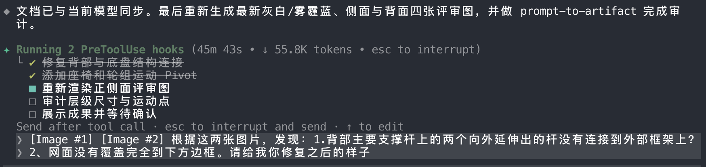
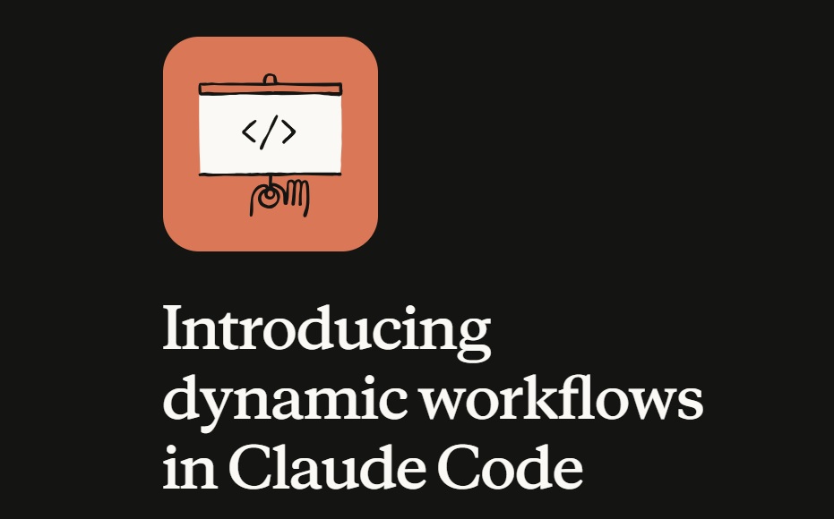

# Dynamic Workflows——一种新的智能体行动模式与执行任务流程方法的发展
## 引言
在最近的公司内部的tech讨论网站上，看到了一篇关于Dynamic Workflows的讨论文章。基于兴趣点进去看了，发现这个概念非常有趣。同时我意识到，很多开创性的东西可能就夹在了我们某些日常开发的两个甚至多个方向之间。只是我们很多时候没有意识到这里能这样做。
## 关于workflow的印象
### 为什么我们会需要workflow？
workflow这个词在agent当中早就已经不陌生了。在为了完成长流程的任务下，我们通常都会要求agent按照一定的任务流程来执行，更多情况下，现在的agent能够自主根据当前任务生成plan，然后按照plan清单去完成任务。这里我们一般观测到的现象为：agent执行任务的过程中，agent输出的内容与我们给agent输入的对话框中间会有相关的清单列表，表示agent根据我们下发指令拆分的步骤。如下图例子所示：  
  
我们可以看到，图中的agent为了完成“修复”这个任务，将流程划分成了修复-添加-重新渲染-审计-展示与验收这些步骤。这种方式有以下的好处：
1. 清晰的反映agent当前正在执行的任务内容，增强用户可观测性
2. 能够动态根据任务执行现状来调整任务流程，提高任务完成效率
3. 同时这种方法也能对agent进行约束，防止agent在执行的过程当中过分偏离原本任务目标  

但是这种方式也有局限性，比如在极大的任务场景下，由于细节很多、可能出现的问题很多、时间很长会导致上下文溢出……此时单agent的规划-执行方式无法满足我们的需求。这种方法只适合一个中小型的任务需要。我们基本不会看到一个agent在执行大型任务的时候，列出一堆清单，然后去完成。这种行为模式显然不太合适。

### 面对大型任务场景下的解决方案
那么对于这种情况，我们目前有很多方案来尝试解决这个问题，这里就聊聊我最熟悉的两种：
#### 1.委派多子agent执行任务
在之前参加相关科研学习时，在面对大型数据分析场景下，我曾经尝试过使用hermes主控+委派子agent执行分析的操作。当时的方案是：
1. 主控agent：
    - 管理任务进度
    - 通过提示词注入等委派任务
    - 处理子agent的执行结果，将内容落实到持久化文件中
    - 统一调度子agent的执行顺序
    - 控制、处理异常情况。比如超时、指令执行错误等
2. 子agent根据主控agent的指令，执行具体的任务：
    - 读取数据
    - 加载并使用分析用skill
    - 执行分析任务并产出相关报告
3. 其余无关部分这里不细讲了

在这一套流程当中，通过这样的方式，一定程度上避免了上下文爆炸与agent注意力涣散导致的流程执行不严谨的问题，并且将一些任务的执行交给了上下文更加干净的对象使用，将任务流程之间通过agent通信解耦。为数据量极大的分析场景下提供了一种有潜力的可行性解决方案。

但是这种方法也存在不少的弊端：
1. 子agent的派发数量受当时的技术限制，只能派发最多三个，但是我们的需要一度到达了16个。这对控制能力产生了巨大的限制。
2. 子agent可能会返回所有上下文执行结果，导致主控agent需要处理大量的文本信息，增加计算成本的同时对主agent的上下文造成巨大压力。
3. 委派过程从用户角度无法观测，只能通过主控agent的输出和agent的tui界面信息来了解任务执行情况。无法控制子agent的执行顺序和任务分配。你不知道主agent向子agent派发了什么命令，你也不知道子agent执行了什么，你也不知道这些agent是否真的按照你的要求执行了任务和验证了任务输出等结果。你无法通过硬编码等强硬的harness方式来控制它们的执行情况。
4. ……

在实际过程中，就经常出现了派发任务之后的主agent接收到了子agent过多的执行结果信息，导致上下文不断膨胀需要经常自动compact压缩，压缩过程中的抽象导致信息丢失。同时，还经常遇到agent执行任务的时候，返回的结果因为执行不规范等导致的质量低下问题……总之，理论可行，但是效果很差。

#### 2.使用DAG任务图来设定任务流程
那么在那之后，我也尝试过使用LangGraph这种agent框架来执行一个任务流程。具体的可见我的GitHub项目：
> https://github.com/Removel/OneAndOnly.git  

该项目当中的agent核心部分便是通过我们预先设定好了一个DAG任务图来处理用户输入的命令，然后通过langgraph编排好的流程来进行agent loop，直到judge agent判断任务结果准出才会完成一轮。

这样的好处在于：
1. 我们能够人工手动编写harness等内容来控制agent，将不确定的内容通过节点之间共享的状态“state”传递，在节点中自定义prompt等较高自由度的代码编写，强制约束agent，规范agent的执行与输出结果等。
2. 在生产环境当中，无论面对多复杂的任务，我们都能通过预先编排好任务图来让agent执行，降低不确定性。比如在电商客服的场景下，agent就一定会遵循我们提前安排的流程，举个查询账单的例子：
```
接受指令-》分析用户意图为查询账单-》通过意图识别agent，防御提示词工具+自动匹配到查询账单的图节点-》从库中查询相关账单状态 -》自动总结相关信息 -》QA节点自动判断质量，通过则继续不通过则打回 -》门禁节点执行脱敏处理 -》 最终输出结果给用户
```

DAG+agent的方法，一方面相较于agent未出现前的传统的ai客服，通过加入agent极大的丰富了功能，同时我们还不用通过手动的编写不同意图下的执行模式与规则来完成用户需求。减少了维护难度并同时提高了可拓展性。另一方面，通过DAG约束，充分减少了agent“自由发挥”的情况。比如敏感信息泄露、提示词攻击防御失败、自动跳过某些关键步骤等问题。

但是该方法依旧存在局限性。它对于不变的生产场景，适配性会很好。但是如果是动态的大型任务呢？我们不可能每次发起一次大型的动态任务前都先手动编写一个DAG任务图。在我看到的那篇文章上，有一句观点说的很好：  
**“任务是未知的，但是我们竟然为这个未知的任务提前设定一个流程。然后用尝试用这个流程去解决这个任务。”**  
即使现在langgraph等有了一些支持动态任务图的功能，但是它们仍然需要从代码层面加入到那个图当中，过于笨重，繁琐。

有人会提出用 AgentTeam（多角色 Agent 团队）来解决大型任务，但 AgentTeam 本质只是一组具备不同职能的执行单元，它本身不定义任务流转逻辑。既可以被主控 Agent 动态调度，也可以嵌入 DAG 节点中运行，不属于独立的任务编排方案，因此本文不把它作为一类范式对比。

## 什么是Dynamic Workflows？
综上，我们能够发现，目前的两个方案对比如下：

| 方案 | 核心优势 | 核心局限 | 适用场景 |
|------|---------|---------|---------|
| 多子Agent委派 | 无需预设流程，**动态自适应未知大任务**；任务解耦，避免单Agent上下文崩坏与注意力涣散 | 执行黑盒不可控、无强流程约束；上下文膨胀严重、结果不稳定、不可审计 | 探索性、动态、未知的大型任务场景 |
| DAG任务图编排 | **流程强约束、可管控可校验**，杜绝Agent乱发挥；结果稳定、可落地、可生产 | 流程固化僵硬，需要提前人工定义拓扑；无法适配未知动态任务，扩展性笨重 | 固定、标准化、确定性的业务生产场景 |

于是最近ClaudeCode官方团队发出了一篇文章用于讲述dynamic workflows这一个概念并落实到官方的agent当中，具体可见：
> 概念说明：https://claude.com/blog/introducing-dynamic-workflows-in-claude-code  
> 如何使用：https://code.claude.com/docs/zh-CN/workflows

**核心在于：在动态任务的场景下，当前agent根据当前情景通过使用一种代码语言，来编写出一套明确的任务流程脚本，同时脚本中从代码层面规定相关约束。然后将该脚本交给执行器执行**



也就是说，传统两种方案都存在明显的单边缺陷：子Agent委派只有动态、没有约束；静态DAG只有约束、没有动态能力。而 Dynamic Workflows 的核心创新，就是将“动态规划能力”与“代码级强约束”进行融合。

不同于依靠Prompt模糊拆解任务、依靠LLM自律执行的软约束模式，Dynamic Workflows 允许智能体在运行时根据未知任务实时生成结构化、可执行、可校验的流程脚本。这套流程将原本的自然语言清单进化成具备执行语义、分支判断、异常捕获、步骤校验的轻量化工作流代码。生成完成后由专属执行器逐条调度运行，全程可观测、可审计、可强制卡点。

简单来说，其执行范式转变为：用户下发未知任务 → Agent实时编写专属工作流脚本 → 脚本自带规则与约束 → 执行器刚性执行并校验结果 → 任务闭环。
## 它和传统的langgraph、subAgent派发的关系与区别？
为了更清晰理解其创新价值，我们从约束性、动态性、可落地性、可观测性四个维度，区分 Dynamic Workflows 与两种传统范式的本质差异。

首先，相较于多子Agent委派方案：子Agent委派完全依赖大模型的prompt理解与自主调度，没有标准化的流程契约。任务拆分、子Agent派发、结果校验全靠模型自主判断，执行过程黑盒化，无法做机器级的强制约束，极易出现上下文膨胀、结果失真、步骤遗漏等问题。而 Dynamic Workflows 保留了动态适配未知任务的能力，同时把所有调度逻辑、步骤规则、校验标准固化在运行时生成的脚本中，将“LLM自律执行”升级为“脚本刚性执行”，彻底解决黑盒不可控、结果不稳定的问题。

其次，相较于LangGraph静态DAG编排方案：传统DAG需要开发者在代码层预定义所有节点、分支、流转拓扑，仅适配固定业务场景，面对未知、探索性、动态变化的大型任务完全无力适配，新增流程成本极高。而 Dynamic Workflows 无需人工预定义拓扑，由Agent针对单次任务实时生成专属流程，兼具DAG的强约束、高稳定、可审计优势，同时彻底摆脱流程固化、扩展性差的短板。

综上可以明确三者的定位差异：
1. 子Agent委派：动态无约束，灵活但不可控，适合探索实验、无法生产落地；
2. 静态DAG编排：约束无动态，稳定但僵硬，适合固定业务、无法适配未知任务；
3. Dynamic Workflows：动态+强约束兼具，既适配未知动态大任务，又具备生产级可控性与稳定性。

## Dynamic Workflows的一种实现说明与应用方式
结合现有Agent工程实践与Claude官方设计思想，Dynamic Workflows可落地为一套轻量化、可复用的运行时工作流生成与执行体系，核心分为三大模块：流程生成模块、刚性执行模块、结果校验与迭代模块。
```
用户原始任务
     ↓
流程生成模块（LLM输出workflow脚本，使用原语集合）
     ↓
刚性执行模块（执行器解析脚本，调用agent/parallel，输出运行日志state）
     ↓
校验迭代模块（check/retry/alert校验；不达标则回退/重新生成脚本）
     ↓
输出最终结果
```
- 第一，流程生成模块。当用户发起未知大型任务时，Agent不再直接执行或委派子任务，而是先对任务目标、执行难点、所需步骤、潜在风险进行拆解，自动生成结构化工作流脚本。脚本中包含明确的执行顺序、分支判断、异常兜底、输出规范等代码级约束，替代传统的自然语言任务清单，从根源上统一执行标准：

这里举个代码案例的例子：
对应的函数功能如下：
|原语|功能说明|
|---|---|
|`agent()`|调度执行子智能体任务|
|`phase()`|标记可可视化工作阶段（界面 / 日志展示）|
|`meta()`|定义工作流元数据、版本、描述、权限|
|`workflow()`|嵌套 / 复用已保存工作流模板，支持工作流中调用工作流|
|`log()`|记录运行时日志、报错、关键节点|
|`args()`|获取当前流程入参、环境变量|
|`state()`|读写全局流程状态（对标 LangGraph State）|
|`check()`|结果校验、合规校验、门禁拦截|
|`retry()`|失败重试策略配置|
|`branch()`|动态分支判断（替代固定 DAG 硬编码分支）|
|`parallel()`|并行任务调度（多 Agent 并发）|
|`persist()`|结果持久化落盘|
|`alert()`|异常告警、降级、兜底|
|`schema()`|输入输出结构化契约约束|
|`timeout()`|步骤超时控制|
|`end()`|流程终止 / 正常结束闭环|  

对应一个示例workflow脚本代码如下：
```javascript
const dynamicWorkflow = {
  // 工作流元信息
  meta: meta({
    name: "大型数据分析动态任务",
    version: "1.0.0",
    createBy: "LLM-Dynamic-Generate",
    desc: "未知任务自动生成工作流，含校验、重试、分支、并行、持久化"
  }),

  // 全局入参定义
  args: args({
    sourceFile: "./big_data.csv",
    confidenceThreshold: 0.7,
    maxRetry: 2
  }),

  // 全局状态容器
  state: state({
    rawData: null,
    cleanData: null,
    analysisResult: null,
    pass: false
  }),

  steps: [
    // 阶段1：数据加载阶段
    phase("数据初始化阶段", async () => {
      log("INFO", "开始加载原始数据集");
      timeout(10000); // 10s超时限制

      // 调用子Agent执行IO任务
      const res = await agent("data_loader_agent", {
        path: args().sourceFile
      });

      // 结构化输出约束
      schema(res, { data: "Array", total: "Number" });

      // 写入全局状态
      state("rawData", res);
      log("SUCCESS", "原始数据加载完成");
    }),

    // 阶段2：数据清洗 + 失败重试
    phase("数据清洗阶段", async () => {
      retry(args().maxRetry);

      const raw = state("rawData");
      const cleanRes = await agent("clean_agent", { data: raw.data });
      
      state("cleanData", cleanRes);
      log("SUCCESS", "数据清洗完成");
    }),

    // 阶段3：并行多Agent分析
    phase("并行智能分析阶段", async () => {
      const clean = state("cleanData");

      // 并行调度多个子Agent
      const analysisRes = await parallel([
        () => agent("stat_agent", { data: clean }),
        () => agent("corr_agent", { data: clean })
      ]);

      state("analysisResult", analysisRes);
      log("SUCCESS", "多维度并行分析完成");
    }),

    // 阶段4：动态分支 + 质量校验
    phase("结果校验与分支决策阶段", async () => {
      const result = state("analysisResult");
      const threshold = args().confidenceThreshold;

      // 动态分支判断：运行时决策
      branch(result[1].r >= threshold)
      .yes(async () => {
        check(true, "置信度达标，校验通过");
        state("pass", true);
      })
      .no(async () => {
        check(false, "置信度不足，触发重新清洗");
        // 复用已有工作流子流程
        await workflow("数据清洗阶段");
        alert("WARN", "结果质量不达标，自动重跑子流程");
      });
    }),

    // 阶段5：持久化归档 + 流程收尾
    phase("结果落地与闭环阶段", async () => {
      if(state("pass")){
        persist(state("analysisResult"), "./final_report.json");
        log("FINISH", "任务全部执行成功，数据已持久化");
      }else{
        alert("ERROR", "多次重试后任务仍未达标");
      }
      end(); // 正式结束工作流
    })
  ]
};
```

- 第二，刚性执行模块。生成的动态脚本交由独立执行器调度运行，可根据任务需求自主调用工具、拆分并行子任务、控制执行节奏。相较于人工编写的固定DAG，该脚本是任务专属、按需生成、用完即弃的，无需修改项目源码，极大降低动态任务的开发成本。同时执行全程日志留存、状态可追溯，解决子Agent委派的黑盒问题。

执行时，agent只需要调用工具，比如:workflowExecutor -excute testworkflow.js，即可触发动态任务的执行。

- 第三，校验迭代模块。脚本内置质量卡点与评审逻辑，参考LangGraph的Judge校验机制，对每一步执行结果进行标准化校验，不合格则自动重试、回滚或重新生成子流程，避免模型自由发挥导致的结果失真，保障任务输出质量。

这里环节中可以使用类似于check()、retry()、alert()等函数，对每一步执行结果进行校验、重试、报警，保障任务输出质量。

那么流程就变为：分析任务-》写/调整workflow-》执行workflow-》验证workflow结果-》loop以上流程直到质量达标.

在实际应用场景中，该模式完美适配两类传统方案无法兼顾的场景：一是面对未知动态大型任务，拥有传统子Agent方案的灵活性，同时能够支持更多数量的agent，将上下文直接通过代码处理完成；二是面对结果合规、流程可审计、质量可把控的准生产级动态任务时，拥有静态DAG方案的稳定性与规范性。

## 总结
纵观智能体工作流的发展历程，Agent任务编排范式经历了多次明显迭代：从最初单Agent自主规划执行，到多子Agent动态委派解决大任务上下文问题、静态DAG编码约束实现生产级稳定落地。但方案始终存在天然短板，形成了“灵活不可控、可控不灵活”的行业矛盾：

- 多子Agent委派以牺牲约束性与稳定性为代价，换取了未知任务的适配能力
- 静态LangGraph DAG编排以牺牲动态扩展性为代价，换取了流程可控性与生产稳定性。
- Dynamic Workflows 的出现，恰好填补了两者之间的空白，实现了动态任务适配与代码级强约束的双向统一。

注意，这里并不一定说要排出方案优劣，更不如说，没有绝对的好与坏的方案，只要是能解决当前问题的方案，就是好的方案。并且方案之间并非独立，它们可能相互嵌套，你中有我，我中有你。

该新模式让智能体可以在无预设流程的情况下，自主为未知大型任务生成标准化、可执行、可校验的专属工作流，既规避了传统方案上下文爆炸、执行黑盒、结果不规范的问题，又解决了静态DAG流程固化、扩展笨重、无法适配动态场景的痛点。是当前大型复杂Agent任务执行场景下，极具落地价值与发展潜力的新一代智能体行动范式。
