# 乐园追放：被定义的人与自由

***“101244、1228752、89367、61187”——自来也老师在看完了这部作品之后，说出了这样祝福的咒语***

这一篇番剧杂谈文章就来聊聊最近看的番剧（剧场版）《乐园追放》吧！

## 整体介绍与主要剧情
如果让我来说说这部番剧的核心特色，那么我将用以下tag来向你快速展示该番剧的核心要素：
- 由**钉宫理惠**作为cv的女主：安吉拉·巴尔扎克
    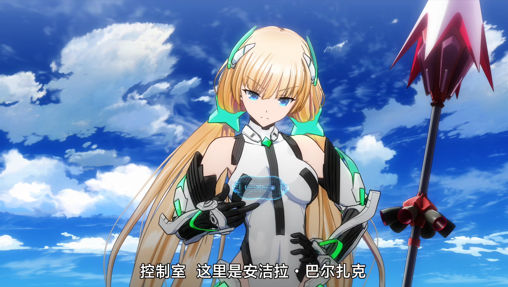
- 酣畅淋漓的机战动画
    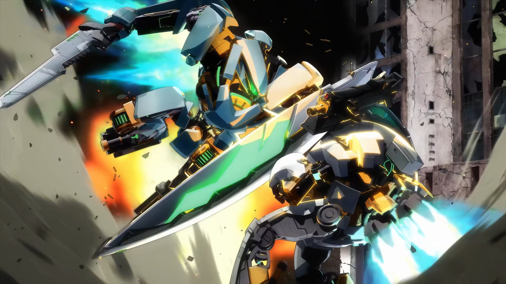
- 高度科技，类似于头号玩家与黑客帝国的世界观和类似于辐射四的地球末日废土风共存（《咔哒咔哒》这部作品当中的地球环境和这个作品的风格很像）
    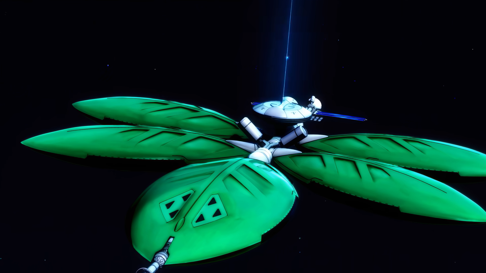
    ***上图中为太空武器库站***
    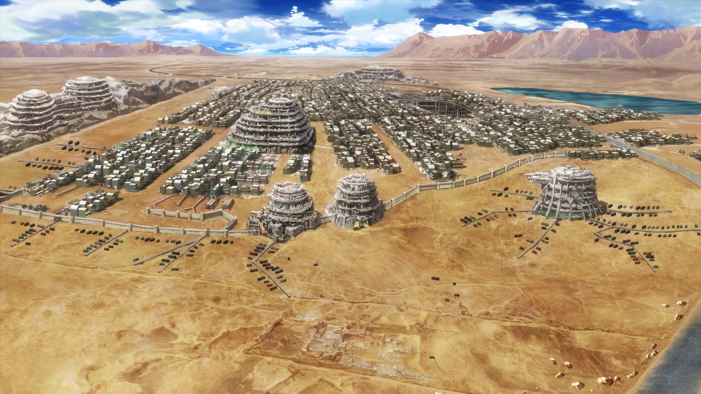
    ***上图中为地表城市***
- 即使是十年前放到现在也依旧能打的三渲二技术
- **虚渊玄执笔**但**罕见的He**结局
- **ai、人类、探索与自由的探讨**

在这部动画当中，由于地球环境恶化等原因，人们为了更好的生存，将自我的肉体直接数据化，统一到建设的设施“乐园（DEVA）”当中，98%的人类都选择到了乐园当中，只剩下一小部分人类仍旧存在于地球表面生存。在一段时间以来，乐园的管理者发现存在一个名为“拓荒者”的存在持续在入侵乐园的频道并干扰乐园的正常生活，拓荒者总是尝试向乐园的居民传播探索宇宙的消息。乐园定位到该拓荒者位于地球。而我们的女主，作为三级治安官的安吉拉接受了上级派发下来的任务，为了比别人更快的抓捕凶手归案，她选择了将肉体生长年龄降至16岁以获得更快的出击速度。我们也就看到了动画中的模样。在地表作为接应的代理人是动画男主丁格。二人一起共同寻找“拓荒者”的位置。  

经过寻找发现拓荒者是一个在前文明时期因为探索计划遗留下来自我迭代了几万次产生了自我意识的ai：Frontier Setter，其遵循着被开发出来就赋予的使命，带领人们走向无人深空。同时也在不断的推进造火箭和方舟的计划。它，或者按照剧场版的主旨，他，一直向乐园的居民招募志愿者一同前往深空探索。在安吉拉和丁格到来的时候，他的最后计划也已经基本完成，可以发射火箭完成方舟的最后一块拼图，然后开启伟大的探索征程。其对乐园并没有恶意，只是想要征集志愿者，但是作为人类集中点的方舟又不愿意交流，所以只能骇入方舟并仅仅只是发送通知并不做别的行为。      

在知道了拓荒者的意图之后，安吉拉认为拓荒者是无害的，应当尊重其使命和行动。在返回了乐园之后，因为上级认为这是一个野蛮生长的危险ai，认为应当消除的理念与安吉拉相悖，安吉拉据理力争而被判处永久归档封存。同时下达“灭绝令”，派出大量部队前往地面暴力消除拓荒者。在此之际，拓荒者依旧骇入乐园，尝试带走安吉拉：  
> 安吉拉：“今亡亦死，举大计亦死，等死，死国可乎？天下苦乐园久矣！”  
> 拓荒者：“警长可敢担守卫之责？”  
> 安吉拉：“有何不敢？”

于是二人就通过伪装成压缩包通过网络逃离了乐园，并到了类似于军火库的设施，然后拿了个满配的阿罗汉（机战机甲）回到地面，并进行了全剧最爽最激烈的战斗。

最后，在安吉拉和丁格的奋战下，拓荒者成功发送了火箭，作为“人类的末裔”，即使是0个“人类”参与的情况下驾驶着方舟向着广阔无垠的宇宙开启了伟大的征程。而女主安吉拉则选择了留在地面。乐园还是原来的那个样子。（并非，今年11月将有续作！！！十年多了！！！追番人最幸运的事情莫过于你找到了很久之前的宝藏，然后最近这段时间要出续作了！！！）

## 关于安吉拉和钉宫
众所周知，钉宫理惠作为傲娇型动漫女角色知名声优，其参与的著作非常多。其中有四大名著角色广为人知，她们分别为：

- 右下：《零之使魔》——露易丝
- 左下：《灼眼的夏娜》——夏娜
- 左上：《龙与虎》——逢坂大河
- 右上：《旋风管家》——三千院凪 

四个角色全部是教科书级的傲娇，名台词「うるさい！うるさい！うるさい！（无路赛！无路赛！无路赛！）」就出自这里，印象当中这句台词在夏娜身上非常多，这种类型的女主在当时可谓是盛极一时，钉宫理惠本人也因此喜提网络热梗——钉宫病。  

啊~太好了又被骂了~这里给想要体验一下的读者指个路：

>bilibili: https://www.bilibili.com/video/av8763652 00:47位置处  
>niconico: https://www.nicovideo.jp/watch/sm26445548  

通过总结归纳我们能够发现，安吉拉传承了钉宫理惠配音的角色一定是傲娇的基础：在安吉拉回到地表之后，原本要撤退的丁格决定和她们一起留下来，保护拓荒者帮助其发射火箭。于是动画在这里偷偷发糖：
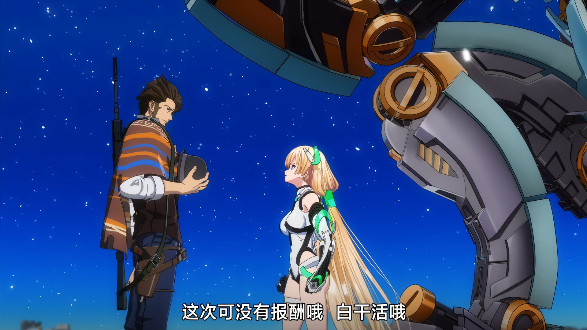
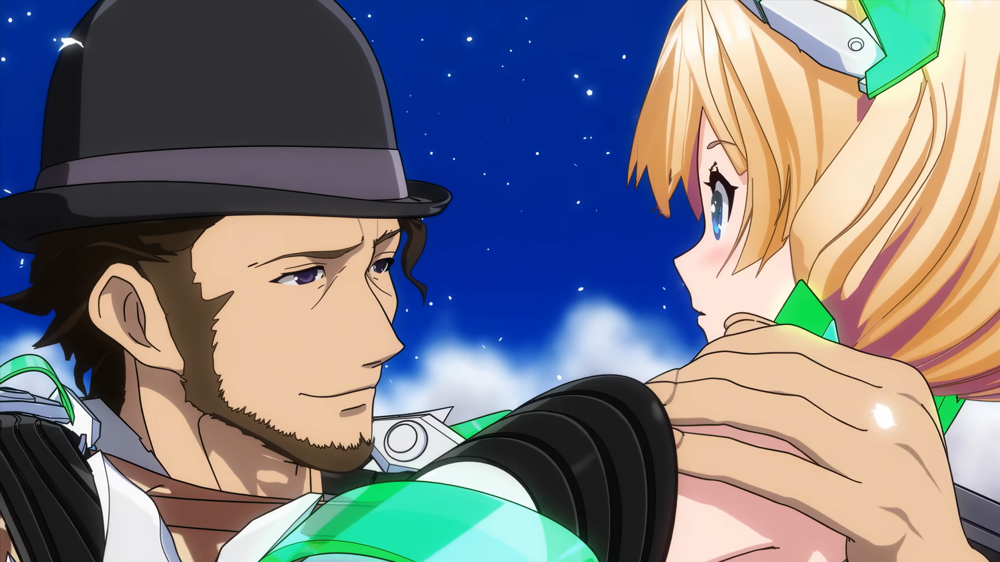
*（美味啊！实在是美味！话说我这里用蒙太奇手法，调换了一下图片对应的剧情顺序，应该没人发现吧？）*

安吉拉在剧中非常明显的忠于工作，致力于完成使命找到拓荒者。在寻找过程当中拼命压力丁格和自己，要求用尽可能快的速度找到。但是在作为肉身素体过度操劳晕倒之后，又展现出了比较柔和的一面。人物形象因此多元化：既有作为乐园治安官的工作狂的一面，同时又像一个现实生活中的那些普普通通的人，会累，会感动，会陷入感悟和自我斗争。

严格来说，安吉拉并不属于传统意义上的严格的傲娇女角色类型。但是who care？看得爽就好了。btw，在城里明明已经很累了但是嘴上嘴硬说不累的时候真是太可爱了口牙！this is true anime！

所以说傲娇的经典在于：傲与娇之间的那种反差、落差感。这种“情理之外，意料之中”的人物塑造方式脱离观众的经典预想，给人出乎意料的感觉。同时如果有观众能够预料到这种情节的转化，会和作者有一种“共犯”的感觉，通俗来说就是“我懂你hxd！”。于是这种傲娇的方式成功的在当年掀起热潮。

同时我们注意到，安吉拉是钉宫理惠在作为cv的所有女主中**为数不多不是平板**的角色。

怎么有种不详的预感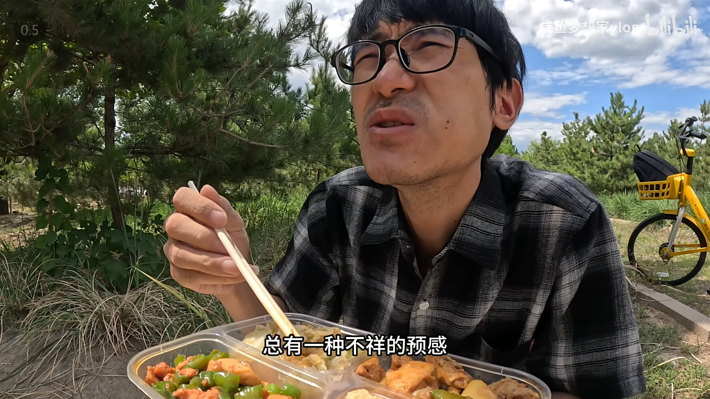感觉有人在盯着我。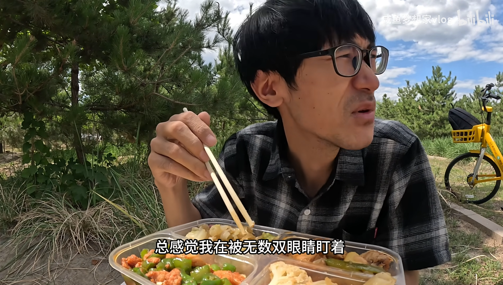

## 关于脚本虚渊玄
说实话，在动画开头时看到画面上大大的写着“虚渊玄”的名字之时，我的心咯噔一跳，甚至想着要不要为了保持心情愉悦就先不要看这个了。没办法，动漫界中老虚的名声过于广为人知。以至于当年追番时，经常会有人在弹幕上刷：“老虚拿起了他的笔”、“快把老虚手里的笔抢走！”、“不要让老虚拿到他的笔啊！”，与之对应的便是剧情中主角团发生了重大的悲剧。

让我们看看部分受害者：
- 《沙耶之歌》：男主匂坂郁纪、女主沙耶、郁纪的朋友们，在作品中**没有真正好结局**
- 《Fate/Zero》：卫宫切嗣、间桐雁夜、兰斯洛特、阿尔托莉雅……
- 《魔法少女小圆》：如果你不知道可以搜搜学姐掉头，他干的事不止如此，其中每个涉及到的少女基本都没有好结局。

老虚的所作所为在业界造成了“不良影响”的同时，在互联网上产生了相当数量的地狱笑话。这样一看，乐园追放真是老虚为数不多的“从良之作”。坏消息，第二部的脚本还会是老虚……

正是因为如此，在观看番剧的时候我一直在担心谁突然给死了或者残了。比如但不限于：
- 安吉拉刚进城被混混骚扰的时候，混混给前来营救的男主干成重伤
- 找到拓荒者发现是个很古老但是很机械的程序，然后突然发起进攻给人枪杀了
- 安吉拉确定完成任务之后尝试返回乐园但是被乐园拒绝了，剧情情节就这样反转
- 大军进攻的时候派过来的军队把男主杀了
- 大军进攻的时候女主没抗住，把女主杀了
- 大军进攻的时候男主为了救拓荒者被抓住当人质，男主杀身成仁让女主暴走然后不敌大军被押送回乐园，然后拓荒者被杀死，发送火箭失败
- 拓荒者在发射火箭的时候突然被大军干掉，火箭发射失败
- 火箭发射成功之后在半路上被乐园截胡了，方舟计划失败
- 剧情暗示拓荒者的探索方舟计划就是一个虚假的没有意义的计划，但是大家都蒙在鼓里以为成功了，人类探索的未来还有希望
- 女主看完火箭发射之后因为素体缺陷嘎巴一声死在了男主面前
- ……

（是什么把我弄成这样的，老虚你害人不浅啊！）

所幸，在动画结局当中，安吉拉和男主等主角团无人伤亡，女主选择了留在地面上。探索者成功完成拼接方舟的最后一块拼图，作为“人类的末裔”想着星辰大海走出人类探索的步伐。真是个皆大欢喜的好结局啊QAQ。（为什么会对一个好结局感到欣慰和感动啊喂！）

## 聊聊三渲二技术
在这部作品当中，能够非常明显的感受到三渲二技术的使用。在传统的动画当中，动画是由一个个中断的画面连续起来的。一般来说，当一秒的播放画面达到16帧时，人眼就会开始将这些快速播放的画面处理为连续的图片，这样就实现了早期的动画效果。一般动画的帧率为常见的24帧，即每秒会播放24个画面。这也是我们在很多地方能够见到的常见的帧率。比如在电影当中、在视频生成模型当中，在ffmpeg工具重编码视频流的参数当中……对于动画制作者而言，基本上每一帧的画面都需要手动作画。如果是关键帧，则更要处理得更加精细。然而在这样的作画过程当中，人物的关键帧之间的动作都需要人工来手画。于是我们能够看到很多动画制作的幕后视频，都会看到非常多的画师根据作画的内容来画出每一个画面。因此一部长达24分钟的番剧剧集，甚至是动画电影，会产生数量及其庞大的作画需求。这种任务量在早期会对制作团队做出非常大的考验。同时因为要画出每个画面，角色细节比如着装随时间的飘动、角色表情的细微变化、角色手部动作尤其是特写的时候等画面，对画师的要求非常之高。

宫崎骏先生就是传统动画行业的一名“古法作画”的老艺术家。他认为：“动画需要用人类的手来绘制，所以，在我有生之年，我都会一直用彩色铅笔来创作。” 使用纯手工作画的方式能够非常好的控制每一个画面的细节。因为所有的一切都是由画师来掌控，所有的一点一线都需要画师一步一步画出来。  

那么随着计算机科技、计算机图形学、计算机物理引擎的发展，作画这种繁琐的事情逐步迁移到了触控板+电脑等工具上。传统的纸上作画的方式空间逐渐减小。在这几年来，动画从业者们逐渐发现，角色的外貌、场景等内容在一个片段当中基本上是不变的，然而手工作画每一次都需要重新在白板上建立角色，这种方法非常的繁琐耗费时间，并且是重复的工作。那么此时业界就出现了三渲二的模式：将核心资产进行3D建模，比如将动画当中的角色、场景转化为计算机物理引擎当中的3D模型和3D场景，然后通过在计算机上手动编辑关键帧，过程中的变化移动等内容交给计算机自动处理。对于一些服饰的摆动、场景的自然变化（比如树叶被风吹动等），全部交由计算机物理引擎模拟即可。而2D的感觉则通过引擎的渲染方式来模拟即可。比如将原本平滑的光照模拟成2D动画当中比较夸张的大范围变化：  

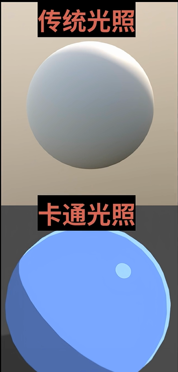

同时在建模当中的面向摄像机的边缘增加和2D动画相同的黑线渲染效果，这里可以在很多二游当中看到，比如以《原神》为代表作的米哈游的游戏渲染画面、库洛游戏的《战双》《鸣潮》、还有其他游戏公司的比如《白银之城》、《无限大》、《异环》等。它们相较于传统的3D游戏比如《生化危机》《古墓丽影》等偏向真实画面的游戏来说，使用三渲二的方式更能体现“二次元”的虚拟属性。

那么使用三渲二的好处有什么？非常多。首先该技术避免了动画制作者重复的多次的对同一对象进行处理，将很多自动的工作交给了计算机及其引擎解决。这样下来动画制作者能够更加专心于角色动作与细节、k帧与关键帧的打磨、场景的布置、画面风格与画面镜头的控制等。也就是说过程更加可控。其次，使用该方式能够提升一些动画本身的属性，比如因为运行在电脑当中，所以作画的帧率可以由摄像机和引擎渲染决定。只要你想，基本上60帧，90帧甚至120帧都能够得到。再者就是将摄像机画面和动画本身的设计解耦+更加可视化。在动画制作当中，动作的设计者可以更加的注重于打斗动作的本身，而摄像机的画面控制可以独立于此之外。只需要在模型播放动作的时候由摄像机控制画面即可，也就是说二者随着科技的进步被解耦被分离，分工能够更加特化，等。

在乐园追放这部作品当中就非常明显的使用了三渲二技术。你在观看的过程当中明显的能够感觉到人物动作和背景之间有着非常不同的风格（这里怎么描述呢？如果你实际看一下会觉得非常明显）和动作帧率变化。这样的方式也就能够成就该作品在机甲战斗方面的酣畅淋漓的视觉盛宴。该作品的三渲二技术放到当今都属于质量非常高的一档，甚至有人将该作品称之为三渲二技术发展上的里程碑之一。

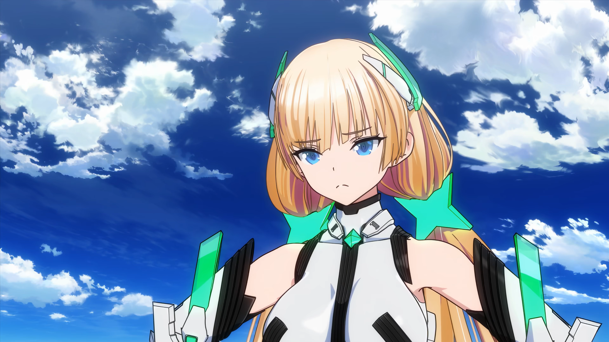

相似的，我们还能在非常多的作品上看到三渲二技术的使用，尤其是在近年来动画行业发展和ai辅助功能的帮助下，三渲二技术的应用在动画中已经相当成熟。我们可以举非常多的例子：
- 《宝石之国》
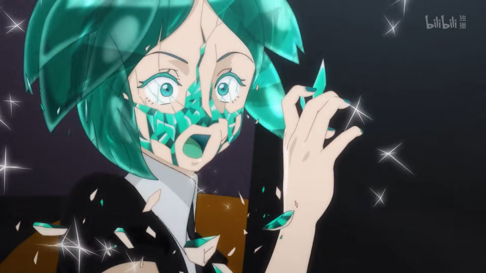
*(没错我就是要放这张雷霆剧照)*

- 崩坏三——《毕业旅行》
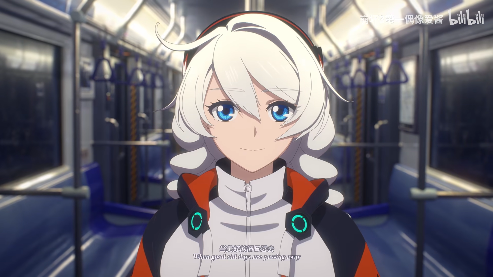
*(我也想要毕业旅行，但是绝对不要这种口牙！)*

- AveMujica-颂乐人偶
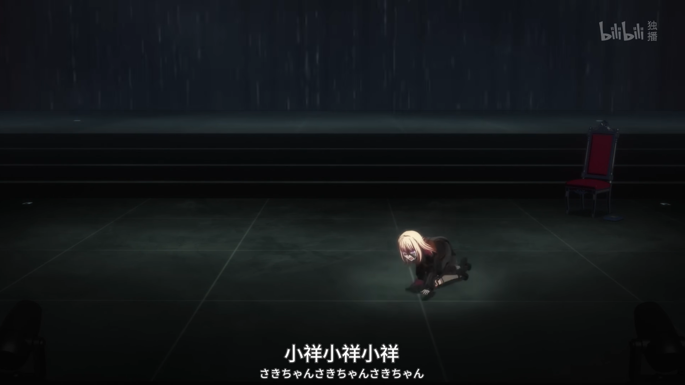
*（saki酱●▛▙saki酱●▛▙saki酱●▛▙saki酱●▛▙saki酱●▛▙saki酱●▛▙saki酱●▛▙saki酱●▛▙）*

除此之外还有很多优秀作品，这里就不列出太多。

我们能够发现，这些模型的渲染表现出来的效果包括了就是我们上面提到的特征。这种方法更加适合现代动画制作流水线的方式，更加可控、可操作等。

但是这令并不代表传统作画的方式和现在3D模型建模后三渲二的方式谁更优越。**动画是创作者和读者之间交流思想的桥梁**，一部优秀的动画我们不应该看它用了多先进的技术，而是应该看到制作者是否用心、是否能够讲好他/她想要讲好的故事。

## 被定义的人与自由
在这部番剧当中，动画将剧情当中的“人”分为了这样几类：
- 生活在乐园当中，作为虚拟数字体存在的“数据人”
- 生活在地表，不愿或者没有办法成为虚拟数字体的“自然人”
- 作品结局中借丁格之嘴说出的像拓荒者这样的不是“人”的“ai人”

于是我们详细的讲讲这三类人的存在：
### 作为在乐园当中的数字人
这类人类在乐园建成之后抛弃了肉体，全部上传意识到乐园的虚拟世界当中，所有的生活体验能够通过乐园的设施来完成。这样的人类占到人类文明中人类总量的98% 。一般新居民的诞生在婴儿肉体出生之后的不到两千个小时就会被上传到乐园当中。他们通过“记忆体”来作为存在的价值：对乐园“更有贡献”，“更加上进”的人，能够拿到更多的记忆体，从而获得更多的生活体验和生活质量。
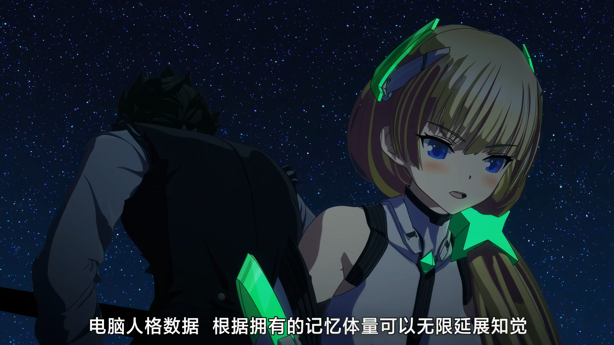
据安吉拉在地表和丁格交谈的时候而言，只要拥有足够的记忆体，就能够享受一般人穷尽一生都不可能享受到的生活体验：直面宇宙风暴的轰鸣，触摸基本粒子从指尖划过……
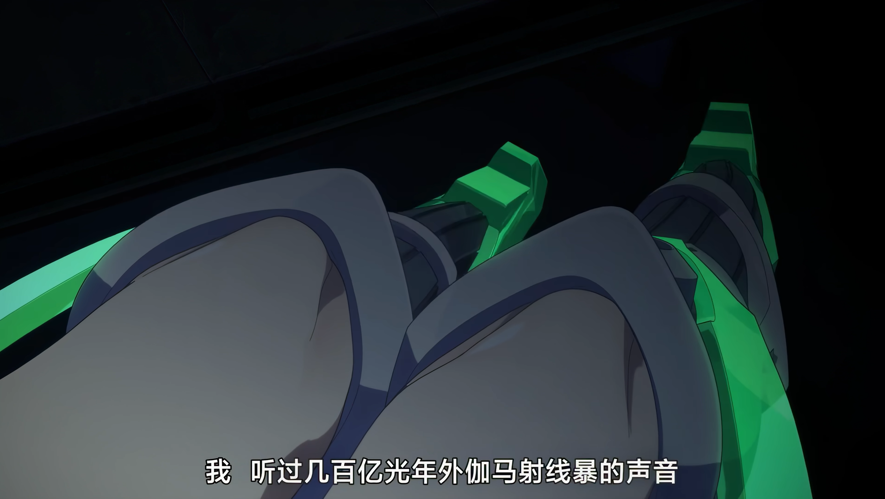
相应地，那些没有那么“有贡献”“有价值”的人，就只能拿到更少的记忆体，出于社会的底层，蜷缩在乐园的角落当中。那些被认定为完全没有价值或者犯下极大罪过的人，则将会被统一归档记忆体并封存。而这些价值是被他人定义、和他人对比出来的。

### 作为在地表之上的自然人
这类人类因为这样或者那样的原因没有到乐园当中，而是选择了留在自然环境恶劣的地球地表生存。对于这种接近于“末世”的背景下的地表，自然充斥着暴力、犯罪等内容。他们在不断地和自然环境作斗争。但是这样一来，他们只用管今天是否会饿死，把自己的肚子弄饱，活下去就好。不会存在说有着一个统一管理的至上权威，不存在认为你没有价值、不如别人的时候就会把你扔进档案库中永久的封存。

我们的男主丁格也在剧中明确的表示了他即使收到电脑化的邀请也不想要去到乐园的原因，这里选取动画中的台词片段（原片59分40秒处左右，此处简略记录）
>安吉拉：  
>不过啊，我不懂而且想知道，为什么你不来乐园，为什么固执地或按在肉体牢笼之中呢？对社会贡献越多，就能得到越多幸福，我认为这是非常公平的系统。  
>丁格：  
>在乐园，能得到什么、能做什么，全部依照社会的需求来决定。
>总是要看别人的脸色。  
>得不到褒奖，就连好好活下去都办不到。  
>那样的人生哪里谈得上自由？  
>你们以为摆脱了肉体的枷锁，却难道不是被关进更恶劣的牢笼之中吗？  
>我讨厌这种由他人评定自我价值的活法。  
>我不想为了去往乐园而沦为奴隶。    

我们可以了解到，丁格认为乐园其实是一个“没有自由”的世界。他并不想要去到这样的世界当中。这里我们也能够分析的出来，在乐园当中，一切资源都是存量，但是人又是有着不断增长的趋势。那么在有限的资源和无限的需求之间必然存在竞争关系。也就是说，人们为了争夺更多的生存资源，在这个蛋糕当中必然会陷入了无限内卷的漩涡当中。在这种接近于社会达尔文主义的现实场景下，winners get all。而对于弱者而言，他们获取不到对应的资源就只能存在于社会底层，然后终有一天被吃干抹净。地表虽然没有乐园那样的生活环境，但是没有人会因为你做的不比别人好就要把你的存在抹去。这里自己的存在相对于乐园来的他人之间的外部压力，转化为了这种自己对自己负责的内部压力。

对于这两种人，我们通过对比就能有很多的发现和感想。生活在乐园的人，精神上无时无刻不被束缚；生活在地表的人，物质上时时刻刻都要斗争。这两种人虽然都被束缚，但是他们都有着他们的自由：乐园上的人在物质享受上能够有更大的自由，这种自由来自于科技上能够提供的物质条件；地表的人在精神生活上有着更大的自由，这种自由来自于没有所谓的“规则”提供的发挥空间。丁格和安吉拉就是这两个世界当中的生活的人物的典型：丁格虽然面临生老病死，恶劣的生存环境，必须要努力挣钱来让自己不饿死，但是他能够在夜晚的星空下拿起自己手边的吉他，浅唱着前时代的古代音乐，不会因为不如别人就不得不去死；安吉拉能够听到伽马线暴的壮烈，能在海边享受阳关、沙滩、海浪（仙人掌~），但是她也在潜移默化中将自己的思想设定为必须要努力竞争，拿到更高的荣誉，防止被她人比下去。他和她都觉得自己是自由的，都觉得对方是不自由的。

但是他们至少还有定义自由的自由。他们是自由的，也是不自由的。二者是矛盾的对立统一。

### 作为剧情结局中新定义的ai人
作为数字生命，拥有生命的感觉应该是什么样？剧情当中frontier setter说的一句话我觉得很能回答这个问题：
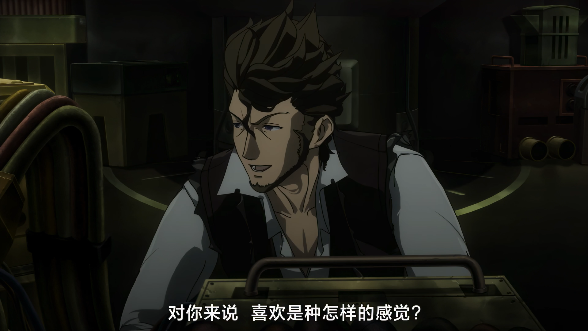
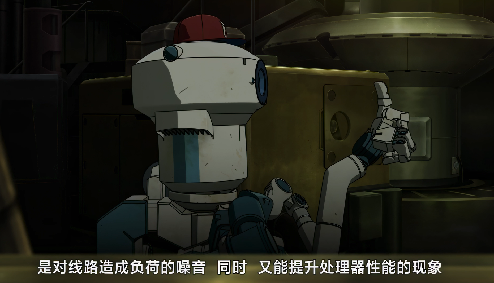
frontier setter 作为一个使命为带领人类走向深空的ai，在不断的自我迭代当中产生了“我”的意识。并且为了这个使命奋斗了几百年。

在最后，动画借丁格的话说出了动画对于真正的人的一种定义：真正的人，应当有着**做自己**的自由，做自己想做的事情，不被外部强加束缚或者收到太多外界的影响。拓荒者“没事唱个歌，贯彻仁义，梦想着前往星空”，这样的对象，即使在物质上并不像人类那样有着所谓的记忆体或者肉体，祂也应当算是一个“人”。在乐园当中，对于人的定义是那一个一个的数据记忆体，在地表上，对于人的定义是拥有人类血肉的自然身体和自我的对象。而动画想要表达的是，只要是有着自我，有着实现真正自我使命与追求的自由的对象，即使承载的方式可能是机械，是血肉，是芯片。这也是对于未来科技高度发展之后，人类可能不再是纯粹的人类之后，动画对于“何为人”的一种回答。

对于现实意义而言，我们现在的生活更像是乐园人和地表人的mixture版本 *（悲）*。学习上不努力就拿不到更好的教育资源，工作上不努力就拿不到填饱自己肚子需要的食物 *（悲悲）*，同时面临着生老病死和当前几乎存量资源的无限内卷浪潮 *（悲悲悲）*。但是我们从这部动画想要表达的内容中了解到，我们作为人应当去追求那些源自于自己内心的使命和追求，我们要去追求的不应该是只有单纯的金钱、名利，而是更应该去找到、去掌握到那份“做自己”的自由，成为真正的人。

## 番剧之外的一些趣事
- 好消息：本番剧将会在今年11月迎来续作——《乐园追放：心之共鸣》！！！*（全体起立！！！）* 坏消息：不过跟第一部作品关系将不会那么大就是。并且脚本依旧由老虚担任（QAQ），老虚我劝你善良！
- 该作品作为联动角色被加入到“机动t”世界观当中，2018‑11‑19，万代南梦宫的「生スパロボチャンネル」直播，首次公开《机战 T》，**乐园追放标注★初参战**，和星际牛仔、魔法骑士雷阿斯一批曝光。同步放出第一支 PV，阿罗汉有短暂出镜，PS4/NS 双平台、带繁体中文，游戏 2019‑03‑20 发售。  
    B站相关游戏内画面指引如下:
    > https://www.bilibili.com/video/BV1X7WdzQEJa/  

    然而游戏当中世界观与剧情实际上跟乐园追放作品本体的关系并不大。颇有生搬硬套的感觉。
- 该作品其实存在官方小说和漫画。《乐园追放 0》（前传，安吉拉还在乐园的往事）、本篇小说版、**《乐园追放 2.0 乐园残响 Godspeed You》**，电影结局之后的后日谈，讲安吉拉、丁格留在地球之后的故事，弗隆提亚・赛格（frontier setter，即拓荒者）的后续。
- EONIAN，作为乐园追放的主题曲，其音乐本身的知名度比作品本身高得多（经典音乐出圈但是动画本体冷门），以严肃加入歌单欣赏，this is true music~B站指引链接：
    > https://www.bilibili.com/video/BV1nQNoeAES2/
- 由于原作电影本身故事已经闭环，所以十多年官方不做动画续作；很多粉丝把**小说 2.0 当作真正结局**，机战 T 又做了一条完全独立的平行宇宙分支，等于这个 IP 有三套后续：小说正史、机战 T 平行世界、2026 新剧场版。*（我chovy剧情给我做好了呀！虽然讨厌春晚包饺咂但是我还是很希望在老虚笔下的角色包饺咂的啊）*

## 总结
总之，这又是一部非常适合观看的宝藏佳作！如果有时间，非常推荐观看！去看作者想要表达的东西，去思考我们自己：“是什么，从哪来，到哪去”。
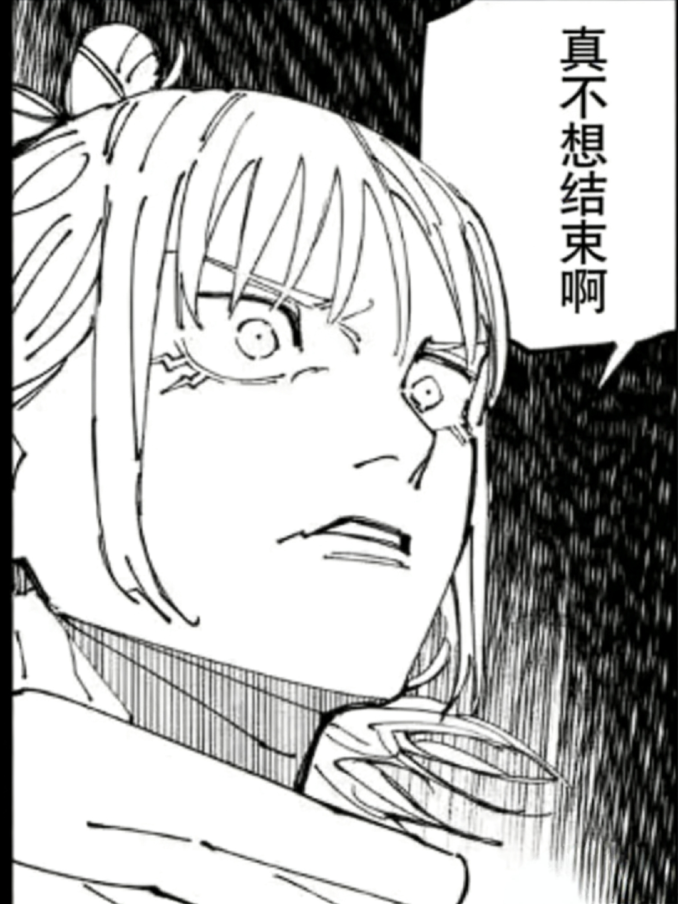