# 异国日记：内求·自我·意义·当下

***“在考场上，甚至以后，我希望你们不是做更好的自己，而是能够更好的做自己”  ——我的高中数学老师，莫仕燊，曾在高三六月的那个重要考试前对我们说到***

## 引言
那么这里也是看完了《异国日记》这一部番剧。说实话这个番剧其实热度并不高，但是其作品质量，尤其是番剧想要表达的思想，对于特定人群来说，非常深入人心。属于“小众宝藏”一类的内容。最开始我甚至没有看到这个番剧的任何讲解，反而是在偶然的系统推荐瓶子君的相关安利视频下简单的给了自己一个“马克（mark）住”的想法。然后在空闲的时候来看看。这是我为数不多的会在看的时候反复倒退来品尝一段台词的番剧。

## 介绍
那么，简单介绍一下这个番剧的特色。相对于别的番剧而言，它的风格非常平淡恬静：它并没有像《素晴》那样搞笑无厘头，也没有像《无职转生》那样史诗般的壮丽冒险。相对的，它用一种“润物细无声”的方式，通过角色的日常生活和台词文戏，向我们表达了一个核心观点：“做自己”。这个番剧的主要角色是通过双女主的方式来进行叙述，一个是面对重大家庭变故，双亲在一夜之间车祸去世的高中生：田汲朝（asa），一个是朝的小姨，作为朝的抚养者，内向作家：高代槙生（makio）。

在作品当中，我们能够非常明显地感受到小姨那种不被现代社会世俗绑架的处事方式：虽然社恐但是并不被所谓的“经济”“社交”等束缚，同时能够通过动画的情节的各种细节看到她对周围人的温柔，或者说，边界感分明。朝的同学来家中做客，槙生姨并不像正常的流程一样直接泡茶，而是摆出了6~7种茶叶，问同学想要喝什么茶，然后再泡：
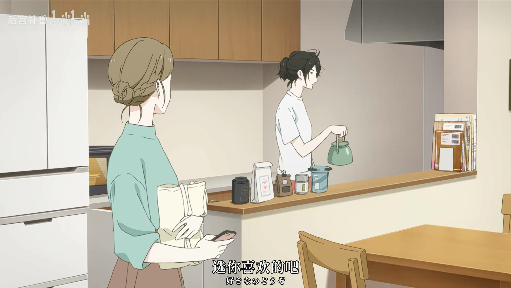
又或者说，在朝把日记放在房屋客厅的桌面上打开时，槙生目光不小心扫到时会把脸移开，然后会主动告诉朝把日记关上。
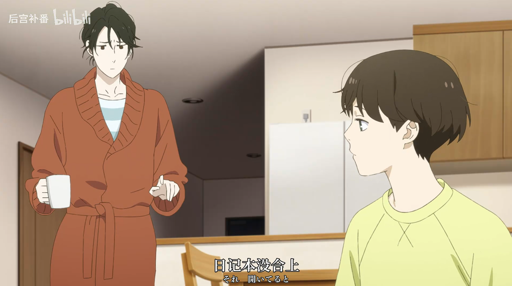
这里我非常有感触。记得我小时候印象比较深刻的一件事：小学时我把学校的作文写好之后，放到书包里，把书包放到衣柜里，关上衣柜，躺到床上去睡觉。第二天早上我的妈妈把我送去学校的路上会跟我说，我昨天看了看你的作文，你的内容哪里哪里写的不好。那时我有一种说不出的奇怪的感觉。因为我不知道为什么都这样做了还能被看到，以及有一种不想被看到意图。

不过这里似乎和我们当期想要讲的内容有点跑偏了。这里我更想讲聊的是，通过这个番剧，我们应当怎样面对生活、学习、工作等一切生命进程中的孤独与迷茫。

## 为什么我们会感到孤独？
在番剧当中有一个经常出现的意象：沙漠。朝、槙生等在动画中都经常在沙漠当中前行。这里似乎也是在向观众表达一种观念，生命其实就像沙漠一样，一望无际，荒芜遍布。我们每个人在活着时其实都是在沙漠上的行舟，迎着无尽的沙浪，在当中一步一步地走着。走向我们自己也不清楚的方向。

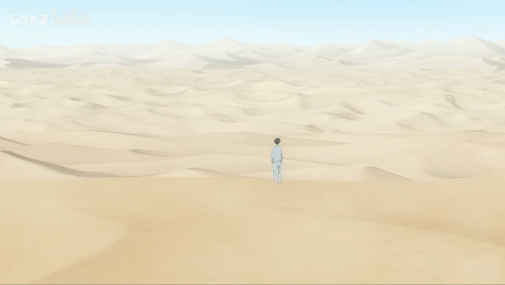

那么这是我们便产生了孤独。而作为群居动物演化而来的我们将害怕孤独铭刻在基因当中。我们会尝试着通过各种方式去消解孤独。但是从现实状况来看，我们能够经常从自己、他人的经历当中发现，即使我们尝试着消解它，但是最后我们依旧无法逃离它。于是从以下原因得出结论，孤独是正常、常见的：

### 每个人在心灵上都是对于相互而言的 “异国”
我们每个人都是独特的，这里的独特指的是非常多的方面，正好像世界上找不到两片完全相同的叶子那样。即使是双胞胎，也会在生活经历、思想方式等方面存在不一样。于是我们不可能完全知道对方在想什么，心里和大脑思维是什么样的。这样一来，我们每个人的都处在“异国”当中，我们每个人都因为主观和客观的原因筑起了“心之壁”：因为现实的限制，我们无法完全的了解对方，这样外界环境给我们筑起了心之壁；又或许因为外界的内容过于喧嚣过于难以承受，我们主动筑起了心之壁来形成舒适区保护自己。否则自己就要面对名为生命的“沙漠”——直面荒芜、空虚、飘渺。就这样大家的心灵、精神被隔开了，人从此成了孤立的
人。心之壁就这样保护了我们的同时也成为了禁锢我们心灵的牢笼。

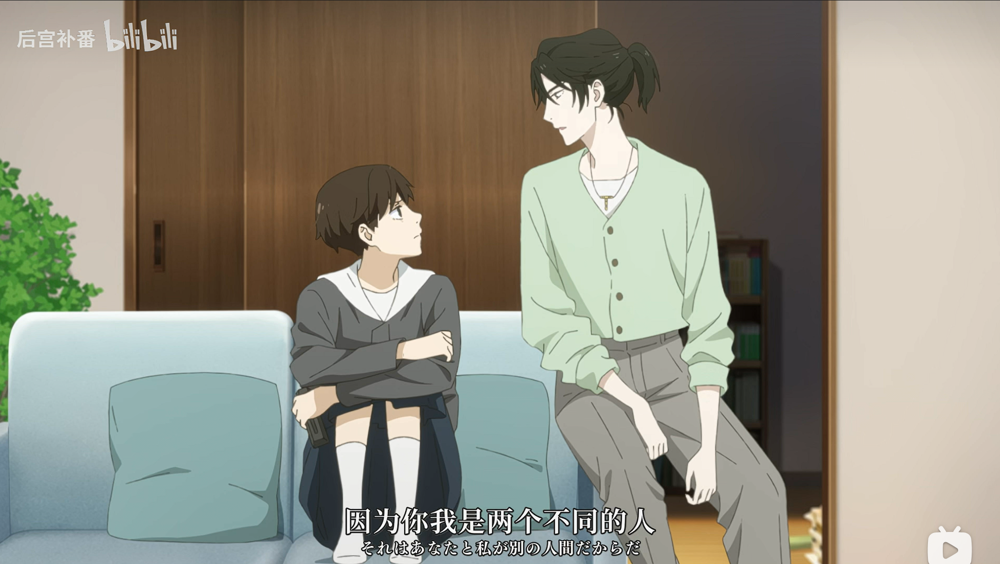
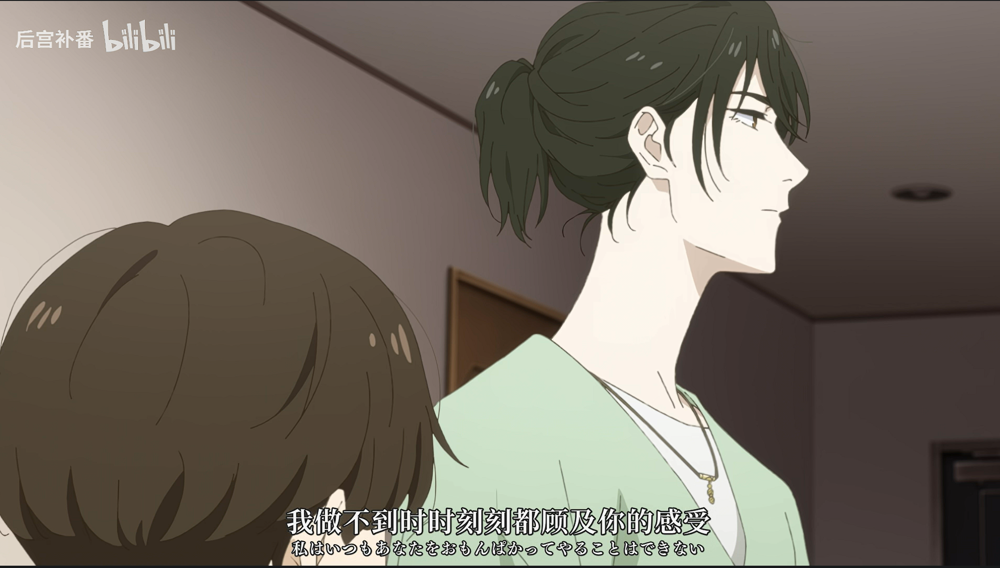
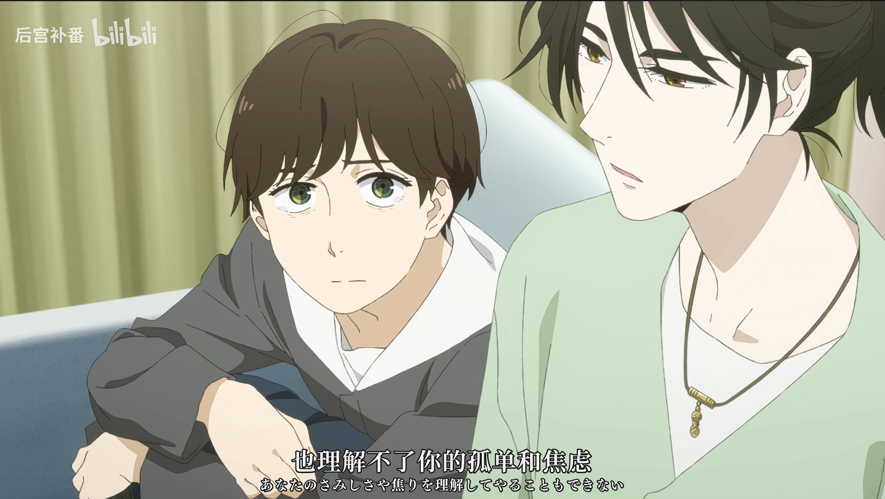

然而大家每个人都有自己的生活：对于槙生来说，她的异国是写作、和一些朋友社交、自己的生活，以及朝来了之后对朝的抚养；对于朝来说，她的异国是上学学习、交朋友、适应父母因为车祸去世后的新的生活，然后健康的长大；对于剧中别的配角人物，比如朝的发小楢绘美里，她的异国基本和朝一样，不同的内容就是她并不用面对父母逝去的现实情况，但是即便如此，也不能说她们在自己的“异国”中面对的困难处境完全一样。映射到现实当中，就有了千千万万的例子：
- 对于小孩来说：
    - 有的小孩面对的是学习不好
    - 有的小孩面对的是生活困难
    - 有的小孩可能还在为了书报杂费发愁
    - 有的小孩因为没有买到自己想要的玩具而生气
- 对于青年学生来说：
    - 有的同学面临着读研的枯燥
    - 有的同学需要经受上班就业的劳累
- 对于成年人来说：
    - 有的成年人思考婚姻、伴侣
    - 有的成年人对下一代的抚养、教育殚精竭虑
    - 有的成年人考虑未来的工作事业发展
    - 有的成年人则需要挣扎着活、生存下去
- 对于老年人来说：
    - 有的老年人注意着自己的身体是否能够继续健康的正常的生活
    - 有的老年人想要为自己的子女做出自己的影响
    - 有的老年人则想着做些什么来度过自己生命当中剩下的时光。

这些仅仅只是非常多的例子当中的很小的一个部分。并且这些面对的困难处境，并不是“非此即彼”的关系，更多的时候，是处于一个“你中有我，我中有你”，只是谁更主要更次要，主要的有哪些，次要的有哪些罢了。这些种种都造就了“心之壁”的复杂、独特、唯一，同时也让我们去了解对方和被对方了解的难度大大增加。我们难以打破自己的心之壁，去和别人交流，同时别人也难以翻过我们自己的心之壁，来到我们的内心世界。

### 为了得到关注，我们尝试穿过自己“异国”的墙，尝试翻过别人的“异国”的壁
我们每个人都是从孩子长大的，身体会随着基因写好的规定，就像自然界中的花开那样，在日夜轮转当中通过细胞的分裂分化逐渐成长，从一株细苗成长为盛开的花。但是我们的心灵并不会像这样自动的就成熟花开。而成长的唯一方式是我们在生活的经历中不断的面对，在困难和苦痛中磨练。就好像深度学习的激励函数那样，不断试错、找到规律，生成反馈激励，然后如此循环往复，知道成长为大人。

这样的方式其实会对一个人的心灵意志提出非常多的考验。而当下甚至以前的教育方式又忽视了这方面的教育。大家被社会的生存焦虑裹挟着内卷，如何把结果做好看，如何把题目回答的更加完美成了大家研究的内容，但是没有人来告诉我们，面对生活中的苦难我们该如何应对处理。

在番剧当中，槙生曾经表达过这样的意思的内容：朝作为孩子，本来应该从她的父母身上获得一些东西，然后通过这些东西来处理、面对或者经历生活上一些事情，再从这些事情当中获取到感悟和成长，但是由于事故，这种正常的人经历的方式被截断了，朝必须要自己来面对这些事情。她可能会感到迷茫，可能会感到不解，但是最终而言还是需要她自己走过这段路。

那么，面对这些内容，我们总有无法处理、无法消解的时候。那么这时候的无法解决、对问题产生的未知后果的恐惧让我们对自己的存在、价值产生怀疑、不解。那么这个时候我们会把“自己解决问题”的方式转化为“别人来帮我们解决”。这里的别人不一定指的是“自然人”，也指的是周围世界社会当中的某些评价标准或者客观事物。举个例子：
- 学生时代面对自己活着的价值是什么时，我们无法找到一个合理的解释来自洽逻辑，那么我们就将“成绩”这个最简单看到、反馈最强烈的内容作为评判自己价值的标准：
    - 成绩好，那么大家都会觉得自己很厉害，就会觉得自己做的事情“有价值”，那么自己也就有了活着的意义。
    - 相反的，如果自己的成绩不好，大家就不会关注你，就会觉得自己“没有价值”，从而更加找不到活着的意义。

- 动画当中的朝就在番剧中向着槙生的朋友这样需要询问“出风头”是否是一件好事，而番剧当中的回答便是并没有什么必要的。
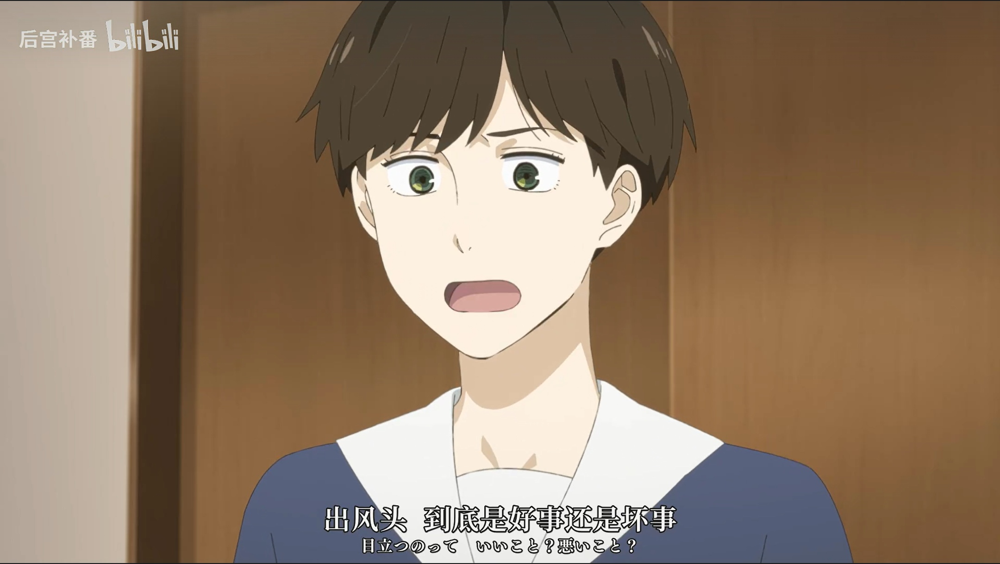
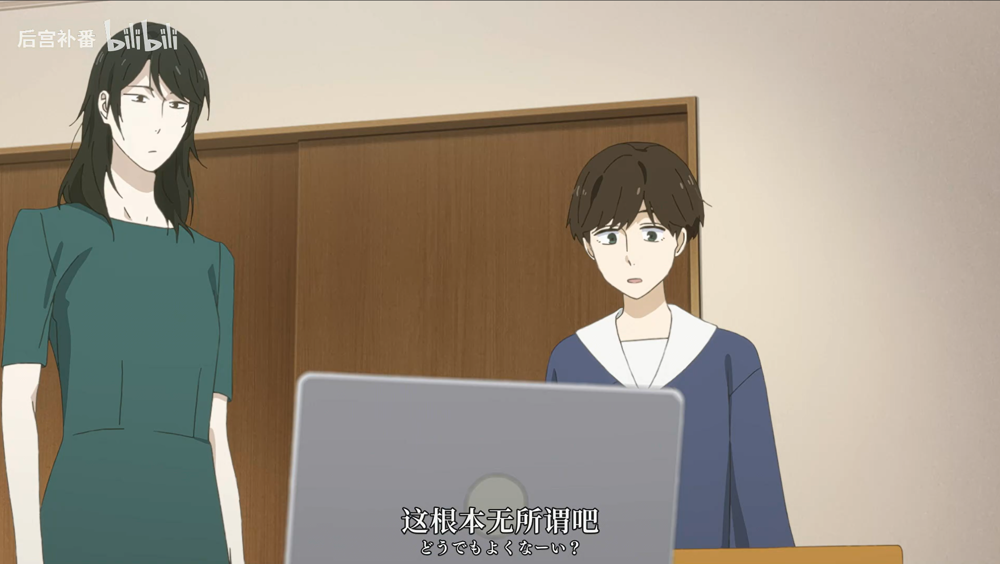
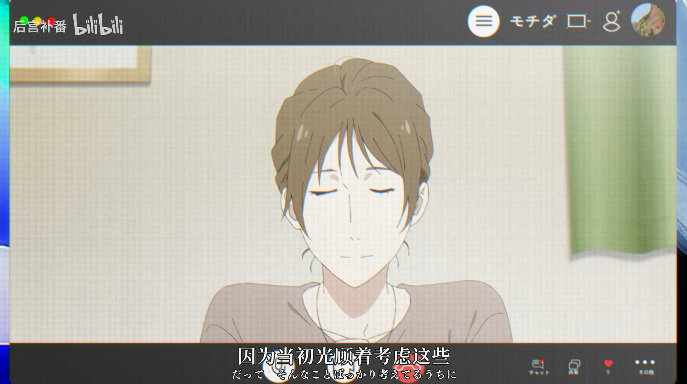
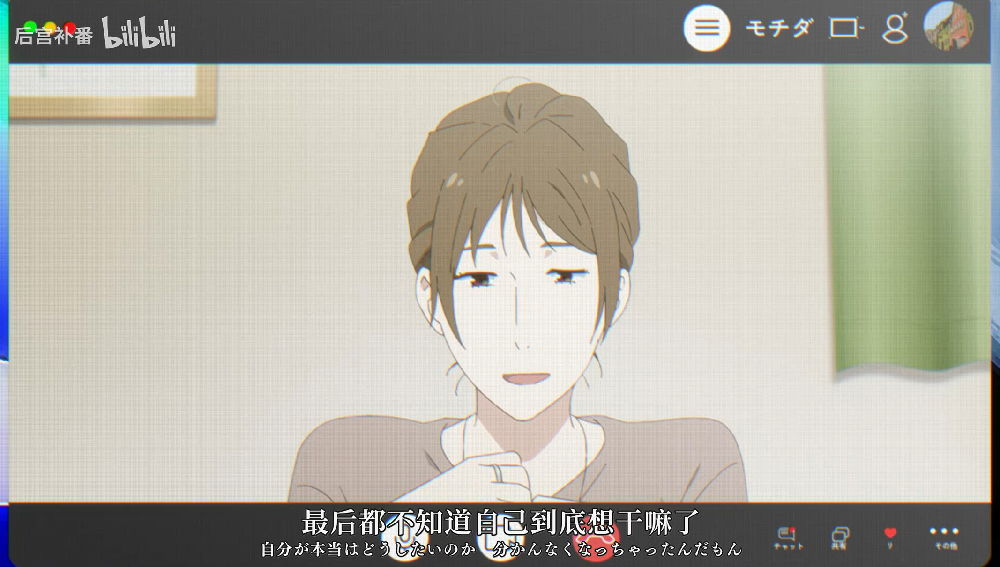

这里对于别人的关注同样的也有一部分来自于我们的基因当中写好的本能，就好像刚出生的婴儿会用啼哭来引起周围个体的注意，防止自己被抛弃被忘记。但是总体而言，通过自己思考、自己发现的途径来确定自己的价值与存在产生一个自洽循环远远不如从外界来确定的容易。结合复杂的现实就产生了一股无名的力量将我们的注意力转移。

整个过程中，我们将对自己的关注就这样逐渐就转移到了对别人的关注上，这里的别人的定义是像上文那样广泛、广义的。恐怖的是这过程通常是潜移默化的，我们通常不会注意到这种逐渐的细微的转变。但是我们上文有提到，人与人之间是难以相互理解、难以去主动的了解彼此的。为了得到他人的关注，或者说，理解，我们试图硬着头皮穿过自己的墙，翻过别人的壁，去引起他人的注意。

但是墙壁又哪有这么好翻过去呢？我们每个人的心之壁都是独特的、复杂的、独一无二的，没有一种万金油的翻墙的方法。每个墙会带有不同的风格：有的人是胆小或者圆滑，边界感及其强烈，你尝试着接触发现怎么都走不进去ta的内心深处，每次都用这样或者那样的方式回避或者拒绝了你尝试深入从中获取的反馈的机会。这样的人的墙光滑无比，你踩上去就会直接滑下来，然后摔到地上；有的人是性格较为冲动烈性，一不小心就发生了带刺的回应，ta的墙浑身带满了刺，只要你一靠近就会被扎得千疮百孔；有的人已经被自己的困境变得麻木不堪，如何尝试着ping回应都是端口不通、响应超时或者不可达。ta的墙又深又厚又高又硬，你不知道该如何走过翻过它。

为什么我们难以获得理解和理解他人这个问题又分为两个方面，一个是自己，一个是他人。那么他人的分析在上面已经讲过了，下面想要通过几个概念来讲讲自己的方面：

#### 1.他人即地狱
萨特在人际关系的冲突当中提出了一种理论：“他人即地狱”。其出自萨特的一个剧本《禁闭》。“他人即地狱”并不指的是别人都对自己有害，认为他人的本质是恶意的，都会对自己产生伤害。这里的“他人即地狱”在我的理解当中，更多的意思是“你对谁有期望，谁就会成为你的地狱”。在上文当中我们提到，我们为了对抗孤独，在自己无法承受或者不想要承受的情况下会本能的向他人索取一种回应、答案、认同。那么在这个情况下我们就对别人有了期望。这里落实到更加具体的概念就是“看法”，我们更多的会注意他人对我们自己的看法，比如别人是否会觉得我“我是一个好人”“我是一个对他有价值的人”，这种看法在不同的深灰关系下会变成不同的更加具体的身份等标识：
- 在亲子关系当中，会变成“我是否是一个孩子眼中的好家长”、“我是否是一个家长眼中的好孩子”
- 在恋人关系当中，会变成“我是否是对方眼中的好对象”、“我是否在对方眼中是理想的”
- 在职场关系当中，会变成“我是否是他人眼中的好同事”、“我在上级眼中是否是一个能力强大业绩出众的员工”
- 在学习关系当中，会变成“我是否成绩足够优秀”、“我是否在老师眼中是一个好学生”
- 在朋友关系当中，会变成“我是否在别人眼里是一个好朋友”、“我是否在别人眼中是一个交流能力好、朋友多的人”

也就是说，只要我们生活在社会当中，我们就不可避免的生活在看法当中。这种看法并不是说是完全不好的，而是分为一个相对应的范围。合理的看法能够让我们更好的对外交流，符合社会的发展需求；相反的，不合理的看法会导致各种问题，最经典的问题就是对于人身心健康的影响。

他人即地狱这个理论在我认为，它很好的解释了外部他人的看法对于我们自己的影响。**我们需要外界对我们的看法来认识自己和定位自己的价值，在得到反馈后我们又需要为了维持或者改善自我，又要相应的改变自身的行为来尝试操控外部的他人的对自己的看法。** 但是在这个过程当中对自我身份的裁判权从自己被转化到外界，所有的对自己的定义逐渐的转化为了交给外部的看法。所有的行动都变成了对外界这个“试题”的“答题”行为，变成了需要外部投喂的做题机器。地狱便在这种人与人之间的被束缚、被凝视、被定义的关系中出现了。今天也许会因为别人的一句认可而开心一天，明天就有可能因为一个批评而怀疑自我难受一周。

而更加可悲的是，“他人即地狱”是双向甚至多向、“全双工”的。别人对我们的看法是我们的地狱的同时，我们的看法也是他人的地狱。就好像家庭关系当中，父母期望我们是一个好孩子的同时也希望自己在孩子眼中是一个好家长。但是不乏出现这种情况：我们无法完成父母的期待，成为父母眼中的期待的好孩子模样，于是对外反馈出来我们的状态等能观测到的情况会让父母觉得她们没有做好，于是她们也同样的认为自己没有成为孩子眼中的好父母，然后便又用着自己的方式来尝试操控我们对于她们的看法。于是恶行循环，地狱降临到每个人身边，没有人真正的快乐。

但是仔细继续分析，我们会发现，我们尝试操控他人对于我们的看法和让他人明白自身对于他的看法这一点是不现实的。在上文讲到，我们每个人之间都是独立的、他人难以观测的，拥有着自己“异国”。一方面，别人难以知晓我们的状态、永远无法完全了解我们，并且他们也有着他们自身的现实生活要处理，我们被“心之壁”隔离开来。另一方面，我们尝试用自己的行为去控制他人的这一举措也是“傲慢”的。因为我们尝试着侵入他人的同时还认为别人的看法变化的规则就会是自己看法变化的规则那样。将“我看到这么做的话我就会觉得”默认为“别人看到这么做别人也会这么觉得”。总结一下这两点就是：
1. 我们希望在关系当中通过不完整不全面不及时的信息得到一个完整、全面、实时的结论（即看法）
2. 我们将自己的一套规则机械的移动到别人的规则上，然后用一个自己的答题规范去答别人的试题。

这明显是不符合逻辑行为。那么关系怎么可能会好呢，地狱怎么可能不出现呢？

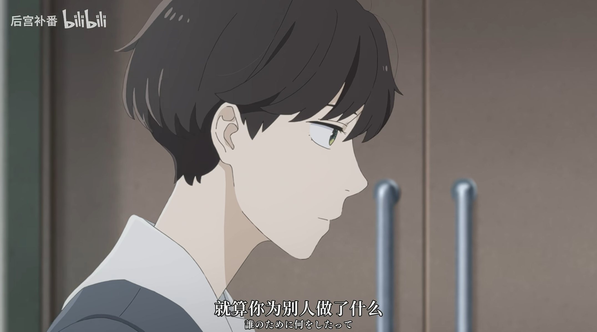
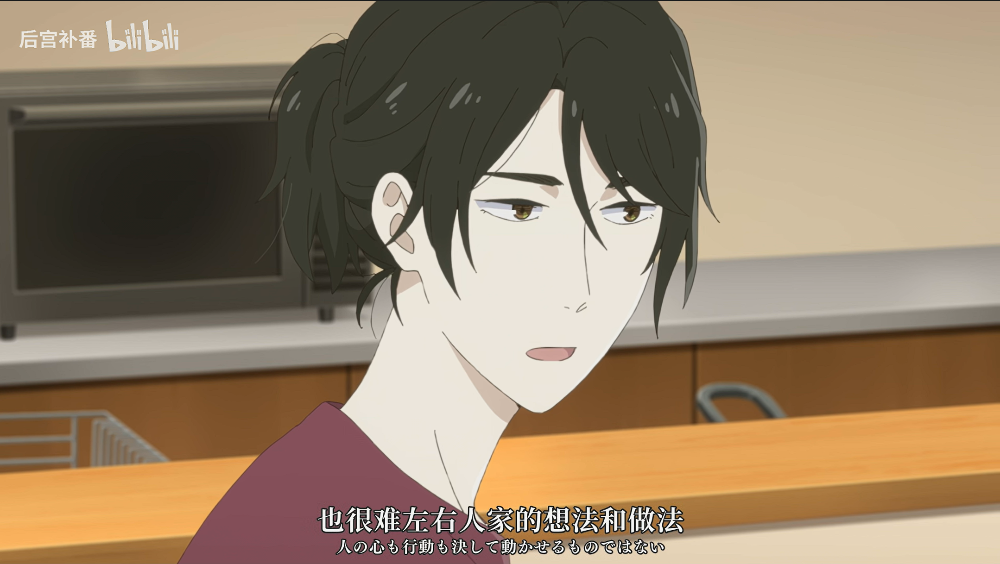

番剧当中朝就尝试在高中开学时跟遇到的同学都平常的说“我父母去世了”，尝试用这样的方式让大家更好的理解自己的情况，之后跟自己更好的像平常人一样的相处。但是实际上这样做的结果是大家可能一个这样或那样的个人原因，有的人认为这个人是个“怪人”，有的人产生了“霸之意志”，有的人因为她的情况而对她特殊化相处。总的结果来看就是并不像她所想要的那样。

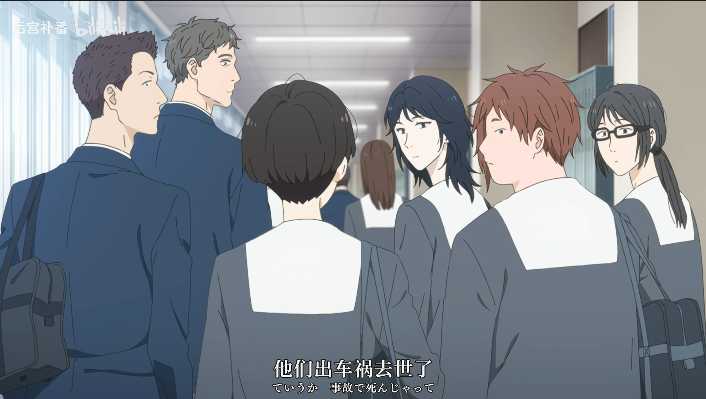

这里并不是说我们之后就不要这么做了，这里只是想表达一个观念，索取看法这件事本身会带来折磨，所以我们应当把对自我认知的定义从重点在外部回到内部。将定义权重新拿回自己手里。外部的看法永远只是一个参考素材，我们自己才是最终的定义权，对自己负责。把外部的看法直接当作自己的价值来源，这样做不费脑子，出了问题也能把原因归咎于“是你们要我这么做的”，是对自己不负责任的表现；把外部的看法拿过来后独立思考，自主决定，这样更多的对自己负责。这样做或许会犯错，或许会撞南墙，再也不能把事故责任从自己身上撇开，但是这时候我们才是真正的自己。


#### 2.豪猪困境
叔本华《附录与补遗》里的寓言当中有这么一个故事：
```
寒冬，一群豪猪想要挤在一起取暖；靠得太近，身上的尖刺就会互相扎得流血；分开，又被寒冷侵袭。于是反复靠近、分开，来回摇摆，最后找到一段不远不近、既能获得暖意、又不至于刺伤彼此的距离。
```
这里其实也是讲的是我们现实当中的情况：人们的本性是由棱角的，私欲、偏见、观念、自我保护、边界，这些是我们每个人都有的“刺”；而寒冬就是我们的与生俱来的孤独，取暖就是为了对抗寒冷，就是对和他人联结、建立深刻关系的渴望。我们被困在两种痛苦之间二选一：

1. **距离太近**：获得温暖，但会互相刺伤。越亲密，越容易暴露缺点、碰撞自我，侵占彼此的边界，发生误解、伤害、消耗。
2. **距离太远**：免于被刺伤，但要承受孤独、冷漠、缺乏情感慰藉。

不存在完美无间、完全毫无伤害的亲密，我们只能不断试探，寻找那个折中平衡点。生活中非常多的人际交往的问题在我看来都是距离把控的不正确，边界感不清晰的结果。在不合时宜的地点说着不和时宜的话、做着的不合时宜的事情。成长意味着不断经历接近与远离的过程，从而找到一种不会伤害彼此的相处距离，同时也是逐渐积累在和不同人相处时，该如何把握距离、管理自己的言行举止的经验。

朝和她的发小就是这样，朝和槙生姨也是这样，槙生姨和她的姐姐也是这样。大家都在生活中找到一个平衡点，让彼此舒适而不相互伤害。

*关于这个豪猪困境，讲的最多番剧的应该还是《新世纪福音战士》，也可以看看另一部电影《触碰》，不过这部电影剧情一般般，看评价说并不能很好的表达作者想要表达的内容，可以听听yoasobi的Monotone这个歌曲~*

### 于是孤独循环
很多人或许并不会意识到这一点，或者说当前的处境问题还不足以暴露到让他感知到。那么在这个过程中就会产生这样一个循环：
1. 我遇到了问题需要解决，我自己无法解决-》产出孤独
2. 我需要找到外人解决，外人能够暂时解决我的问题
3. 为了维持问题的解决，我需要不断维持让外人解决我的问题
4. 为了维持，不断产生新的问题

于是，就形成了一个孤独循环。我们的孤独不断积累，我们似乎看上去和他人建立了很多联系，但是事实上没有人真正走进我们的内心。

## 那么，我们应当怎样面对孤独呢？

我们在孤独的时候，更多的情况或许表现为：心里的事情没有可以倾诉的对象、没有空余出的时间来做别的事情，或者空余出的时间想要做别的事情但是因为焦虑等原因必须要回到未来的比如工作、家庭等方面当中，去为了更好的工作不被淘汰学习更多的知识，了解更多的情况等。这里我指的孤独更多的是指向心灵上那种无人接近无人理解的状态。那么这里我将从两个方面来聊聊自己的看法：

### 享受当下，不将希望和诉求放在未来上

从小到大我们都经常会被灌输这样的理念：将来考上好高中就好了；将来考上好大学就好；将来找到好工作就好了……等，这是人生的里程碑上的节点，而这种理念也会体现在日常生活当中：等到周末放假我就去和朋友爽打游戏猛猛倾泻；等到考试考完了我就去旅游放松；等到这项任务结束了我就能有非常多的收获。这里我们不难发现，我们将当前的困难的意义寄托在未来的结束那一刹那之后。也就是说，当前的所有意义都是为了一个不确定的未来的我们自己附加的意义。把确定的东西寄托在不确定的事情上，这显然是不符合逻辑的。未来是常变、难以预测的，谁也没有把握说未来一定会按照什么样子成为现在。于是我们经常会发现：周末即使放假了但是朋友却突然有事来不了了；考试虽然考完了但是根本抢不到旅游的车票；这项任务结束了之后并没有想象的收获那么多。这样一来我们就会对之前受过的苦产生怀疑：我为什么要吃这些苦呢？这些苦吃了有什么意义呢？早知道现状是这样了我就不这样做了。

这就是我们将当下的意义寄托在不确定的未来的问题体现。我们从当下的现实感受到我们的所作所为没有意义，所以我们为了自洽，为了安慰自己，为了逃避思想，为了快速找到一个答案，我们将当下的无意义放到未来，然后尝试着用未来的有意义作为答案来支撑自己撑过当下的无意义。但是这样依赖，即使未来确实像我们所预测的那样，成为了现实，那么又有几次未来能够一直按照我们所想的那样发展呢？我们又能够有几次经受这样的思想链条崩溃呢？我们所预测的未来成为了现实之后，就会重新陷入循环当中，将当前已经成为现实的未来的意义，再赋予到那个未来的未来吗？这样明显是不对的，因为未来的未来不断往复，总有没有未来的最终节点，那个节点就是死亡。死亡之后，任何事物对于死去的我们而言都没有意义。不管是金钱财物也好、声名贡献也罢，这些影响都只是对于和我们有关系的人的相关，这些东西随我们的本体着心脏停止跳动、大脑死亡的那一刻，对我们自己而言已经没有关系。就好像我们什么都不带着来到这个世界上，又什么都不带着离开这个世界一样。

这个不断的将现在意义寄托在未来的递归链中，我们将意义最终递归寄托到死亡的那一刻，然后什么也没有了，这样一来意义本身要求携带意义，但是最终变成了没有意义。

我这里并认为说我们就应当只关注于当前，不考虑未来，仅仅的只是享乐，醉生梦死；也不是认为我们就应当像苦行僧那样默默忍受当下的一切苦痛，认为自己就应当如此。我想说的是，承认世界本不预装先天意义，意义是人主动赋予，不是某个未来事件馈赠给你的礼物。我们应当承认当下的生活就是没有意义的，也不将当前的意义寄希望在未来的结束那一刹那之后。然后依旧在当前的无意义中享受当下，让自己赋予当下意义：让自己倾泻并不一定要等到周末，可以从座位上立刻站起来，然后去走走去看看周围那些之前未曾注意到的角落，带给自己惊喜；放松并不一定要等到考试考完，可以在今天的任务执行到受不了时，瘫坐在椅子上什么关于考试的事情什么也不想；任务的收获并不一定要在完成之后，你在执行任务时敲下的每一行代码，大脑当中思考的每一个字，都是你在任务当中的收获。
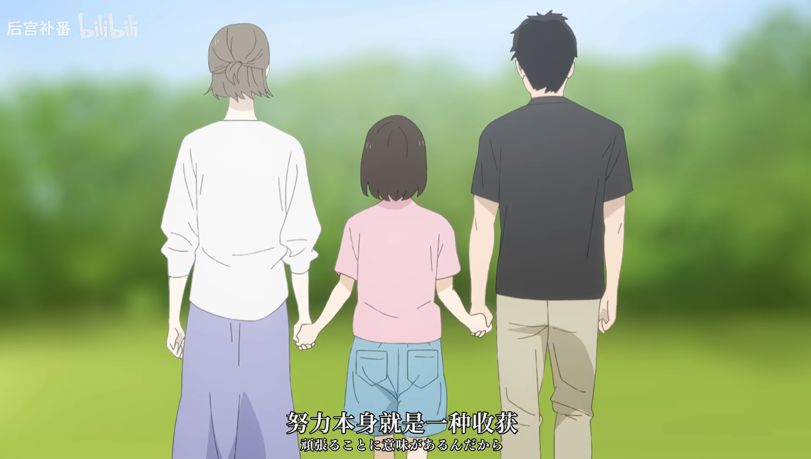
西西弗斯每天开始时都徒劳着将巨石从山底抬到山顶，然后每天结束时巨石又会滚落回去。某种意义上，我们每个人自己都是西西弗斯，我们应当认为西西弗斯是可以幸福乐观的，我们自己也是可以幸福乐观的。而不是在一天一天的无意义下麻木，用虚伪的飘渺的未来意义掩盖当前的痛苦，我们要清醒的活着，痛苦的活着。
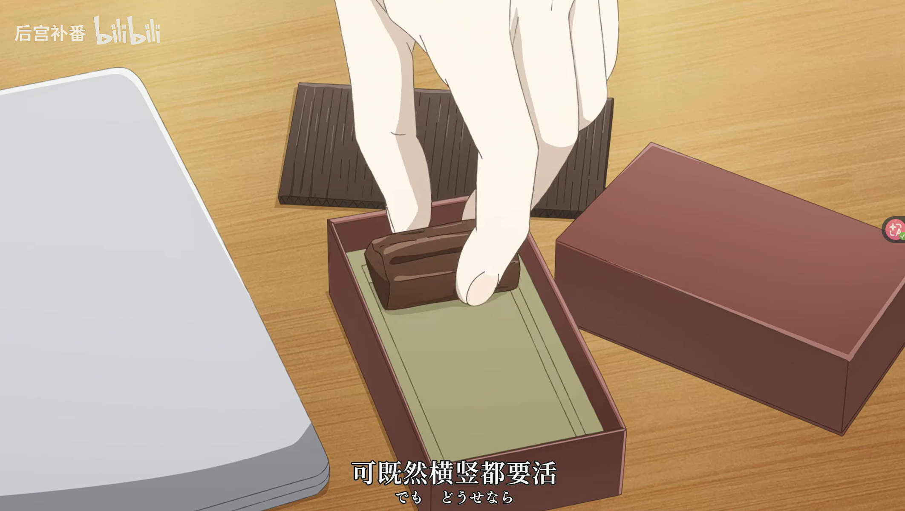
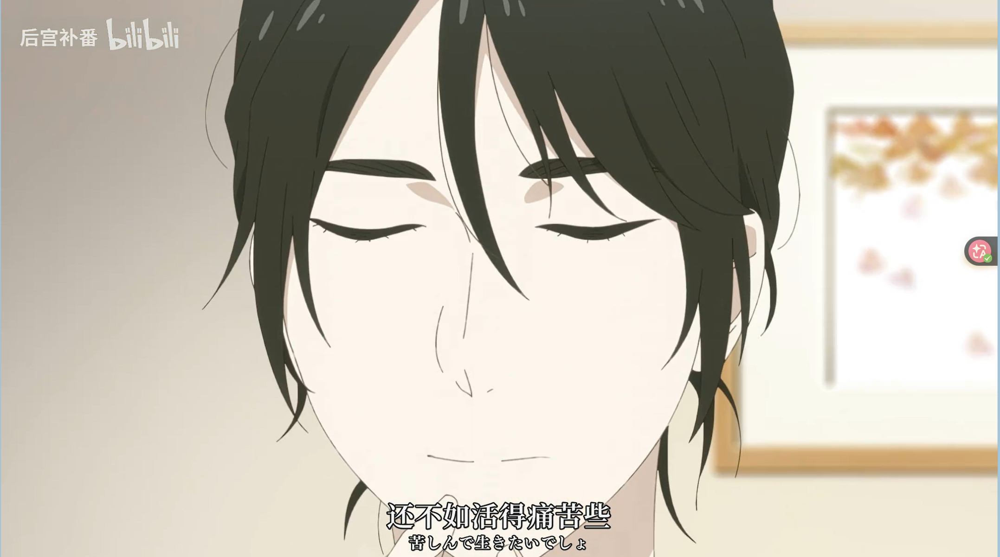
巨石往复滚落并不代表一切徒劳，意义不是远方终点发放的奖品，而是我们行走途中亲手赋予自己的东西，这就是我们正在活着在这个世界上的证明。

### 做自己想做的事情，做一只特立独行的猪
离开高中单一的考试赛道之后，我们面前铺开保研、考研、考公、实习、就业、创业无数条道路。但很多人依旧延续从小到大的路径依赖：把外部社会定义的 “正道” 当作自己的追求。我在很多线上社群潜水，经常能看见两种尖锐对立的叙事：一部分人信奉实习至上：课程可以舍弃，一切学习、项目的最终目标都是大厂 offer 与更高薪资；另一部分人信奉保研至上：只钻研绩点相关内容，其余一切皆可舍弃。两边互相轻视，各自以自己选择赛道的外在标签建立优越感：保研者以高绩点、科研经历证明自己高人一等；求职实习的人，依靠技术积累、大厂实习经历生出技术傲慢。他们评判自我价值的标尺不是自己是否享受这件事、是否遵从内心，在我看来更多的是外界公认的成功标签和他人的羡慕与认可。

可惜的是，面向这套世俗规则，我们深深陷在它中，做不到轻易的逃离它。举我自己的例子，理智上我明白，一个人的好坏不该由学历、实习、薪资定义；如果一个人发自内心热爱科研，便投身学术；如果热爱技术，便在项目中打磨；想要走向基层服务，便奔赴岗位，这些选择本身都值得祝福。可是我们还是需要因为现实而不得不做一些妥协，翘课去实习，翘课去考研复习，接受来自外界的审视和比较。离不开这样的一套规定，只能守护好自己的一方世界，在面对这些情况时能够有更多的理解、认识与从容。

朝的父母在意识到自己就是被外部规训成现在这样之后，对朝有了让她做自己的期待。这样在即使她们离开了，那一天之后朝也能自己独立着生活下去。
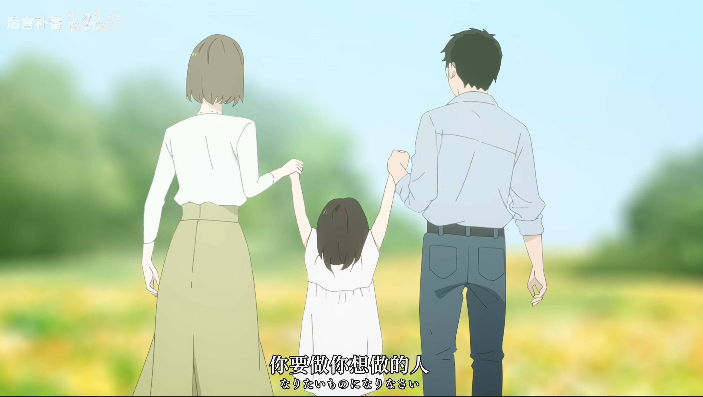
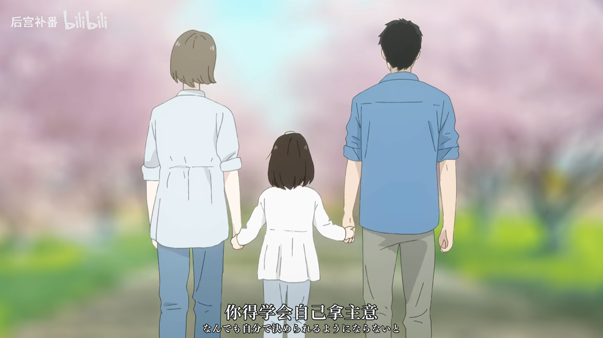

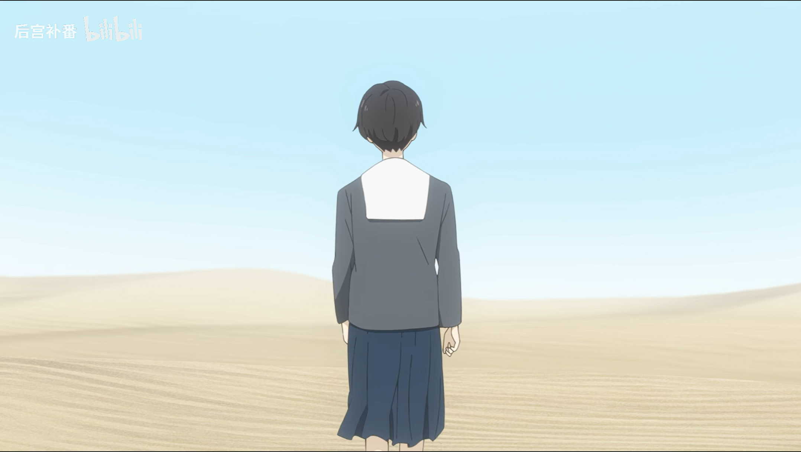

最后朝完成了成长，去轻音社做了自己想要做的事情：
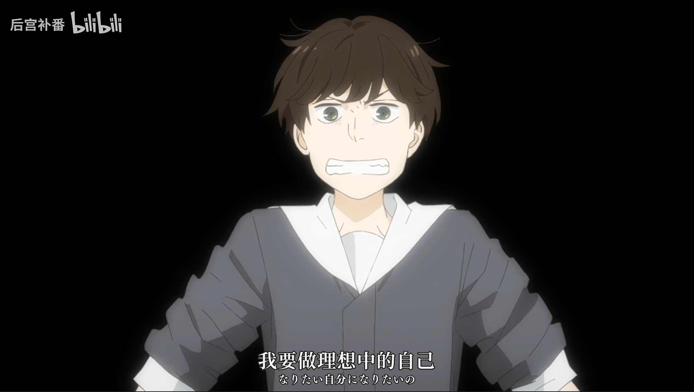

所以去做自己想做的事情吧，做一只特立独行的猪。想做什么就去做什么，想要什么就去追求什么，想要去哪里就去哪里。不要因为外界的眼光而束缚自己，不要因为所谓的“社会规则”而放弃自己的兴趣和热情。每个人的生活都是独一无二的，我们不需要去迎合别人的期待，也不需要去证明自己的价值给别人看。最重要的是，我们要学会倾听自己的内心，找到真正让自己快乐和满足的事情，并为之努力。那些在你兴趣和热情驱动着做的过程当中的收获，总有一天会在你想不到的地方偷偷发挥作用。我为你能做自己想做的事情而感到喜悦。
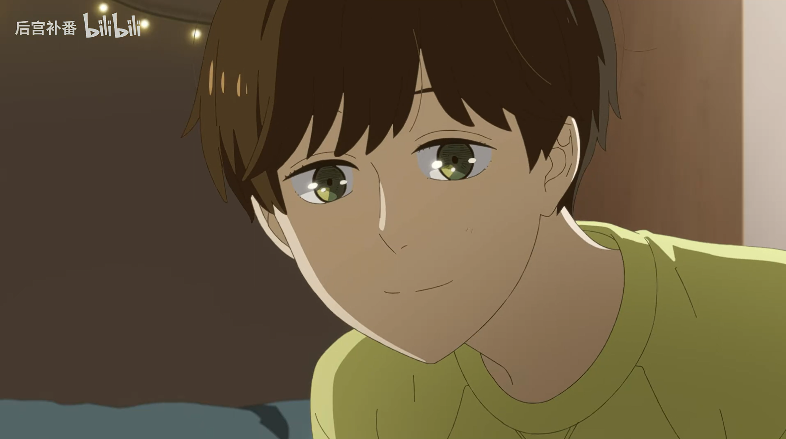

## 总结

瓶子君在视频中说：“同是人间一场，皆是异国旅人”。不要渴求着他人真正理解你，也不要傲慢的觉得自己理解他人，“有些内心的空洞不能变成语言，无法变成语言，一旦变成语言就不再是它们了”。我们每个人都是自己的异国，有着自己的困难和问题，只能自己通过时间和行动去消化、和解、遗忘。过程中产生的孤独我们应当滋养、和解、共存。在番剧的末尾，朝在槙生的指引下理解了自己应当成为自己想要做的样子，她的脚印又开始指引着森本千世（在考第二志愿的医大的时候，由于入学考试有舞弊现象只对女生扣分导致最终入学考试不及格，但仍然继续考医大）、楢绘美里（发小）她们找到自己沙漠中的方向。槙生姨写的小说中说，当你一个人在名为生命的沙漠中找不当方向和同伴时，可以看看你的脚印，那是指向你的内心的家的方向。

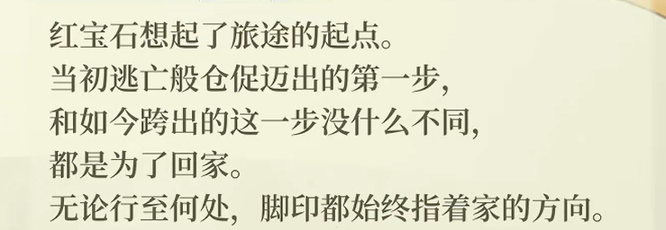

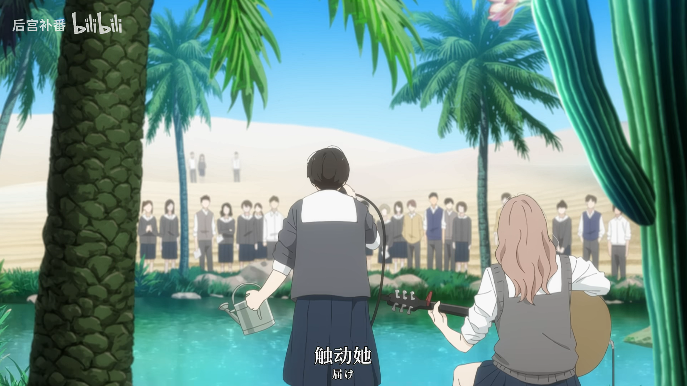
我希望看到这里的朋友们如果也是在孤独和迷茫的时候，能够重新拾起勇气和动力，找到属于自己，触动他人的绿洲。


***~~完~~***
